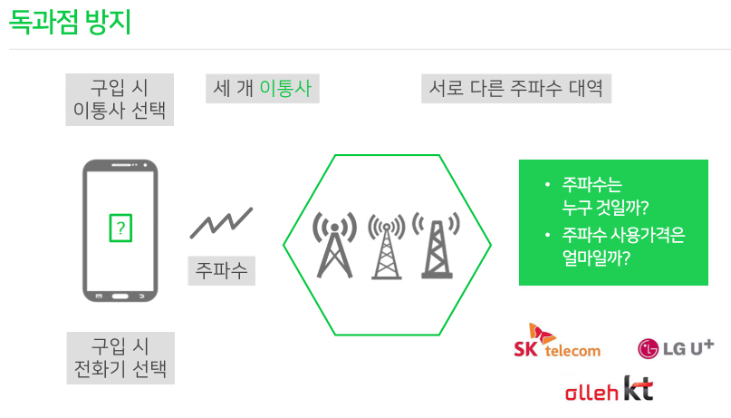
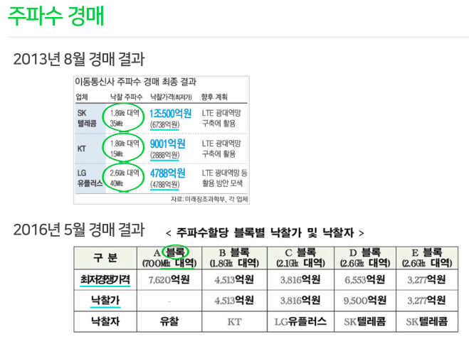

# 주파수

## 1. 학습목표

셀룰러 통신을 할 때, 주파수는 빠질 수 없는 가장 중요한 요소 중 하나입니다. 
그렇다면 주파수의 어느 성질이 통신을 가능하게 하는지, 
그리고 주파수가 통신에서 어떻게 쓰이는지 지금부터 자세히 알아보도록 하겠습니다.

## 2. 학습내용

- 주파수가 통신사에서 사용되는 원리
- 무선 통신의 종류
- 무선랜(인터넷 공유기)

## 3. 학습하기

- 독과점 방지
  - 세 개 이동통신사
    - SK, LG, KT
    - 서로 다른 주파수 대역
  - 주파수는 누구 것일까?
    - 주인이 없다.

- 주파수 경매

- 무선 통신 종류
  - **셀룰러 통신(동네)**
  - 무선 랜
    - AP장치 : 무선을 쏘아주는 장치 
    - **Wi-Fi** : 와이파이, 무선랜
      - 랜 서비스가 제공되는 지역을 벗어나면 서비스를 이용할수없어서 이동통신이라고 하지않는다.
  - Bluetooth
    - 아주 가까운 거리내에 1:1로 연결가능
    - 프린터, 노트북, 다른스마트폰, 이어폰
    - **한 번에 한 기기에만 연결 가능**

[라디오 청취 방법]

1. 기존 라디오
2. 이동통신망(셀룰러망) 통한 앱 실행
3. 무선랜(WiFi) 통한 앱 실행

- 무선통신

  - 이동통신사(유료)

    - 기지국을 통해 우리에게 신호를 쏴줘서 통신료를 내야함

      

  - WiFi(무료)

    - 우리가 있는 지역에 LAN 설치되어있다면 무료사용 가능

- 무선랜
  - WiFi 공유기
  - 설정 - PC / 노트북 / 스마트폰
  - WiFi 선택 및 암호(사용권) - 호텔 / 카페
  - 가는 장소마다 'WiFi 설정'

## 4. 정리

- AP (Access Point) 장치
  - 무선랜 접속을 위한 장치를 뜻합니다.
- **Wi-Fi** (Wireless Fidelity)
- 무선 데이터 전송 시스템, 무선으로 인터넷에 접속 가능하게 해주는 시스템을 뜻합니다.

