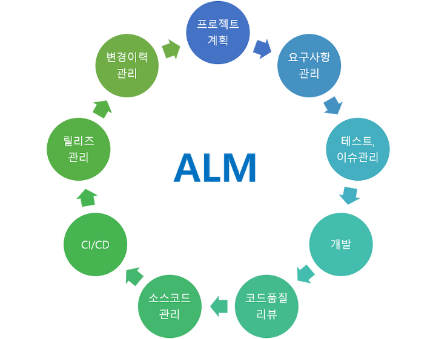
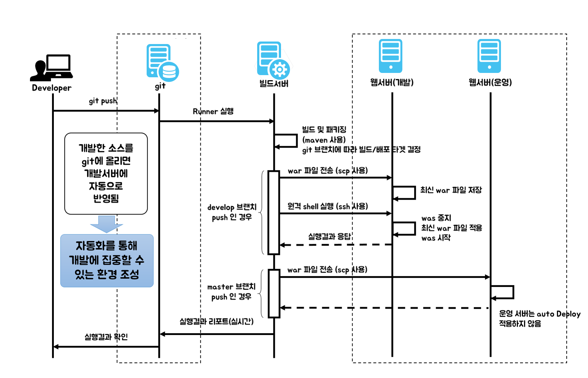

개념
=====

**Application Lifecycle Management**

 

요구사항, 이슈 관리 툴
=====

  Confluence, Redmine, JIRA

개발 환경 툴
=====

  SpotBugs, SonarQube, PMD, jUnit

소스 관리 시스템
=====

 Github, Gitlab, Bitbucket

빌드, 테스트 자동화 시스템
=====

 Jenkins, Travis CI

 