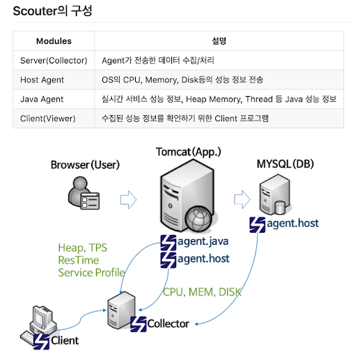
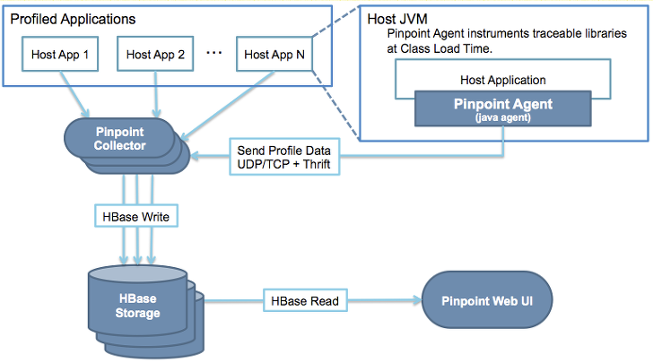

개념
=====

**Application Performance Management** (or **Monitoring**)

scouter
=====

 

 - Scouter Server
   - 모니터링 데이터 수집

 - Scouter Host
   - 호스트 모니터링을 위한 용도로 제공

 - Scouter Agent
   - java 실행 시 옵션 설정 `-javaagent`, `-Dscouter.config=`

 - Scouter Client
   - 모니터링 브리우저

pinpoint
=====

 

 - Hbase
   - agent로 부터 수집한 데이터 적재

 - Pinpoint Web
   - 모니터링 브리우저

 - Pinpoint Collector
   - agent로부터 데이터 수집

 - Pinpoint Agent 
   - 타겟 서버에 심어서 master 서버로 데이터 송신
   - java 실행 시 옵션 설정 `-javaagent`, `-Dpinpoint.applicationName=,agentId=`
