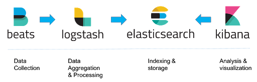
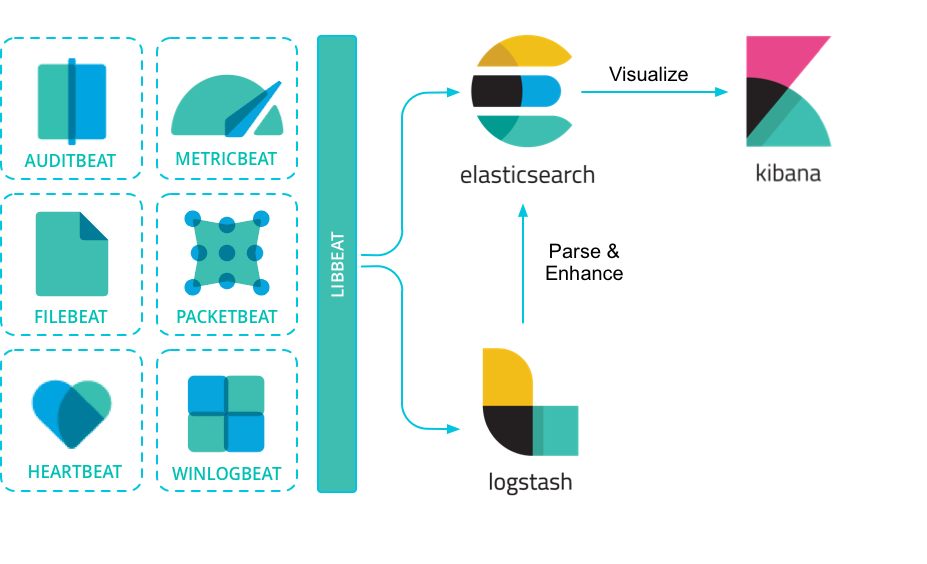
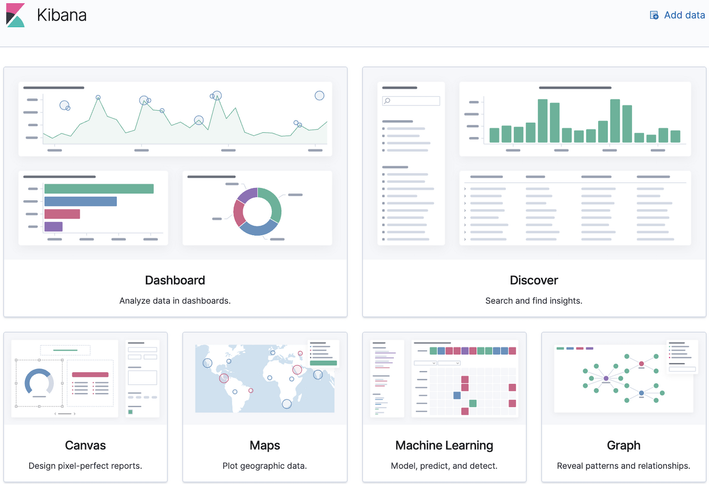

개념
=====

**ELK** stands for the monitoring solution which is mainly consist of **Elasticsearch**, **Logstash** and **Kibana**

Elastic Stack
=====

 

 - Elasticsearch
   - Store, Index, Search, Analyze

 - Logstash
   - Unify data from disparate sources
   - Normalize data into destinations

 - Kibana
   - Kibana is the front end GUI for Elasticsearch

Kibana
=====

 

Beats
=====

 
