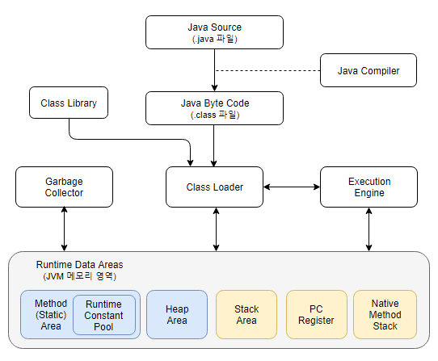

JVM 구조
=====


PID 확인
=====
```
./jps -v

44608  -XX:+IgnoreUnrecognizedVMOptions --add-modules=ALL-SYSTEM -Xms64m -Xmx1024m
21220 Jps -Dapplication.home=C:\javadev\jdk\jdk-15 -Xms8m -Djdk.module.main=jdk.jcmd
39108 AuthserverApplication -Dcom.sun.management.jmxremote -Dcom.sun.management.jmxremote.port=49513 -Dcom.sun.management.jmxremote.authenticate=false -Dcom.sun.management.jmxremote.ssl=false -Djava.rmi.server.hostname=localhost -Dspring.jmx.enabled=true -Dspring.application.admin.enabled=true -XX:TieredStopAtLevel=1 -Dspring.boot.project.name=myapp-authserver -Dfile.encoding=UTF-8
45156  -Dosgi.requiredJavaVersion=11 -Dosgi.dataAreaRequiresExplicitInit=true -Xms256m -Xmx2048m --add-modules=ALL-SYSTEM -javaagent:C:\javadev\programs\sts-bundle\sts-4.9.0.RELEASE\lombok.jar
```

GC 모니터링
=====
```
./jstat -gc -h20 23928 1000

 S0C    S1C    S0U    S1U      EC       EU        OC         OU       MC     MU    CCSC   CCSU   YGC     YGCT    FGC    FGCT    CGC    CGCT     GCT
22528.0 21504.0  0.0    0.0   220160.0 208600.4  196096.0   30584.3   59160.0 56594.1 8704.0 8203.9     11    0.082   3      0.274   -          -    0.356
22528.0 21504.0  0.0    0.0   220160.0 208600.4  196096.0   30584.3   59160.0 56594.1 8704.0 8203.9     11    0.082   3      0.274   -          -    0.356
22528.0 21504.0  0.0    0.0   220160.0 208600.4  196096.0   30584.3   59160.0 56594.1 8704.0 8203.9     11    0.082   3      0.274   -          -    0.356
22528.0 21504.0  0.0    0.0   220160.0 208600.4  196096.0   30584.3   59160.0 56594.1 8704.0 8203.9     11    0.082   3      0.274   -          -    0.356
22528.0 21504.0  0.0    0.0   220160.0 208600.4  196096.0   30584.3   59160.0 56594.1 8704.0 8203.9     11    0.082   3      0.274   -          -    0.356
22528.0 21504.0  0.0    0.0   220160.0 209701.2  196096.0   30584.3   59160.0 56594.1 8704.0 8203.9     11    0.082   3      0.274   -          -    0.356
22528.0 21504.0  0.0    0.0   220160.0 209701.2  196096.0   30584.3   59160.0 56594.1 8704.0 8203.9     11    0.082   3      0.274   -          -    0.356
22528.0 21504.0  0.0    0.0   220160.0 209701.2  196096.0   30584.3   59160.0 56594.1 8704.0 8203.9     11    0.082   3      0.274   -          -    0.356
```

Default GC 확인 방법
=====
```
java -XX:+PrintCommandLineFlags -version
```

GC 처리 방식
=====
* **-XX:+UseSerialGC**: 하나의 스레드를 이용하여 Young 영역과 Old 영역의 정리를 처리
  
* **-XX:+UseParallelGC**: Young 영역의 정리에 다수의 스레드를 이용하여 처리
  
* **-XX:+UseParallelOldGC**: Old 영역의 처리도 다수의 스레드를 이용하여 처리
  
* **-XX:+UseConcMarkSweepGC**: 메이저 GC의 성능 향상을 위해 Old 영역의 정리를 Concurrent 방식으로 처리
  
* **-XX:+UseG1GC**:
   1. 장기적으로 말도 많고 탈도 많은 CMS GC를 대체하기 만들어졌고, 가장 큰 장점은 성능이다.
   1. 큰 메모리를 가진 멀티 프로세서 시스템에서 사용하기 위해 개발된 GC이다.  
   1. GC 일시 정지 시간을 최소화하면서, 따로 설정을 하지 않아도 가능한 한 처리량(throughput)도 확보하는 것이 G1GC의 목표이다.  
   1. **Java 9**부터 디폴트 GC이다.  
   1. 실시간(real time) GC가 아니다. 일시 정지 시간을 최소화하긴 하지만 완전히 없애지는 못한다.  
   1. 통계를 계산해가면서 GC 작업량을 조절한다.  

* **용어**  
`Mark-Sweep-Compaction`, `Mark-Summary-Compaction`, `Stop-The-World`, `Age`, `Promotion`

* **PermGen**
   * JDK 8부터 Permanent Heap 영역이 제거되었다.
      * 대신 Metaspace 영역이 추가되었다.
      * Perm은 JVM에 의해 크기가 강제되던 영역이다.
   * Metaspace는 Native memory 영역으로, OS가 자동으로 크기를 조절한다.
      * 옵션으로 Metaspace의 크기를 줄일 수도 있다.
   * 그 결과 기존과 비교해 큰 메모리 영역을 사용할 수 있게 되었다.
      * Perm 영역 크기로 인한 java.lang.OutOfMemoryError를 더 보기 힘들어진다.

* **Java 7, Java 8 비교**
```
<----- Java Heap ----->             <--- Native Memory --->
+------+----+----+-----+-----------+--------+--------------+
| Eden | S0 | S1 | Old | Permanent | C Heap | Thread Stack |
+------+----+----+-----+-----------+--------+--------------+
                        <--------->
                       Permanent Heap
S0: Survivor 0
S1: Survivor 1
```
```
<----- Java Heap -----> <--------- Native Memory --------->
+------+----+----+-----+-----------+--------+--------------+
| Eden | S0 | S1 | Old | Metaspace | C Heap | Thread Stack |
+------+----+----+-----+-----------+--------+--------------+
```

Memory Leak 사례
=====
   1. <a href="https://woowabros.github.io/tools/2019/05/24/jvm_memory_leak.html" target="_blank">https://woowabros.github.io/tools/2019/05/24/jvm_memory_leak.html</a>
   1. <a href="https://gist.github.com/ihoneymon/9efec8cc2b671a020b5164260992c87c" target="_blank">https://gist.github.com/ihoneymon/9efec8cc2b671a020b5164260992c87c</a>

쓰레드 분석하기
=====
```
./jstack 23928

"http-nio-5088-exec-5" #48 daemon prio=5 os_prio=0 tid=0x0000000024392800 nid=0x4228 waiting on condition [0x000000002756f000]
   java.lang.Thread.State: WAITING (parking)
        at sun.misc.Unsafe.park(Native Method)
        - parking to wait for  <0x0000000776e962f8> (a java.util.concurrent.locks.AbstractQueuedSynchronizer$ConditionObject)
        at java.util.concurrent.locks.LockSupport.park(LockSupport.java:175)
        at java.util.concurrent.locks.AbstractQueuedSynchronizer$ConditionObject.await(AbstractQueuedSynchronizer.java:2039)
        at java.util.concurrent.LinkedBlockingQueue.take(LinkedBlockingQueue.java:442)
        at org.apache.tomcat.util.threads.TaskQueue.take(TaskQueue.java:107)
        at org.apache.tomcat.util.threads.TaskQueue.take(TaskQueue.java:33)
        at java.util.concurrent.ThreadPoolExecutor.getTask(ThreadPoolExecutor.java:1074)
        at java.util.concurrent.ThreadPoolExecutor.runWorker(ThreadPoolExecutor.java:1134)
        at java.util.concurrent.ThreadPoolExecutor$Worker.run(ThreadPoolExecutor.java:624)
        at org.apache.tomcat.util.threads.TaskThread$WrappingRunnable.run(TaskThread.java:61)
        at java.lang.Thread.run(Thread.java:748)

"http-nio-5088-exec-4" #47 daemon prio=5 os_prio=0 tid=0x0000000024391000 nid=0x702c waiting on condition [0x000000002746e000]
   java.lang.Thread.State: WAITING (parking)
        at sun.misc.Unsafe.park(Native Method)
        - parking to wait for  <0x0000000776e962f8> (a java.util.concurrent.locks.AbstractQueuedSynchronizer$ConditionObject)
        at java.util.concurrent.locks.LockSupport.park(LockSupport.java:175)
        at java.util.concurrent.locks.AbstractQueuedSynchronizer$ConditionObject.await(AbstractQueuedSynchronizer.java:2039)
        at java.util.concurrent.LinkedBlockingQueue.take(LinkedBlockingQueue.java:442)
        at org.apache.tomcat.util.threads.TaskQueue.take(TaskQueue.java:107)
        at org.apache.tomcat.util.threads.TaskQueue.take(TaskQueue.java:33)
        at java.util.concurrent.ThreadPoolExecutor.getTask(ThreadPoolExecutor.java:1074)
        at java.util.concurrent.ThreadPoolExecutor.runWorker(ThreadPoolExecutor.java:1134)
        at java.util.concurrent.ThreadPoolExecutor$Worker.run(ThreadPoolExecutor.java:624)
        at org.apache.tomcat.util.threads.TaskThread$WrappingRunnable.run(TaskThread.java:61)
        at java.lang.Thread.run(Thread.java:748)

"http-nio-5088-exec-3" #46 daemon prio=5 os_prio=0 tid=0x0000000024391800 nid=0x9d80 waiting on condition [0x000000002736f000]
   java.lang.Thread.State: WAITING (parking)
        at sun.misc.Unsafe.park(Native Method)
        - parking to wait for  <0x0000000776e962f8> (a java.util.concurrent.locks.AbstractQueuedSynchronizer$ConditionObject)
        at java.util.concurrent.locks.LockSupport.park(LockSupport.java:175)
        at java.util.concurrent.locks.AbstractQueuedSynchronizer$ConditionObject.await(AbstractQueuedSynchronizer.java:2039)
        at java.util.concurrent.LinkedBlockingQueue.take(LinkedBlockingQueue.java:442)
        at org.apache.tomcat.util.threads.TaskQueue.take(TaskQueue.java:107)
        at org.apache.tomcat.util.threads.TaskQueue.take(TaskQueue.java:33)
        at java.util.concurrent.ThreadPoolExecutor.getTask(ThreadPoolExecutor.java:1074)
        at java.util.concurrent.ThreadPoolExecutor.runWorker(ThreadPoolExecutor.java:1134)
        at java.util.concurrent.ThreadPoolExecutor$Worker.run(ThreadPoolExecutor.java:624)
        at org.apache.tomcat.util.threads.TaskThread$WrappingRunnable.run(TaskThread.java:61)
        at java.lang.Thread.run(Thread.java:748)
```

finalization 기다리는 오브젝트 검색
=====
```
./jmap -finalizerinfo 23928

No instances waiting for finalization found
```

라이브 오브젝트 검색
=====
```
./jmap -histo 23928 | grep myapp
./jmap -histo:live 23928 | grep myapp (FullGC)

 num     #instances         #bytes  class name
----------------------------------------------
1530:             4             96  myapp.authserver.config.OAuth2Configuration$$EnhancerBySpringCGLIB$$3c5c2d3a$$FastClassBySpringCGLIB$$803acbfe
1531:             4             96  myapp.authserver.config.OAuth2Configuration$$FastClassBySpringCGLIB$$1d3db239
1692:             1             80  myapp.authserver.config.WebSecurityConfiguration$$EnhancerBySpringCGLIB$$ccda40e5
2058:             1             64  myapp.authserver.config.OAuth2Configuration$$EnhancerBySpringCGLIB$$3c5c2d3a
2379:             2             48  myapp.authserver.config.WebSecurityConfiguration$$EnhancerBySpringCGLIB$$ccda40e5$$FastClassBySpringCGLIB$$6fca637e
2380:             2             48  myapp.authserver.config.WebSecurityConfiguration$$FastClassBySpringCGLIB$$e5b5db84
2750:             1             40  myapp.authserver.config.CustomTokenEnhancer
3136:             1             32  myapp.authserver.AuthserverApplication$$EnhancerBySpringCGLIB$$8237259c
3137:             1             32  myapp.authserver.config.CustomOauth2RequestFactory
5141:             1             16  myapp.authserver.config.CustomPasswordEncoder
5142:             1             16  myapp.authserver.config.WebSecurityConfiguration$$Lambda$741/1006552148
5143:             1             16  myapp.authserver.service.CustomUserDetailsService
(base)
```

쓰레드 덤프 획득
=====
```
./jmap -dump:live,file=./heap.hprof{pid} 23928
```

VisualVM 다운로드
=====
* JVM을 실시간으로 모니터링 할 수 있는 오픈소스 기반 GUI Tool
* <a href="https://visualvm.github.io/download.html" target="_blank">https://visualvm.github.io/download.html</a>

MAT 다운로드
=====
* 자바 힙 분석을 위한 풍부한 기능을 제공
* <a href="https://www.eclipse.org/mat/" target="_blank">https://www.eclipse.org/mat/</a>

pinpoint 다운로드
=====
* Java로 작성된 대규모 분산 시스템용 APM 도구
* <a href="https://pinpoint-apm.github.io/pinpoint/installation.html" target="_blank">https://pinpoint-apm.github.io/pinpoint/installation.html</a>

ngrinder 다운로드
=====
* 성능 측정 목적으로 개발된 오픈소스 프로젝트
* 테스트 프로세스를 제공
* 부하를 줄 수 있는 웹 인터페이스를 제공
* 테스트 결과를 수집하여 통계로 제공
* <a href="https://github.com/naver/ngrinder/releases" target="_blank">https://github.com/naver/ngrinder/releases</a>
