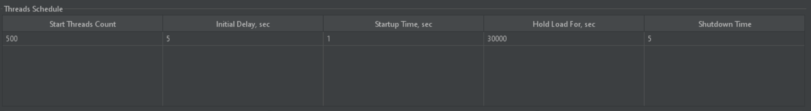
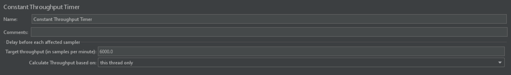
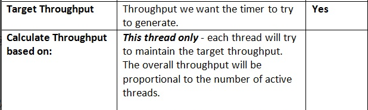

APACHE Jmeter
=====

[**공식 사이트**](https://jmeter.apache.org)

[**다운로드**](https://jmeter.apache.org/download_jmeter.cgi)

UltimateThreadGroup
=====

   - 동시 사용자 설정
   


   - Threads Schedule 예시
   
```
<?xml version="1.0" encoding="UTF-8"?>
<collectionProp name="ultimatethreadgroupdata">
   <collectionProp name="-1734936043">
      <stringProp name="49">500</stringProp><!-- Start Threads Count : "500"개의 동시 사용자 수 -->
      <stringProp name="53">5</stringProp><!-- Initial Delay, sec : "5"초 초기 지연 -->
      <stringProp name="49">1</stringProp><!-- Startup Time, sec : "1"초 동안 단계적으로 동시 사용자 증가 -->
      <stringProp name="48577203">30000</stringProp><!-- Hold Load For, sec : "500"분 동안 유지 -->
      <stringProp name="53">5</stringProp><!-- Shutdown Time : "5"초 동안 단계적으로 동시 사용자 제거 -->
   </collectionProp>
</collectionProp>
```

ConstantThroughputTimer
=====

   - 분당 요청 수 설정



   - Throughput 설명



   - Throughput 예시

```
<?xml version="1.0" encoding="UTF-8"?>
<ConstantThroughputTimer guiclass="TestBeanGUI" testclass="ConstantThroughputTimer" testname="Constant Throughput Timer" enabled="true">
   <intProp name="calcMode">0</intProp>
   <doubleProp>
      <name>throughput</name>
      <value>6000.0</value><!-- 분단위, 초당 100개를 의미 -->
      <savedValue>0.0</savedValue>
   </doubleProp>
</ConstantThroughputTimer>
```

CLI Mode
=====

   - 파라미터

| command options | description |
| ---: | :--- |
| -n | This specifies JMeter is to run in cli mode |
| -t | [name of JMX file that contains the Test Plan]. |
| -l | [name of JTL file to log sample results to]. |

   - 예시

```
#!/bin/sh
export CUR_DATE=`date +%Y%m%d_%H%M%S`
../bin/jmeter -n -t ./jmx/PRJ_TEST.jmx -l ./log/${CUR_DATE}_PRJ_TEST.log
```
