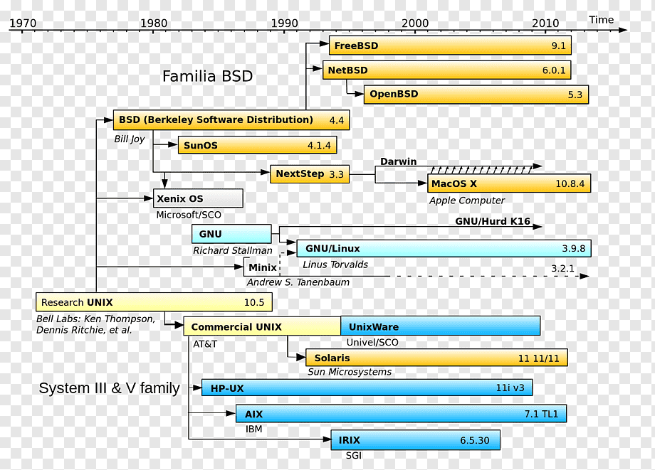

UNIX Families
=====

LINUX Families
=====

Linux 배포본 솔루션업체
=====

- **Red Hat** (https://www.redhat.com)

	미국 기반의 Linux 대표기업이라 할 수 있습니다. 오픈소스 비즈니스를 하는 기업 중 가장 성공한 기업이라 할 수 있습니다. 2012년에는 오픈소스 기업으로는 처음으로 매출 1조원을 기록하기도 했습니다. 전세계적으로 엔터프라이즈 서버 환경에서 점유율이 높은 Red Hat Enterprise Linux와 클라우드 관련 솔루션을 판매하고 있습니다. 2018년 IBM이 40조원에 인수하였고, 5분기 연속 역성장 후 지난해 4분기 시장 예상치를 상회하는 매출액을 기록하며 Red Hat과의 시너지에 대한 기대감을 높이고 있습니다.

- **CentOS** (https://www.centos.org)

	CentOS는 회사가 아니라 오픈소스 프로젝트이며, Red Hat Enterprise Linux(RHEL)의 소스코드를 재빌드하여 무료로 사용할 수 있는 Linux 배포본 프로젝트입니다. 2014년 Red Hat이 CentOS 프로젝트를 흡수했습니다. CentOS 프로젝트의 핵심개발자들을 채용하고, RHEL 발표 후 전보다 짧은 시간 내 CentOS 버전이 출시될 수 있도록 하고 있습니다.

- **Oracle** (https://www.oracle.com/linux)

	2006년부터 RHEL의 소스코드를 재빌드하고 리브랜딩하여 Oracle Linux를 배포하고 있습니다. Oracle Exadata, Oracle Databse 등의 Oracle Engineered Systems에서 주로 사용되고 있습니다. 매번 발표하는 패치를 별도의 Subscription 없이도 다운로드받을 수 있고, 저렴한 Subscription 비용과 각 버전에 대한 10년 주기의 Life Cycle을 보장하는 등 Red Hat과의 차별점을 부각시키기 위해 노력하고 있습니다.

- **SUSE** (https://www.suse.com)

	유럽에서 강세를 보이는 독일 기반의 Linux 배포본 업체입니다. SAP와의 협업을 통해 SAP 솔루션의 높은 점유율을 가지는 SUSE Linux Enterprise Server와 Kubernetes 기반의 클라우드 애플리케이션 플랫폼 솔루션을 판매하고 있습니다. 2003년 Novell로 인수합병, 2010년 The Attachmate Group이 Novell을 인수, 2014년 Micro Focus와 합병, 2018년 SUSE Linux EQT 사모펀드에 매각. SUSE는 그 동안 굴곡이 정말 많았습니다. 이제는 독립회사로서 다시 유럽의 강자가 되기 위한 준비를 하고 있는 듯 합니다.

- **Canonical** (https://canonical.com)

	Ubuntu 개발자인 마크 셔틀워스(Mark Richard Shuttleworth)가 Ubuntu의 보급을 위해 세운 회사입니다. Debian 기반의 배포본이며, 현재 개발자들이 가장 많이 사용하는 Linux 배포본으로 자리잡았습니다. 개발자들이 많이 사용하고 있기 때문에 상당수의 오픈소스 플랫폼들이 Ubuntu 기반에서 개발되거나 최적화되어 있습니다.

