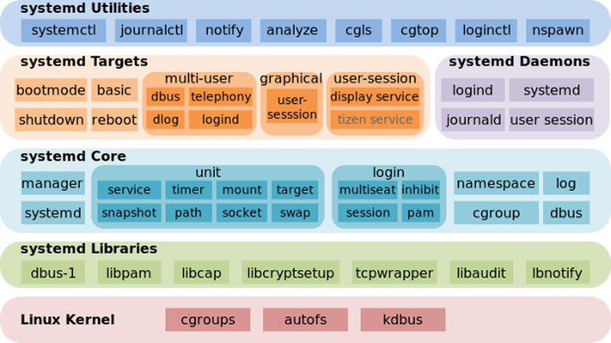

LINUX systemd
=====

   - Systemd 는 부팅과정에서 최초로 실행되는 프로세스이며 리눅스 시스템 전체를 움직하게 하는 프로세스이다.

   - 구조
      
      

구분
=====

   - 전역 systemd 영역 (배포판의 패키지를 설치할 경우에 사용)
      - /usr/lib/systemd
      - /lib/systemd
   - 커스터마이징 전역 systemd 영역 (별도 설치한 데몬 프로그램에 사용)
      - /etc/systemd
   - 사용자 systemd 영역 (사용자가 자신만의 systemd를 운영하고자 한다면 사용)
      - ~/.config/systemd/user

예제#1
=====

   - "/etc/systemd/system" 디렉토리에 "tomcat.service" **서비스** 파일 생성

      ```
      $ cd /etc/systemd/system
      $ vi /etc/systemd/system/tomcat.service
      ```

   - **서비스** 내용을 입력 한 후 저장 (/etc/systemd/system/tomcat.service)

      ```
      [Unit]
      Description=tomcat 9
      After=network.target syslog.target
      
      [Service]
      Type=forking
      Environment="JAVA_HOME=자바경로"
      Environment="CATALINA_HOME=톰캣경로"
      User=tomcat
      Group=tomcat
      ExecStart=톰캣경로/bin/startup.sh
      ExecStop=톰캣경로/bin/shutdown.sh
      
      [Install]
      WantedBy=multi-user.target
      ```

   - 서비스를 등록하기 위해서는 **서비스 활성화** 실행

예제#2
=====

   - **서비스** 내용을 입력 한 후 저장 (/lib/systemd/system/rc-local.service)

      ```
      # This file is part of systemd.
      #
      # systemd is free software; you can redistribute it and/or modify it
      # under the terms of the GNU Lesser General Public License as published by
      # the Free Software Foundation; either version 2.1 of the License, or
      # (at your option) any later version.
      #
      # This unit gets pulled automatically into multi-user.target by
      # systemd-rc-local-generator if /etc/rc.d/rc.local is executable.
      
      [Unit]
      Description=/etc/rc.d/rc.local Compatibility
      ConditionFileIsExecutable=/etc/rc.d/rc.local
      After=network.target
      
      [Service]
      Type=forking
      ExecStart=/etc/rc.d/rc.local start
      TimeoutSec=0
      RemainAfterExit=yes
      
      [Install]
      WantedBy=multi-user.target
      ```

   - 서비스를 등록하기 위해서는 **서비스 활성화** 실행

설명
=====

   - 주요 설정 항목

   | 항목 | 설명 |
   | ---: | :--- |
   | Environment | .bash_profile 설정은 bash shell 에 접속시 사용될 뿐, OS 구동 시 사용되는 systemd 에서는 **Enviroment**를 사용함.
   | WorkingDirectory | 프로세스의 작업 디렉토리를 지정함. 특정 디렉토리에서 실행해야하는 프로세스에서 필요함. 별도의 지정이 없으면 **"/"** 를 작업 디렉토리로 사용함.
   | After | 해당 라인에 등록되어 있는 서비스가 우선 실행되어야 현재 서비스가 실행됨. |
   | SuccessExitStatus | 성공으로 판단할 시그널을 설정함. |
   | RemainAfterExit | 실행 이후 해당 실행이 종료되더라도 RemainAfterExit=yes 옵션을 통해 유닛을 활성화 상태로 간주할 수 있음. |
   | TimeoutStartSec | 시작 대기 시간 (default는 90초 이고, 0으로 설정하면 무한정 기다림) |
   | TimeoutStopSec | 중지 대기 시간 (default는 90초 이고, 0으로 설정하면 무한정 기다림) |
   | TimeoutSec | "TimeoutStartSec"와 "TimeoutStopSec"을 동시에 설정함. |
   | multi-user.target | SysV **runlevel 3**와 동일한 의미임. |

   - runlevel과 target 비교

   | runlevel | target |
   | ---: | :--- |
   | runlevel 0 정지(시스템 종료) | poweroff.target
   | runlevel 1 단일 사용자(single user) | rescue.target |
   | runlevel 2,3,4 다중 사용자(multiuser) | multiuser.target |
   | runlevel 5 다중 사용자 + GUI | graphical.target |
   | runlevel 6 재기동 | reboot.target |

명령어
=====

   - **시스템** 시작 시 자동으로 시작 할 수 있도록 **서비스 활성화** 필요

   - 명령어 예제

      - 서비스 상태

      ```
      $ systemctl status tomcat.service
      ```

      - 서비스 비활성화

      ```
      $ systemctl disable tomcat.service
      ```

      - 서비스 활성화

      ```
      $ systemctl enable tomcat.service
      ```

      - 서비스 실행

      ```
      $ systemctl start tomcat.service
      ```

      - 서비스 종료

      ```
      $ systemctl stop tomcat.service
      ```

      - 서비스 내용 변경 시

      ```
      $ systemctl daemon-reload
      ```

      - 모든 서비스 조회

      ```
      $ systemctl list-unit-files
      ```

      - 자세한 오류 및 기록 확인

      ```
      $ journalctl | grep tomcat.service
      ```
