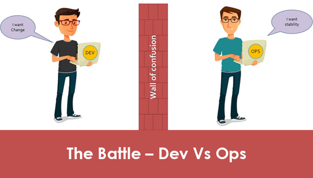
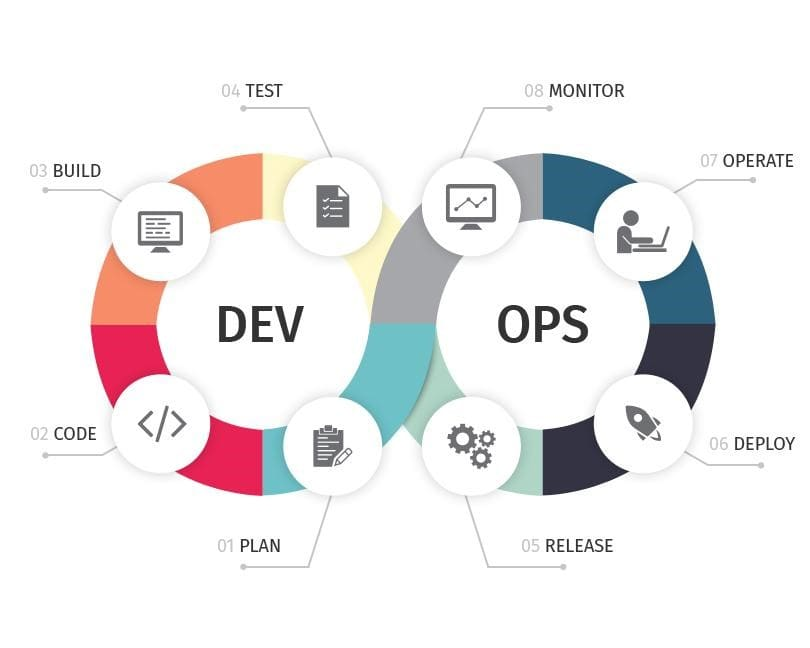
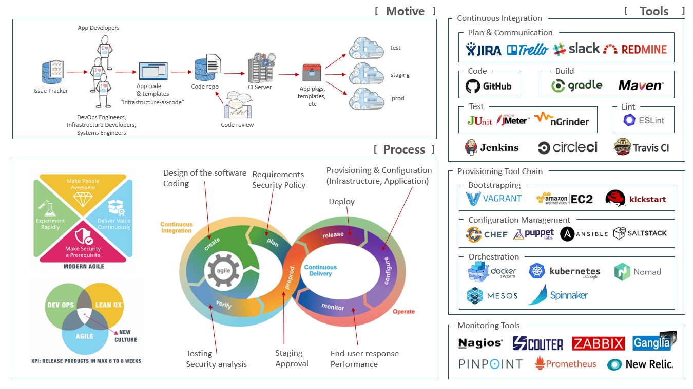

개념
=====
**데브옵스**(DevOps)는 소프트웨어의 **개발**(Development)과 **운영**(Operations)의 합성어로서, **소통, 협업 및 통합**을 강조하는 개발 환경이나 문화를 말한다. 데브옵스는 소프트웨어 개발조직과 운영조직간의 **상호 의존적** 대응이며,  서비스를 빠른 시간에 개발 및 배포하는 것을 목적으로 한다.

배경
=====

1. 운영 이관 및 신규 기능 배포
1. 운영 문제 원인 분석 및 문제 해결  
1. 개발팀과 운영팀간의 **의사 소통 및 협업**

목적
=====
**데브옵스**(DevOps)의 목적은 개선된 **배포 파이프라인**을 통한 안정적인 **배치(deployment)** 환경을 포함한다.

1. 서비스 배포까지 걸리는 시간 단축
1. 서비스 배포 자동화
1. 어플리케이션 테스트 수행 및 모니터링
1. 문제 발견 시 빠른 복구 시간

툴체인
=====

1. 계획 - 목적을 수행하기 앞서 방법이나 절차 등을 미리 생각하여 계획.
1. 코드 - 코드 개발 및 검토, 버전 관리 도구, 코드 병합
1. 빌드 - 지속적 통합(CI) 도구, 빌드 상태
1. 테스트 - 테스트 및 결과가 성능을 결정
1. 패키지 - 애플리케이션 디플로이 이전 단계
1. 릴리스 - 변경사항 관리, 릴리스 승인, 릴리스 자동화
1. 구성 - 인프라스트럭처 구성 및 관리, IaC(Infrastructure as Code) 도구
1. 모니터링 - 애플리케이션 성능 모니터링, 최종 사용자 경험.

아키덱처
=====

   - 구성 요소

| 구분 | 설명 |
| :---: | :--- |
| **동기(Motive)** | Dev와 Ops 간에 서로 다른 목표때문에 갈등이 발생한다. |
| | (Dev는 고객에게 제공한 변경을 빠르게 보기를 원하나, Ops는 안정성에 관심이 많음) |
| | 따라서, 공유된 목적에 대한 **합의, Ownership, 가치 공유** 등이 중요하다. |
| **프로세스(Process)** | 소프트웨어를 어떻게 개발하고 배포할지 정의하는 프로세스가 툴보다 중요하다. |
| | 개발에서 운영에 전달하는 속도를 관리하기 위한 프로세스를 만들고 최적화하여야 한다. |
| **도구(Tools)** | DevOps의 능률은 자동화에 의존하며, |
| | 사용하는 도구는 `version control`, `build`, `package`, `deployment`, `configuration` 등이 있다. |

   - 측정 지표 요소 (Cycle Time, 아이디어에서 서비스 오픈까지 걸리는 시간 외..)

| 구분 | 설명 |
| :---: | :--- |
| 측정지표 관점 | quality, testing 등 |
| 프로세스 관점 | **협업**, **빠른 피드백**을 위한 흐름, 전체적인 프로세스 구성 |
| 기술 관점 | 자동화를 통한 빠른 피드백, **인프라를 코드로 관리하기**와 같은 자동화된 릴리즈 |
