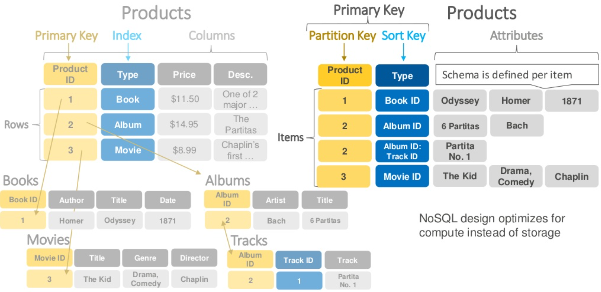
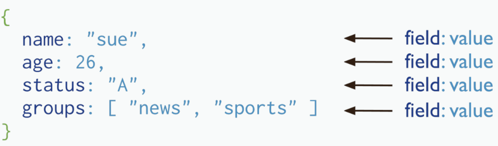
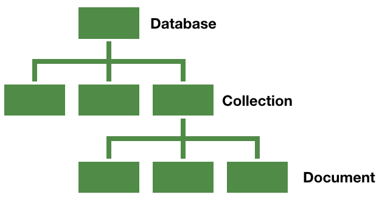
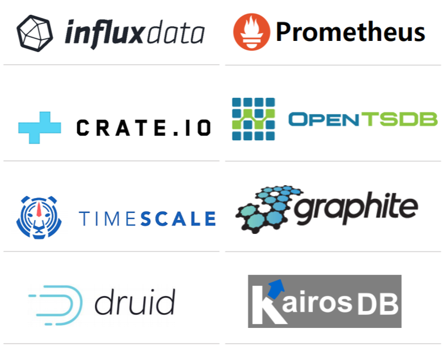
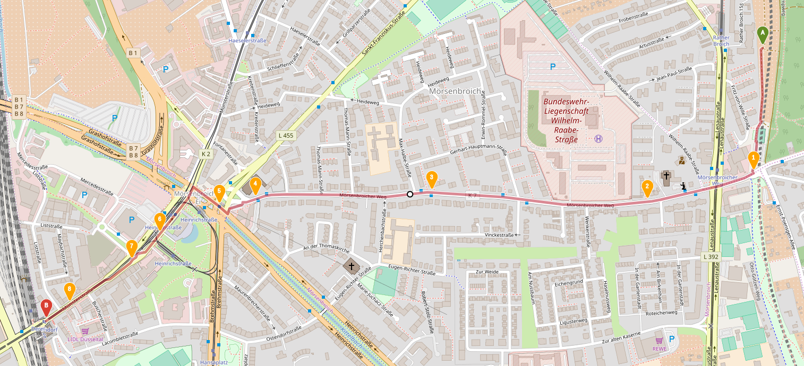
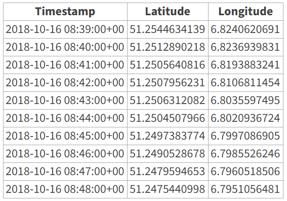

NoSQL
=====
 - NoSQL [Not Only SQL] 
   - 스키마가 없다.
   - NoSQL은 가용성과 확장성이 높고, 고성능에 최적화된 비관계형 데이터베이스이다.
 - NoSQL 데이터베이스 타입
   - Key-value data stores
   - Document stores
   - Wide-column stores
   - Graph stores
 - NoSQL 데이터베이스 장점
   - Scalability
   - Performance
   - High Availability
   - Global Availability
   - Flexible Data Modeling

`DynamoDB`
-----
 - Key-value data stores for NoSQL
 - 테이블
   - 스키마가 없음. 데이터 형식을 미리 정의할 필요가 없음.
   - 테이블 크기 제한 없음.
 - 항목
   - 최대 항목 크기가 400 KB를 초과할 수 없음. 속성 이름은 크기 제한에 포함함.
 - 장점
   - 클러스터링, 백업정책, 성능향상, 다중리젼 지원함.
   - AWS에서 운영하는 serverless 플랫폼의 DB이며, AWS support로 운영시 장애 해결 가능함.
 - 단점
   - ORM 지원 라이브러리가 없음.
   - 분량이 큰 REST API 서비스를 만들기 위해서 nosql 쿼리 코드 관리 전략이 필수 요소임.
   - 대부분의 nosql들이 가지고 있는 단점으로 여러 쿼리에 대해 일관성, 원자성을 보장하지 않음. No Transaction 극복 전략이 필요함.
   - 러닝커브 큼, 기존에 알고있던 RDBMS와 MongoDB의 혼종으로만 생각하면 안됨.

 - RDBMS와 DynamoDB 비교

   

`MongoDB`
-----
 - Document stores for NoSQL
 - MongoDB는 C++로 작성된 오픈소스 문서 지향적(Document-Oriented)임. Cross-platform 데이터베이스이며 뛰어난 확장성과 성능을 자랑함.
 - mongo Shell: https://docs.mongodb.com/manual/reference/method/

 - RDBMS와 MongoDB 비교
 
| RDBMS | MongoDB |
| ---: | :--- |
| Table, View | Collection |
| Row, Record | Document |
| Column | Field |
| Index | Index |
| Join | Embedded Document |
| Foreign key | Reference |
| Partition | Shard |

 - Document 예시

   

 - 구조

   

Time Series DB
=====
 - 데이터 특성 (정형/비정형)
   - 시간 흐름에 따라 발생하는 로그, 이벤트 정보

 - 데이터 입력 위주
   - 데이터 업데이트 없고 과거 데이터순 삭제

 - ID, 상태 정보 포함
   - 해당 데이터 소소의 ID 및 상태 정보를 반드시 포함

 - 시간 데이터
   - 시간을 기준으로 각종 통계, 분석 수행

 - 종류

   

 - 시각화

   

 - 데이터

   
