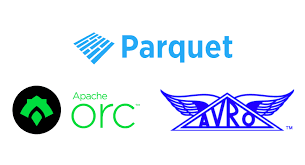

## Data Storage Formats

## Usage domains:
   - APIs: `Protobuf`, `Thrift`, `Avro`
   - storage for data analysis (Hive, Impala, ...): `ORC`, `Parquet`, `Avro`
   - data storage: sequence files, compressed text (gzip, bzip2, lz4), `Avro`

## Protobuf
`프로토콜 버퍼(Protocol Buffers)`는 구조화된 데이터를 직렬화하는 방식이다. 유선이나 데이터 저장을 목적으로 서로 통신할 프로그램을 개발할 때 유용하다.

   - Google's protocol buffers
   - defines one record serialization
   - suitable for data transportation
   - good for optional attributes - message contains just data for present attributes
   - attributes are identified by id
   - schema evolution
   - similar: capnproto

### Using java
   - https://developers.google.com/protocol-buffers/docs/reference/java-generated

## Thrift
`스리프트(Thrift)`는 인터페이스 정의 언어이자 이진 통신 프로토콜로서 수많은 언어를 위한 서비스의 정의 및 생성에 사용된다.
원격 프로시저 호출(RPC) 프레임워크를 형성하며 페이스북에서 "스케일링이 가능한 언어 간 서비스 개발"을 위해 개발된 것이다. 

   - developed in Facebook, newer than Protobuf
   - slightly slower and bigger than Protobuf
   - more complex data types than Protobuf
   - RPC implementation
   - schema evolution

### Using java
   - https://thrift.apache.org/tutorial/java.html

## Avro
`아브로(Avro)`는 아파치의 하둡 프로젝트에서 개발된 원격 프로시저 호출(RPC) 및 데이터 직렬화 프레임워크이다. 자료형과 프로토콜 정의를 위해 JSON을 사용하며 콤팩트 바이너리 포맷으로 데이터를 직렬화한다. 
주 용도는 아파치 하둡에서 클라이언트 to 하둡 서비스에 대해 영구 데이터를 위한 직렬화 포맷과 하둡 노드 간 통신을 위한 와이어 포맷을 둘 다 제공하는 것이다.
`Thrift`나 `Protobuf`와 비슷하지만 스키마 변경이 발생할 때(정적 자료형 언어를 위해 요구되지 않을 경우) 코드 생성 프로그램의 실행을 요구하지 않는다.
아파치 스파크 SQL은 데이터 소스로서 아브로에 접근할 수 있다.

   - row-based
   - defines record and also container serialization
   - schema evolution
   - IDL uses JSON
   - splittable in Hadoop
   - data corruption of container: sync markers between data blocks => after corruption, all records to the end of the particular block will be lost
   - good for complex tables with strings
   - schema in the header => no need of external schema
   - rows can be appended

### Using java
   - https://www.baeldung.com/java-apache-avro
   - https://docs.spring.io/spring-hadoop/docs/current/reference/html/springandhadoop-store.html#using-avro
   - http://avro.apache.org/docs/current/gettingstartedjava.html

## Parquet + ORC
`파케이(Parquet)`는 중첩된 데이터를 효율적으로 저장할 수 있는 컬럼 기준 저장 포맷
컬럼 기준 포맷은 파일 크기와 쿼리 성능 측면에 모두 효율성이 높음
동일한 컬럼 값을 나란히 모아서 저장 –> 인코딩 효율이 높음
일반적으로 행 기반 포맷에 비해 파일 사이즈가 작음. 쿼리 성능 높음

`ORC` 파일 포맷은 하이브의 처리 속도를 높이기 위하여 개발 되었다. 
하이브가 처음에 사용한 TextFile, SequenceFile 포맷의 처리속도를 높이기 위하여 `RCFile` 포맷이 개발 되었다. 
`RCFile` 포맷은 각 컬럼을 하나의 파일 묶음으로 만들었기 때문에 각 노드에 분산 처리된 데이터를 모으는 비용이 많이 들어가게 된다. 
이를 극복하기 위하여 제안된 것이 ORC 파일 포맷이다.
`ORC` 포맷은 칼럼 단위로 데이터를 기록하고, 인덱스를 기록하여 컬럼에 바로 접근할 수 있기 때문에 속도가 빨라진다. 

   - column-based
   - great when reading subset of attributes
   - schema in the footer
   - splittable in Hadoop
   - stores statistics of columns (min, max, count); ORC has indexes
   - hierarchical data structures
   - write-once formats

### Using java
   - https://docs.spring.io/spring-hadoop/docs/current/reference/html/springandhadoop-store.html#using-parquet
   - https://orc.apache.org/docs/core-java.html

