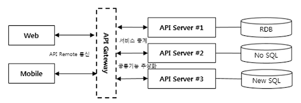
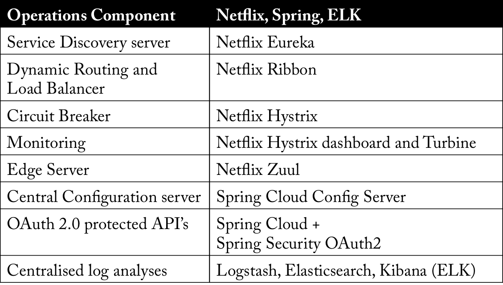
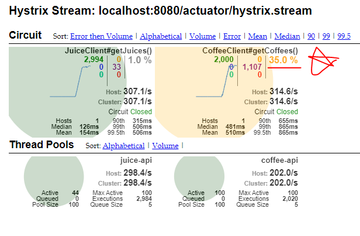
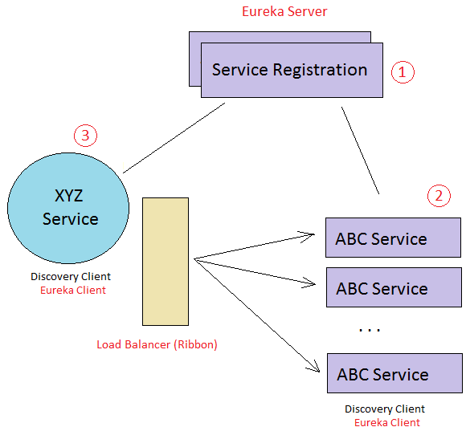
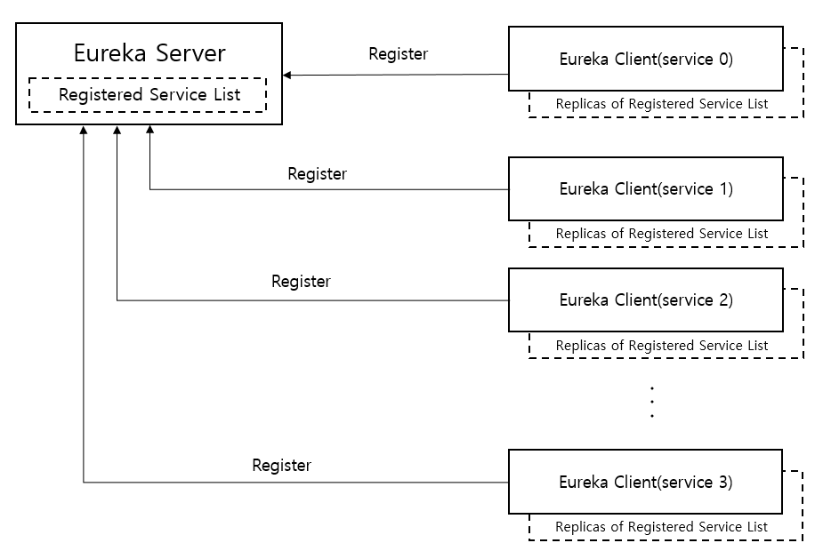
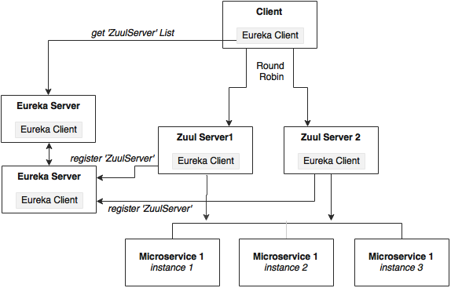
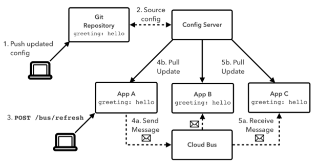
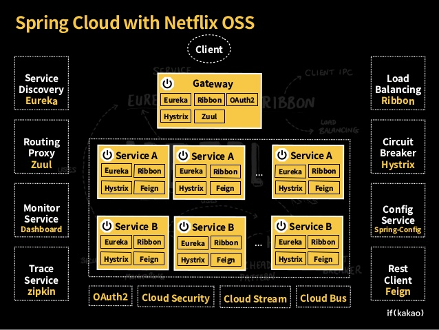
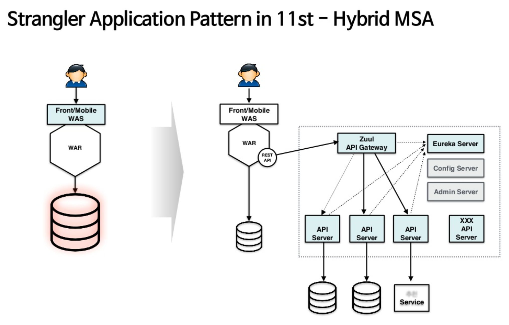
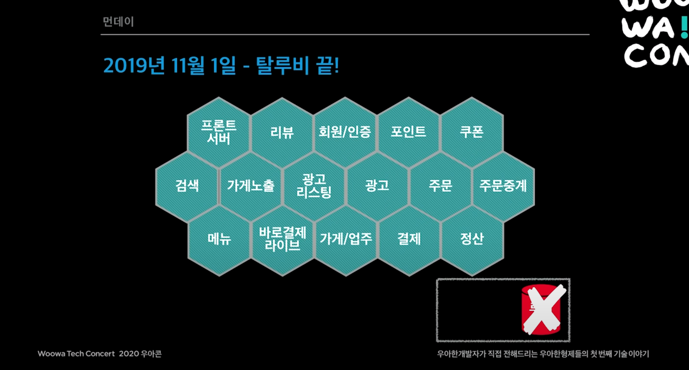

개념
=====
잘 정의된 **API**를 통해 통신하는 **소규모의 독립적인 서비스**로 구성


MSA
=====
**마이크로 서비스 아키텍처**

1. Hystrix (Circuit Breaker)
1. Ribbon (Client Load Balancer)
1. Eureka (Dynamic Service Discovery)
1. Spring Cloud Feign
1. Zuul (API Gateway)
1. Configuration Server

## 구성



## 컴포넌트



## 1. Hystrix (Circuit Breaker)
- 다른 서비스의 실패에 따른 내 서비스의 지연 또는 실패 방지
- 연쇄 실패 방지
- 빠르게 실패하고 빠르게 복구

## Circuit Breaker
- 일시적인 외부 시스템 장애 또는 예상치 못한 시스템 장애가 지속적으로 반복되는 것을 방지하는 로직을 캡슐화하는 데 사용하는 디자인 패턴

## Circuit Open/Close
- 실행된 결과의 성공 / 실패 여부를 기록하고 **통계**를 낸다.



## CommandKey (설정)
```
hystrix: 
  command:
    default:
      execution.isolation.thread.timeoutInMilliseconds: 10000
      metrics.rollingStats.timeInMilliseconds: 10000
      circuitBreaker:
        requestVolumeThreshold: 1000
        errorThresholdPercentage: 50
        sleepWindowInMilliseconds: 5000
    'ClassName#MethodName(Object,String,Integer)':
      execution.isolation.thread.timeoutInMilliseconds: 10000
      metrics.rollingStats.timeInMilliseconds: 10000
      circuitBreaker:
        requestVolumeThreshold: 1000
        errorThresholdPercentage: 50
        sleepWindowInMilliseconds: 5000
```

## Threadpool (설정)
```
hystrix: 
  threadpool: 
    default:
      allowMaximumSizeToDivergeFromCoreSize: true
      coreSize: 100
      maximumSize: 300
    'ClassName#MethodName(Object,String,Integer)':
      allowMaximumSizeToDivergeFromCoreSize: true
      coreSize: 100
      maximumSize: 300
```

## Fallback
- Circuit이 오픈된 경우 혹은 Exception이 발생할 경우 대신 호출될 **Method**

## Timeout
- 해당 메소드가 설정된 시간안에 끝나지 않으면 **Timeout**으로 인한 Exception 자동 발생


## 2. Ribbon (Client Load Balancer)
- 구성



## Client Load Balancer

## ServerList
- Load Balancing의 대상이 될 서버 목록 결정

## IRule
- Simple Round Robbin
- Response Time Weighted (서버별 응답 시간에 따라 트래픽 조절)
- Avaliability Filter (최근 3회 연속 에러를 발생시킨 서버를 대상에서 제외)

## IPing
- 특정 URL 호출
- Discovery 기반

## Retry
- 실패 시 정해진 횟수 만큼 재시도

## 참고 (설정)
```
ServiceName:
  ribbon:
    eureka:
      enabled: false
    listOfServers: http://localhost:80
    ConnectTimeout: 5000
    ReadTimeout: 5000
    MaxAutoRetries: 1
    MaxAutoRetriesNextServer: 1
```


## 3. Eureka (Dynamic Service Discovery)
- 구성


## Dynamic Service Discovery
- 수많은 API 서버의 IP, Port를 Caller에게 전달하는 방법
- 서버가 새롭게 투입되면 목록에 자동으로 추가, 서버가 종료되면 목록에서 자동으로 삭제

## Eureka Server
- 서버 목록 테이블 저장

## Eureka Client
- Eureka를 사용할 모든 Server에 **Eureka Client** 탑재


## 4. Spring Cloud Feign
- 공식 문서  
https://cloud.spring.io/spring-cloud-static/spring-cloud-openfeign/2.1.0.RELEASE/single/spring-cloud-openfeign.html
- Circuit Breaker 지원
- Eureka 및 Ribbon 지원
- Declarative HTTP 호출 지원

## Declarative Http Client
- 인터페이스 선언만으로 Http Client 구현물을 생성해 줌.

## Feign + Hystrix, Ribbon, Eureka
- Feign의 강점은 **Hystrix + Ribbon + Eureka**와 통합되어 있다는 점.

## 참고 (설정)
```
feign:
  hystrix:
    enabled: true
  client:
    config:
      default:
        connectTimeout: 5000
        readTimeout: 5000
        loggerLevel: full
  httpclient.disableSslValidation: true
  httpclient.enabled: false
  okhttp.enabled: true
```


## 5. Zuul (API Gateway)
- 모든 API 서버들에 들어갈 공통 기능을 구현할 곳과 전체 API 호출을 통제할 곳이 필요

- 내부 구성


- 외부 구성


## Zuul + Hystrix, Ribbon, Eureka
- Zuul의 강점은 **Hystrix + Ribbon + Eureka**와 통합되어 있다는 점.


## 6. Configuration Server
- 어플리케이션의 환경설정 정보를 어플리케이션과 분리해 외부의 **Config 서버**를 통해 관리
- 어플리케이션의 환경설정 정보를 **GIT** 또는 **SVN**에 저장
- **Config 서버**는 **GIT** 서버에 접근해서 환경설정 정보 획득



## 참고 (설정)
```
spring:
  cloud:
    config:
      server:
        git:
          # uri: https://github.com/myapp/config # remote git
          uri: file:///home/user/myapp/config # local git
```

## 사례
## 넷플릭스
- 생존 문제
- 2008년부터 7년간 MSA로 전환 경험, 내부 서비스를 Netflix OSS로 공개

## 카카오


   - 광고 플랫폼
   - https://www.slideshare.net/ifkakao/msa-api-gateway
   
## SK 플래닛 11번가


   - 기존 Monolithic 시스템을 Spring Cloud 기반의 수십 개의 MSA로 분리 및 전환
   - https://github.com/yongsungyoon/spring-cloud-workshop
   
## 우아한 형제들


   - 2019년 MSA로 분리 및 전환 완료 
   - https://www.youtube.com/watch?v=BnS6343GTkY&ab_channel=%EC%9A%B0%EC%95%84%ED%95%9CTech
   - 발표 요점
      - 2015년 5만 ~ 2020년 200만
      - **CQRS** 아키텍처 구성 
      - 데이터 저장소
         - 조회 (고성능) : `AWS Dynamo DB`, MongoDB, Redis
         - 명령 (안정성) : `AWS Aurora DB`
      - 이벤트 기반 아키텍처 구성
         - `AWS SNS`
         - `AWS SQS`
      - **MSA** 아키텍처 구성
         - 각 시스템은 API 또는 이벤트 방식으로 연동
