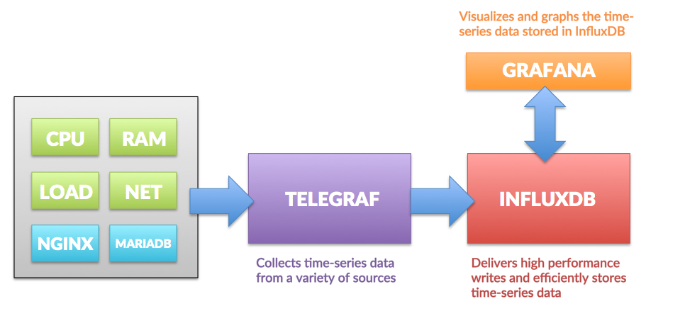
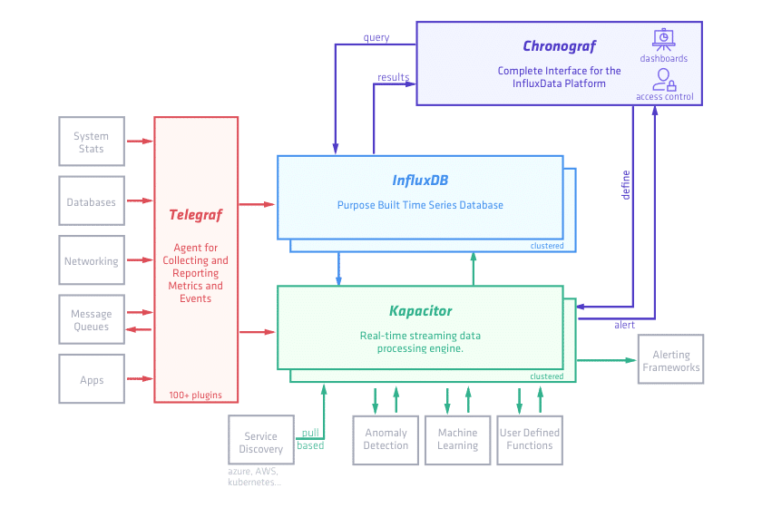

개념
=====

**Collecting**, **Processing**, **Aggregating**, and **Writing metrics**

telegraf 가이드
=====
[**GITHUB**](https://github.com/influxdata/telegraf)

TIG
=====

 

# 설명

 

 - `수집기` Telegraf는 Go 언어로 쓰여진 agent이다. 
 - 주로 수집, 처리, 종합처리, 메트릭에 쓰기 위해 사용된다. 작은 메모리를 사용하면서 개발자들이 메트릭을 수집할 수 있도록 지원한다.
 - `Input` Plugin, `Processor` Plugin, `Aggregator` Plugin, `Output` Plugin으로 구성된다.

 

 - `시계열 저장소` InfluxDB는 인플럭스 데이터가 개발한 오픈 소스 시계열 데이터베이스이다. 
 - Go 언어로 작성되었으며 운영 모니터링, 애플리케이션 매트릭스, 사물인터넷 센서 데이터, 실시간 분석 등 분야에서 시계열 데이터의 고속, 고가용 저장 및 검색에 최적화되어 있다.
 
 

 - `시각화 툴` Grafana는 다중 플랫폼 오픈 소스 분석 및 대화 형 시각화 웹 애플리케이션이다. 
 - 지원되는 데이터 소스에 연결되면 웹에 대한 차트, 그래프 및 경고를 제공한다. 
 
 

TICK
=====

 

# 설명

 

 - `수집기` Telegraf는 Go 언어로 쓰여진 agent이다. 
 - 주로 수집, 처리, 종합처리, 메트릭에 쓰기 위해 사용된다. 작은 메모리를 사용하면서 개발자들이 메트릭을 수집할 수 있도록 지원한다.
 - Input Plugin, Processor Plugin, Aggregator Plugin, Output Plugin으로 구성된다.

 

 - `시계열 저장소` InfluxDB는 인플럭스 데이터가 개발한 오픈 소스 시계열 데이터베이스이다. 
 - Go 언어로 작성되었으며 운영 모니터링, 애플리케이션 매트릭스, 사물인터넷 센서 데이터, 실시간 분석 등 분야에서 시계열 데이터의 고속, 고가용 저장 및 검색에 최적화되어 있다.

 

 - `시각화 툴` Chronograf는 플랫폼의 관리 사용자 인터페이스 및 시각화 엔진이다. 
 - 인프라 스트럭처에 대한 모니터링 및 경고 기능을 쉽게 설정하고 유지 관리 할 수 ​​있다.

 

 - `원시데이터 처리 엔진`  Real-Time 스트리밍 데이터 전송 및 Alert을 제공한다.
