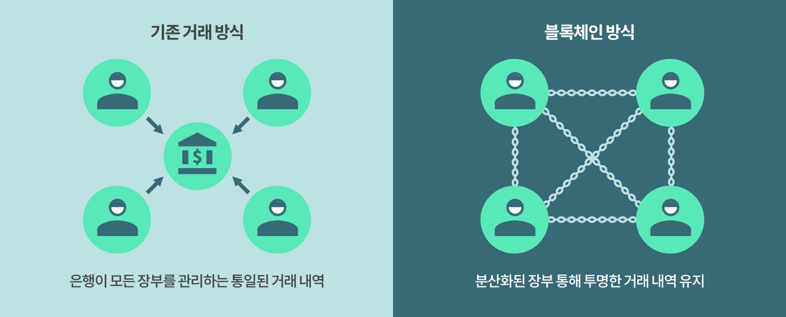
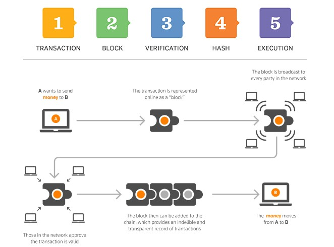
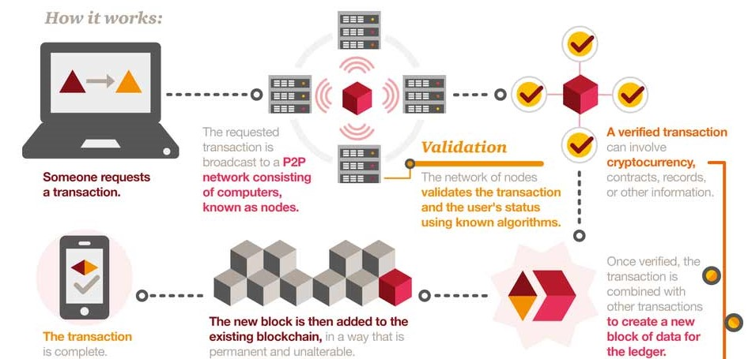
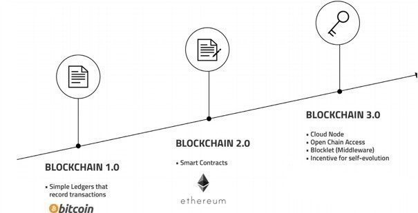
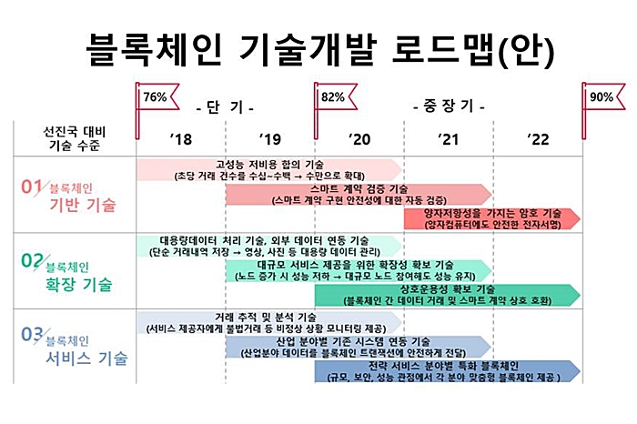

개념
=====

   - "**블록**"이라고 하는 데이터들을 P2P 방식 기반으로 생성된 "**체인**" **형태의 연결고리 기반** 분산 데이터 환경에 저장
   - 누구라도 임의로 수정할 수 없고, 누구나 변경의 결과를 열람할 수 있는 분산 컴퓨팅 기반의 원장 관리 기술
   - 분산 데이터 저장기술의 한 형태로, 지속적으로 변경되는 데이터를 모든 참여 노드에 기록
   - 분산 노드의 운영자에 의한 임의 조작은 불가능하도록 고안
   - **블록체인** 기술은 **비트코인**을 비롯한 대부분의 **암호화폐** 거래에 사용
   - **암호화폐**의 거래과정은 **탈중앙화**된 전자장부에 쓰이기 때문에 블록체인 소프트웨어를 실행하는 많은 사용자들의 각 컴퓨터에서 서버가 운영되어, 중앙에 존재하는 은행 없이 개인 간의 자유로운 거래가 가능

동작 방법
=====

버전
=====

사용예 - 가상 화폐
=====

명칭 | 분류 | 특징
:---:|:---:|:---
BTC | 1세대 | 코인거래소
Ethereum | 2세대 | **smart contract**, 코인거래소
_ | 3세대 | 현재는 과도기로, EOS, ADA, NEO, IOTA, Qtum, Boscoin 등 각축전
... | ...| ...
CBDC | 법정 디지털 화폐 | **중앙은행 발행**, 개인생활 추적 가능

사용예 - 메타버스 (metaverse)
=====

   - 블록체인 - 탈중앙, 투명성
   - 블록체인 기반의 **메타버스** 등장

로드맵
=====

