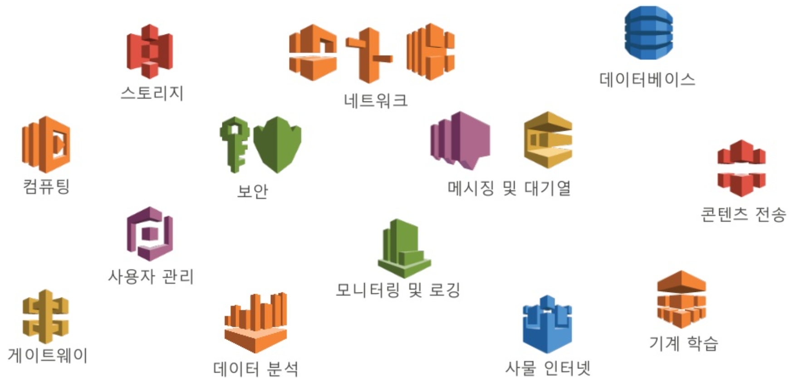
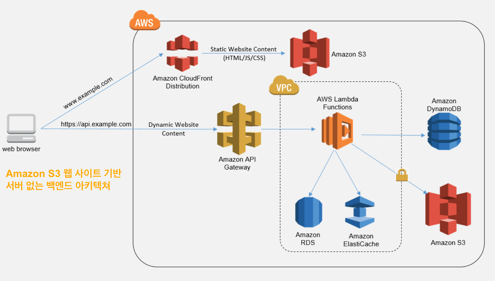
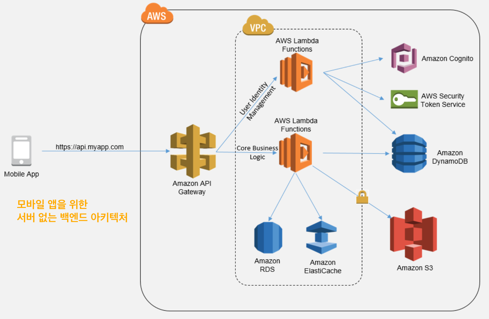

서버리스
=====

- 서버에 대한 고민 없이 애플리케이션 구축 및 작동
- BaaS (Backend as a Service) 혹은 FaaS (Function as a Service) 에 의존하여 작업을 처리

서버리스 장점 및 단점
=====

- 장점
1. 비용 효율적 - 사용자와 개발자는 서버 없는 컴퓨팅 플랫폼에서 코드가 실행되는 시간만 지불한다. 그들은 유휴 상태인 가상 머신에 대한 비용지불할 필요가 없다.
1. 구축하기 쉽다 - 개발자는 몇 주 또는 몇 달이 아닌 몇 시간 또는 며칠 만에 애플리케이션을 구현할 수 있다.
1. 자동 확장 - 코드가 실행되지 않을 때 클라우드 공급자가 스케일업 또는 스핀다운을 처리함
1. 개발자 생산성 향상 - 개발자는 서버 및 런타임을 다루는 대신 대부분의 시간을 앱 작성 및 개발로 보낼 수 있다.

- 단점
1. 벤더 잠금 - 서버 없는 서비스가 제공되는 방식이 벤더마다 다를 수 있으므로 클라우드 공급자를 전환하기가 어려울 수 있다.
1. 장기간 실행되는 애플리케이션에 효율적이지 않음 - 때로는 긴 작업을 사용하는 것이 가상 시스템이나 전용 서버에서 워크로드를 실행하는 것보다 훨씬 많은 비용이 소요될 수 있음.
1. 지연 시간 - 확장 가능한 서버 없는 플랫폼이 종종 콜드 스타트라고 알려진 기능이 처음으로 처리하는 데 걸리는 시간이 지연된다.
1. 디버깅은 더욱 어렵다 - 서버리스 인스턴스는 스핀을 증가시킬 때마다 자체 버전을 새로 생성하기 때문에 서버리스 기능을 디버깅하고 수정하는데 필요한 데이터를 수집하기 어렵다.

AWS의 수많은 서버리스 옵션
=====

AWS 기반 서버리스 아키텍처
=====

[출처] [**Amazon Web Services 한국 블로그**](https://aws.amazon.com/ko/blogs/korea/serverless-architecture-by-korean-developers/)

   - Amazon S3 웹 사이트를 위한 서버 없는 백엔드 아키텍처 예제
   
   

   - 모바일 앱을 위한 서버 없는 아키텍처 예제
   
   

   - 마이크로서비스를 위한 서버 없는 백엔드 아키텍처 예제
   
   
