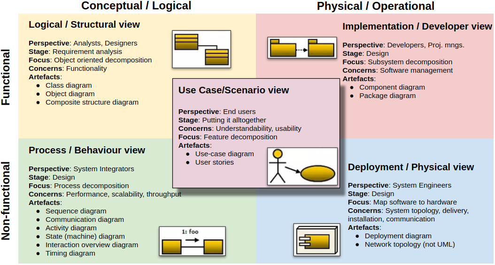

Documenting Software Architecture
=====

UML
-----

[**UML 가이드**](https://www.visual-paradigm.com/guide/)

4+1 Architectural view model
-----

1. Logical/Structural view
   - Concerns itself with the functionality that is provided by the system and how the code is designed to provide such functionality
   - Elements developed by developers. In object-oriented languages, these elements are classes and packages. The connection between elements is the connection between these classes and packages, including inheritance, association and dependency.
1. Implementation/Developer view
   - Portrays the static organisation of the code, the components, modules and packages
   - Generated by the build system module, JAR file, WAR file or executable file.
1. Process/Behaviour view
   - Focuses on the runtime behaviour of the system, how system processes communicate, concurrency, synchronisation, performance and so on
   - Run-time components. Each element is a process, and the connections between processes represent internal process communication.
1. Deployment/Physical view
   - Illustrates the physical organisation of the application, its about “what code runs in what hardware”
   - How the process is mapped to the machine. The elements of this view include machines and processes. The connection between the machines represents the network.
1. Use Case/Scenario view
   - The architecture as a whole is explained with the help of a few use cases, which are simply sequences of interactions. Part of the architecture evolves from such use cases.
