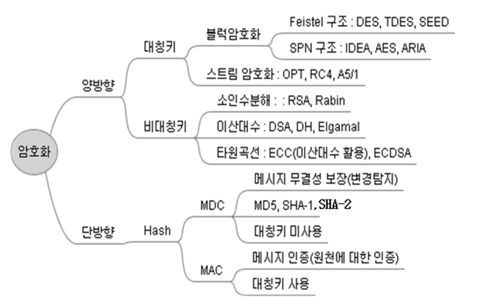
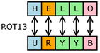
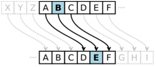
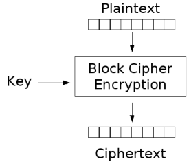
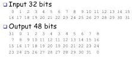
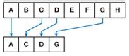
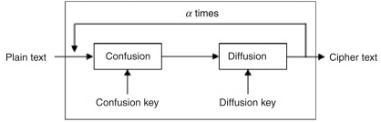

암호화 (Encryption)
=====

   - 종류
   
   

   - 원리
   
| 원리 | 개념도 | 설명 |
| :---: | :--- | :--- |
| 대체 (Substitution) |  | 글자 간 매칭, 표 이용 대체 |
| 치환 (Transposition) |  |  문자열 위치 변경, 서로 바꾸어 표현 |
| 블록 (Blocking) |  | 블록으로 구성, 단체 암호화 |
| 확장 (Expansion) |  | 무의미한 문자 삽입 |
| 압축 (Compaction) |  | 문자열 중 일부문자 삭제 |
| 혼돈과 확산 (Confusion & Diffusion) |  | 상관관계 숨김, 암호특성 전파 |

   - 특징
   
| 특징 | 적용 기술 | 설명 |
| :---: | :--- | :--- |
| 인증 | X.509 | 사용자 신원 확인 가능 |
| 기밀성| DES, AES, SEED | 송/수신자 외 내용 열람 불가 |
| 무결성 | MD5, SHA-2 | 정보 조작, 임의 변경 불가 |
| 부인방지 | 전자서명, PKI| 송수신 사실 부인 불가 |
| 가용성 | 암호/인증 | 요구 시 서비스 제공 |
