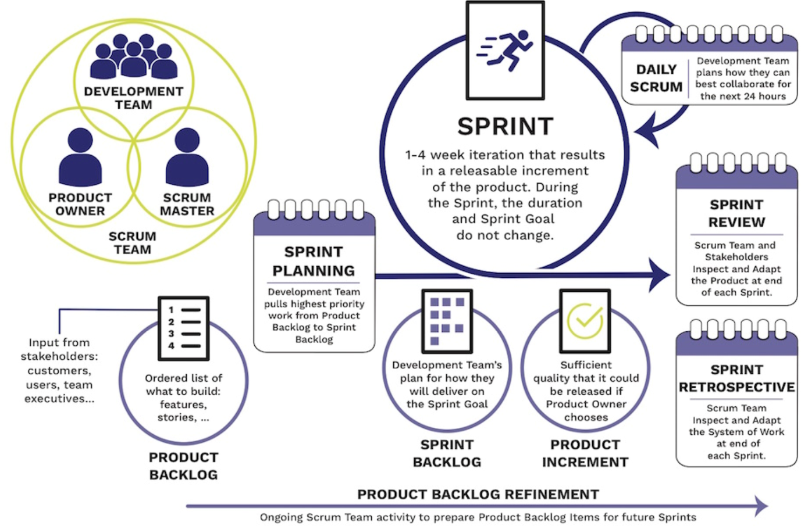
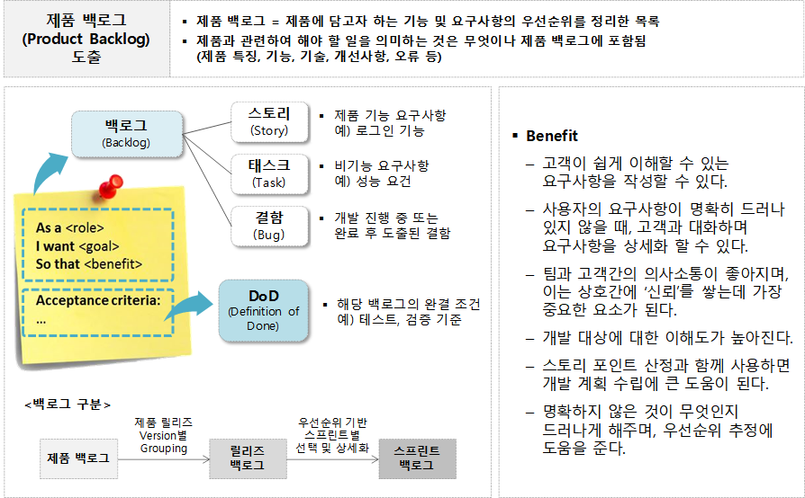
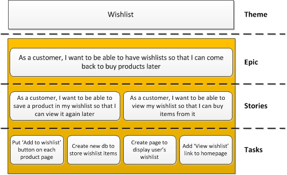
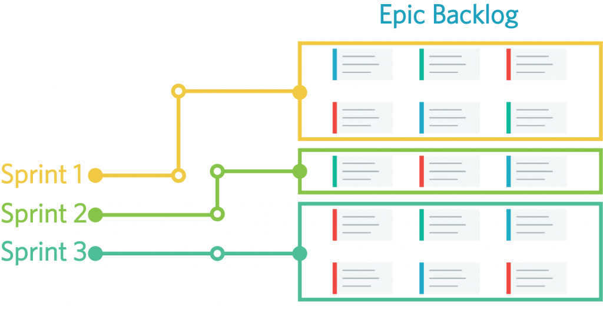
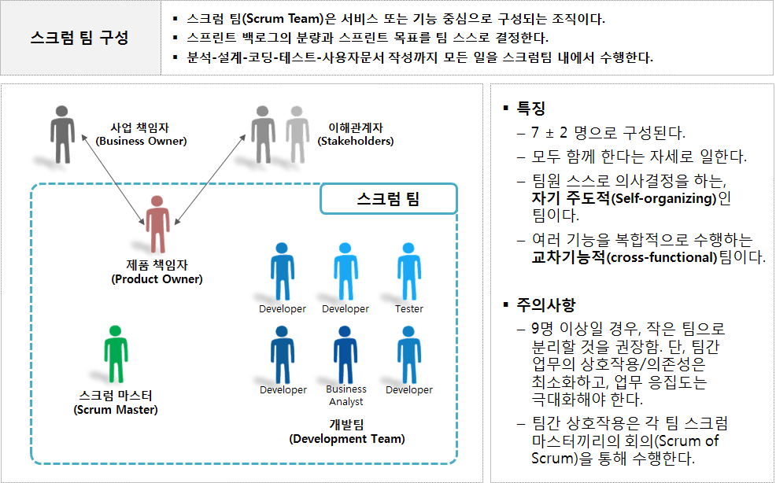
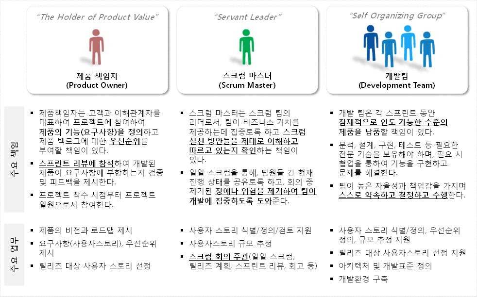
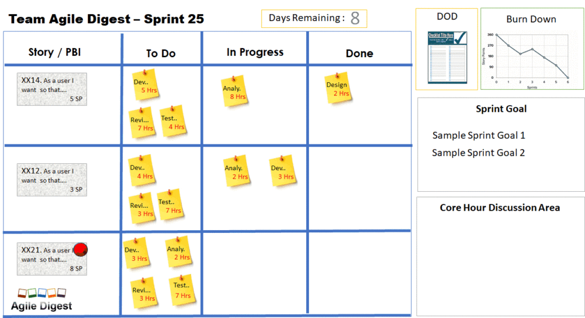
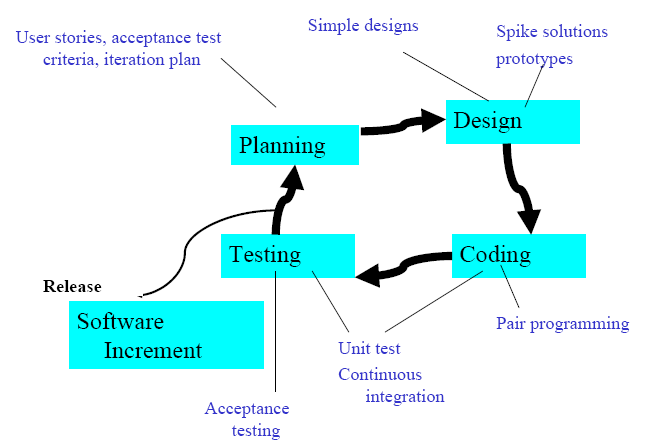
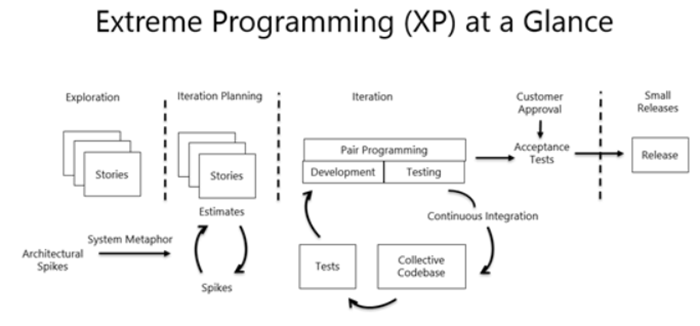
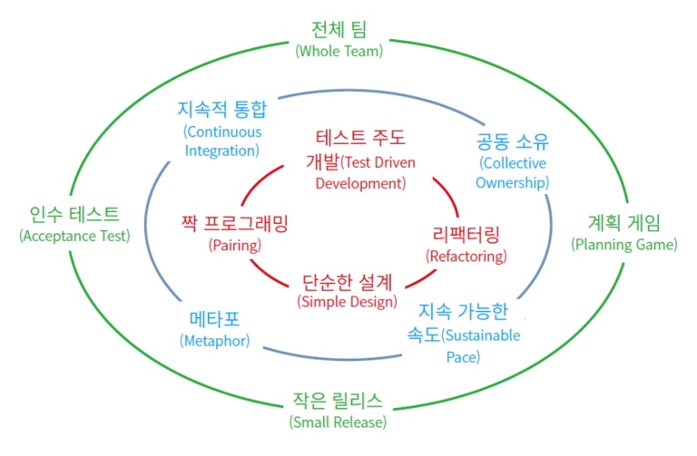

개념
=====
- **애자일**(Agile)은 **기민하다**라는 뜻으로 너무 계획이 없는 개발 방법론과 너무 체계적인 계획이 있는 개발 방법론 사이의 균형을 잡아보자는 의도로 나온 개발 방법론이다.
- **계획**을 따르기보다 **변화**에 대응하는데 가치를 두고, **수직적**인 업무 진행이 아닌 **수평적** 커뮤니케이션과 **공개 / 공유**(결과뿐만 아니라 그 맥락까지)을 중시한다.

종류
=====
1. **Scrum**
   - 상호, 점진적 개발방법론
   - 기능/개선점에 대한 우선 순위를 부여
   - 개발 주기마다 실제 동작할 수 있는 결과를 제공
1. **Kanban board**
   - 작업 관리
   - 시각적 표시
1. **XP** (Extreme Programming)
   - 비즈니스 상의 요구가 시시각각 변동이 심한 경우에 적합한 개발 방법
   - **개발 문서** 보다는 **소스 코드**를, **조직적인 개발의 움직임** 보다는 **개개인의 책임과 용기**에 중점

Scrum
=====
- **2 circles**
   - Sprint Period
   - Daily Scrum

- **4 quadrants**
   - Product Backlog
   - Sprint Backlog
   - Sprint Review Meeting
   - Sprint Retrospective Meeting

1. **제품 백로그**

   
   
   
   
   
1. **스크럼 팀 구성**

   
1. **스크럼 팀 주요 업무**

   

Kanban Board
=====
- **Visualize your work**

Extreme Programming
=====
- **4 framework activities**

- **5 phases** of an XP project life cycle

- **XP의 5가지 핵심 가치**

| 핵심가치 | 설명 |
| :---: | :--- |
| 용기(Courage) | 고객의 요구사항 변화에 능동적인 대처 |
| 단순성(Simplicity) | 부가적 기능, 사용되지 않는 구조와 알고리즘 배제 |
| 커뮤니케이션(Communication) | 개발자, 관리자, 고객 간의 원활한 의사소통 |
| 피드백(Feedback) | 지속적인 테스트와 반복적 결함 수정, 빠른 피드백 |
| 존중(Respect) | 모든 프로젝트 관리자는 팀원의 기여를 존중 |

- **XP의 12가지 실천 사항**

| 구분 | 구분 | 설명 |
| :---: | :--- | :--- |
| Fine scale feedback | Pair Programming | 개발 머신 당 두 명의 개발자. 상호 보완 체계 구현 |
| | Planning game | 개발 계획을 위한 실천 방법. 릴리스 / iteration 계획으로 나뉨 |
| | TDD | 구현 전 단위 test driver의 작성을 통한 validation |
| | Whole Team | 고객 역시 개발 팀의 일원 |
| Continuous Process | Continuous Integration | 개발은 누구에게나 최신 버전에서 수행되도록(이후 통합으로 인해 지연을 야기하지 않도록) |
| | Refactoring | (성능 및 유지보수성 모두에서) 최적화된 코드 유지 |
| | Small Release | 작고도 자주 수행되는 릴리스를 통한 신뢰도 향상 |
| Shared understanding | Coding Standards | **팀원 모두에게 적용되는 일관된 코딩 규칙을 통한 코드 품질 제고** |
| | Collective code ownership | **모든 코드는 개발 팀원 모두의 책임임** |
| | Simple design | **Refactoring과 함께 언제나 단순성을 최대한 유지하도록** |
| | System metaphor | 구현 대상 시스템의 동작 방법을 개발자-고객 모두가 알 수 있는 언어로 표현하도록(코드에서도) |
| Programmer welfare | Sustainable pace | **40시간 이상의 초과 작업은 금물. 이는 전체 생산성을 떨어뜨림** |

- **XP 전략**

| 구분 | 내용 |
| :---: | :--- |
| 관리측면 | 결정은 분산화, **코칭** / 트래킹 / 조정 |
| 계획측면 | 팀이 개발한 SW의 가치를 최대화 |
| | 가능한 적게 투자하고, 빠르게, 가장 가치 있는 기능 부여 |
| 설계측면 | 의사소통 통해 설계, 중복된 코드가 없을 것 -> 단순하게 개발 |
| | 가능한 클래스와 메소드 들은 적게 만들 것 -> 변경에 유연 |
| 개발측면 | **지속적인 통합**, 수정, 테스트, 배포 |
| | 복잡한 코드 제거, Pair 프로그램으로 완벽한 코딩 |
| 테스트측면 | 각 테스트는 다른 부분과 관련이 없어야 함 |
| | 테스트 자동화 테스트 프로그램 만드는 주체는 프로그래머 |
| 기타 | 계획세우기, 작은시스템 릴리즈, 12가지 실천사항 병행 |
