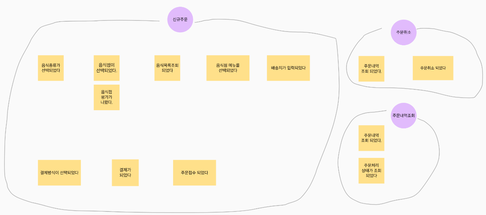
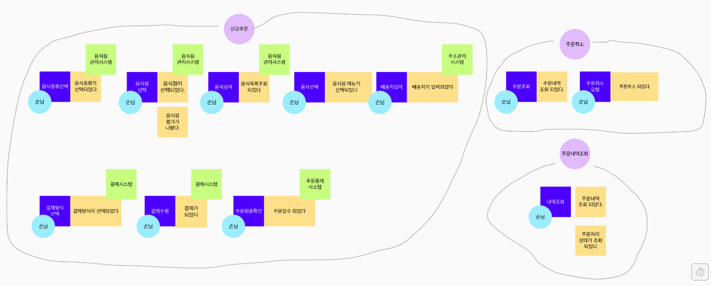
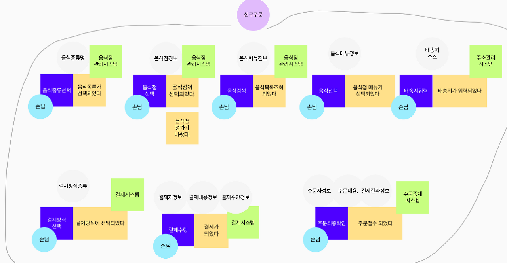

DDD란? Domain Driven Design
=====

* **마이크로 서비스** 아키텍처 설계 방식 중 하나
* **비즈니스 Domain**별로 나누어 설계하는 방식

이벤트 스토밍이란? Event Storming
=====

* **도메인 전문가**와 **개발자**가 같이 참여를 하여, 어떻게 전략적으로 설계를 효율적으로 할것인가에 대한 방법이다. 
* 명사나 데이터 보다 **비즈니스**와 **비즈니스 프로세스**에 초점을 맞춘다.
* 팀 구성원 전체가 **서비스 이해도**를 증가시킬 수 있고, 도메인 전문가도 이해의 폭을 다시 넓히고 새로운 통찰력을 얻을수 있다.

포스트-잇 색깔 | 유형 | 설명
:---:|:---|:---
오렌지색 | `Domain Event` | 발생된 사건, 과거시제동사로 표현
파란색 | `Command` | 이벤트를 트리거하는 명령
노란색, 작은 포스트잇 | `User` | 개인 또는 조직의 역할
핑크색 | `External System` | 이벤트가 호출하거나 관계가 있는 레거시 또는 외부 시스템, 장비
라일락색 | `Policy` | 이벤트 조건에 따라 진행되는 결정 When [이벤트] then [커맨드]
노란색, 큰 포스트잇 | `Aggregate` | 상태가 변경되는 데이터
보라색 | `Business Process` | 프로세스 그룹핑

* 색깔은 상황에 따라 변경

   - **Step1.** `Domain Event 정의`: 비즈니스 도메인내에 발생하는 모든 **이벤트**를 과거형으로 기술 - "**오렌지색**"
   - **Step2.** `Tell the story`: 도출된 **이벤트**로 도메인의 업무 흐름을 이해하고 토론하여 보완
   - **Step3.** `프로세스로 그룹핑`: **이벤트**들을 프로세스로 그룹핑 - "**보라색**"
   
   

   - **Step4.** `Command 정의`: 각 Domain Event를 발생시키는 **명령**을 현재형으로 정의하며 명령형(예: 제품목록을 검색)으로 기술 - "**파란색**"
   
   

   - **Step5.** `Trigger 정의`: Command를 일으키는 **Actor**와 Event를 일으키는 **External System**와 **Policy/Rule**을 정의 - "**하늘색**", "**초록색**", "**라일락색**"
   
   

   - **Step6.** `Aggregate 정의`: Command 수행을 위해 CRUD해야 하는 **데이터 객체** 정의 - "**회색**"
   
   

Tool
=====
[**미로 서비스 - https://miro.com**](https://miro.com)
