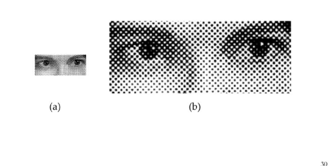

## 하프 토우닝과 디더링

인쇄물 색상의 수

모니터든, 프린터든 컬러 해상도가 제한되어 있기 때문에 보일 수 있는 색상의 수는 제한된다.

사람의 눈이 지닌 속성을 이용한다면 제한된 장비에서 더욱 다양한 색상이 보이게 할 수 있다.

흑백 신문의 사진은 흑색 잉크 한 가지로 인쇄되었음에도 불구하고 희색처럼 보이기도 한다.

이는 우리 눈이 어떤 명도를 전체적으로 종합하여 인식하는 속성을 이용한다.

### 하프 토우닝

아래는 하프 토우닝의 예이다.

위는 회색 잉크를 사용한 것이 아니라 흑색 점의 크기를 변화시켜서 점의 크기가 커질수록 어둡게 보이게 한 것이다. 사람의 눈은 어떤 색을 그 자체로 인식하는 것이 아니라 주변 영역에 걸쳐 있는 평균적인 명도를 인식한다. 이에 따라 점의 크기를 다양하게 하면 여러 가지 회색 레벨을 만들어 낼 수 있다. 컬러 화보의 경우도 마찬가지다.

### 디더링

디더링은 요구된 색상의 사용이 불가능할 때(인쇄매채, 컴퓨터 등등) 다른 색상들을 섞어서 근사화할 때 시도되는 용어이다.

계단 현상을 제거하는 안티에일리어싱도 디더링 기법의 일종이다.

보통 플로이드 스타인버그의 오류확산 알고리즘이 적용되는데 영상의 픽셀들을 왼쪽에서 오른쪽 위에서 아래로 따라가면서 각각의 픽셀을 양자화 한다. 양자화 오류는 주위의 픽셀로 이전되지만 이미 양자화된 픽셀은 영향을 받지 않는다.

간단하게 원 영상의 색과 표현해낼 수 있는 색에서 나오는 오류를 주변에 이전하여 차이를 최소화 한다는 의미이다.

#### 하프 토우닝과의 차이

하프토우닝과의 차이는 하프토우닝은 실질적 시각적 해상도를 감소해서라도 주어진 색을 최대한 근사적으로 표현하기 위한 기법인 반면 디더링은 근사화에 따른 시각적 오류를 최소하하기 위해 사용하는 것이며, 이 방법에서는 해상도가 동일하게 유지된다.
