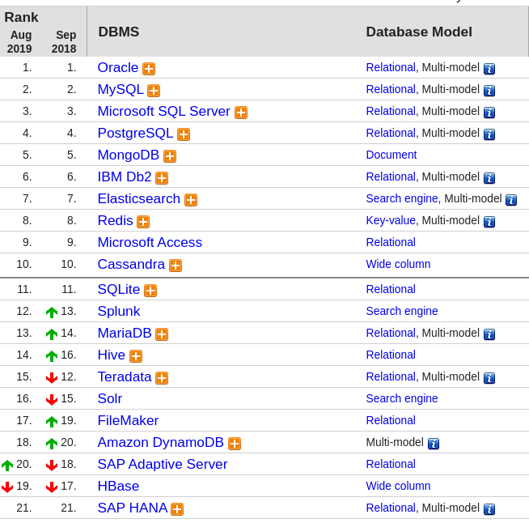

### DB 사용 동향 분석

https://db-engines.com/en/ranking

#### 상승 차트

- PostgreSQL
- MySql
- Elasticsearch
- Redis(NoSql)
- Mongodb(NoSql)

#### 하락 차트

- Oracle
- Microsoft SQL Server
- IBM Db2

전반적으로 NoSql의 대표적인 두 DBMS가 가파르게 상승

RDBMS는 Postgre와 MySql이 상승하고 있다.
