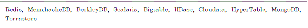
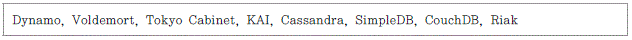

### noSql과 데이터 무결성의 관계

RDBMS에는 데이터베이스 트랜잭션이 정상적으로 처리되기 위한 4가지 필수 속성이 있다. (ACID)

nosql은 이러한 네가지 속성을 과감히 버리고 에릭 브레워의 CAP정리에 기반을 둔다.

#### CAP란?

NoSQL 기술이 화두가 되기 훨씬 전인 2000년에 발표되었으며, 분산(distributed) 또는 확장(scalable) 시스템을 위한 정리였다. 하나의 공유된 데이터 시스템은 이 중 최대 2개의 CAP 속성만 만족할 수 있다는 것을 골자로 한다.

- Consistency: 모든 노드가 동시에 동일한 데이터를 조회함을 보장
- Availability: 성공 또는 실패를 막론하고 모든 요청에 대한 응답을 보장
- Partition Tolerance: 미리 예측할 수 없는 데이터 손실 또는 시스템 구성 요소 중 일부의 실패(Failure)에도 전체 시스템은 항상 정상 작동을 보장

이때 최대 2개의 CAP속성을 만족해야 함으로 시스템은 CP, AP, CA 타입으로 나뉜다. nosql은 여기서 크게 CP와 AP 시스템으로 나뉜다.

#### CP

CP는 데이터의 무결성을 만족하고 시스템 일부의 오류를 허용하기 위해 사용자 쿼리 응답에서 지연이 생길 수 있다. CP에는 다음과 같은 NoSQL이 있다.

#### AP

AP는 서비스 가용성을 만족하는 동시에 성능을 위해 데이터 무결성을 희생한다. 그러므로 사용자 쿼리 응답에 지연은 없지만, 일정시간 무결성이 보장되지 않을 수 있다. AP에는 다음과 같은 NoSQL이 있다.

스스로를 CA로 일컫는 NoSQL도 있다. Neo4j나 FlockDB같은 Graph 데이터베이스는 CP나 AP 범주에 들어가지 않는다. HP의 버티카(Vertica)와 같이 분산 데이터베이스 환경에 SQL을 탑재한 클라우드 DB 제품도 대부분 CA에 해당한다.
