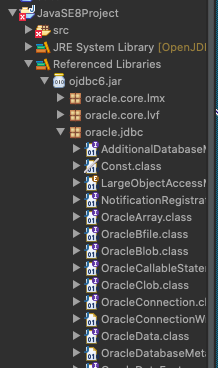

## 🕹 JDBC 오라클 연동하기

### JDBC란?

> 자바로 데이터베이스에 접근할 수 있게 해주는 프로그래밍 API

<br >

### JDBC 사용하기

    1. ojdbc.jar 다운받기
     => oracle 홈페이지에서 다운로드

    2. 사용하고자하는 프로젝트에 jar 붙여넣고서 오른쪽 버튼 클릭
        => Build Path => Configure build path => Library => add jar

    3. 리스트 확인하기 (아래 그림처럼 나오면 성공)

[연결 완료 이미지]



<br>

## < JDBC 코딩 절차 >

#### 1. Driver 등록

#### 2. DBMS와 연결

#### 3. Statement 생성

#### 4. SQL 전송

#### 5. 결과 받기

#### 6. 사용 자원 반납

<br >

#### 1. Driver 등록 : Class.forName() 사용

> - DriverManager에 해당 DBMS Driver 등록하기
> - new OracleDriver와 같은 명령어를 사용하지 않는 이유
> - **특정 DB에 종속되지 않고** DB가 바뀌어도 드라이버 클래스 이름만 바꿔서 연동할 수 있도록 하기 위함

```java
Class.forName("oracle.jbbc.driver.OracleDirver");
```

<br>

#### 2. DBMS와 연결 : getConnection()

> - 해당 드라이버로부터 Connection instacne 획득
> - 각 DriverManger에 등록된 드라이버들을 식별해서 매핑하는 단계

[오라클의 hr/hr에 연결]

```java
	String url = "jdbc:oracle:thin:@127.0.0.1:1521:xe";
	String user = "hr";
	String password = "hr";

    	public Connection getConnection() throws SQLException {
		return DriverManager.getConnection(url, user, password);
	}
```

<br>

#### 3. Statement 생성 : createStatement()

> - Connection 인스턴스에서 Statement 인스턴스 획득
> - 실질적인 작업영역
> - 여기서 만들어진 statement로 sql 작업 실행

```java
//getConnection으로 만든 인스턴스에 statement 생성

Connection con = getConnection();
Statement stmt = con.createStatement();
```

<br>

#### - Statement vs PreparedStatement

> - Statement는 두 가지 형식으로 작성 가능

| 종류 | Statement                                             | PreparedStatement                                                   |
| ---- | ----------------------------------------------------- | ------------------------------------------------------------------- |
| 단점 | 실행시마다 SQL을 실행해서 오버 헤드가 큼              | 코드가 길어질 수 있다.                                              |
| 장점 | 원하는 Query를 직접 넣어주기 때문에 직관적 / 사용쉬움 | 같은 Query를 반복 수행해야 하는 경우 성능이 좋음 (loop 이용이 용이) |

```java
// Statement 예시

Statement stmt = conn.createStatement();
stmt.executeUpdate( "Insert into emp values ( '21421', 'Kim' )" );
stmt.executeUpdate( "Insert into emp values ( '32211', Hong )" );
...

```

```java
//Prepared Statement 예시

PreparedStatement pstmt = conn.preparedStatement( “ Insert into emp values ( ?, ? ) “ );

//(? , ?) 물음표 안에 인자를 하나씩 넣어줌

pstmt.setString( 1, "21421" ); // 1번 인자
pstmt.setInt( 2, "Kim" ); // 2번 인자
pstmt.executeUpdate();

...
```

<br />

#### 4. SQL 전송 : executeQuery(query);

> - 생성된 statement에 query를 실행하는 역할
> - 예외처리를 위해 try ~ catch / throws 와 함께 사용

```java
try {
    Connection con = getConnection();
    Statement stmt = con.createStatement();

    stmt.executeQuery("select * from EMPLOYEES where EMAIL = '" + email + "'"
	);
}
catch (SQLException e) {
    e.printStackTrace(); }


```

<br>

#### - execute 매소드 차이점

> - SQL전송시 사용되는 excute method 차이점 알아보기

| execute()                                   | executeQuery()             | excuteUpdate()                                                                                        |
| ------------------------------------------- | -------------------------- | ----------------------------------------------------------------------------------------------------- |
| Boolean 타입을 반환                         | ResultSet 객체의 값을 반환 | Int 타입의 결과 값을 반환                                                                             |
| return값이 ResultSet 이면 true 아니면 false | SQL select 실행 시 사용    | UPDATE, DELETE, INSERT 실행 시 사용 => **반영된 레코드의 수 만큼 반환** CREATE / DROP 실행 시 -1 반환 |

<br>

#### - append() & StringBuilder로 sql문 작성하기

> - append와 StringBuilder로 sql문을 작성하고 대입하여 사용 가능

```java
public class StringBuilderTest {
	public static void main(String[] args) {


	StringBuilder builder = new StringBuilder();
	builder.append("select EMPLOYEE_ID, FIRST_NAME, HIRE_DATE, DEPARTMENT_NAME")
	.append("from EMPLOYEES e, DEPARTMENTS d")
	.append("where e.DEPARTMENT_ID = d.DEPARTMENT_ID")
	.append("and FIRST_NAME like '%Da%'") //query안에 넣거나 args로 받아오거나;
	.append("order by EMPLOYEE_ID desc");

	String sql = builder.toString();
	System.out.println(sql);

	}
}

// select EMPLOYEE_ID, FIRST_NAME, HIRE_DATE, DEPARTMENT_NAME /// from EMPLOYEES e, DEPARTMENTS d
// where e.DEPARTMENT_ID = d.DEPARTMENT_ID and FIRST_NAME like '%Da%'
// order by EMPLOYEE_ID desc

```

<br>

#### 5. 결과 받기 : ResultSet

> - query 실행 후 결과를 ResultSet(Select) 혹은 int형 변수로 받아서 처리

```java
 Connection con = getConnection();
 Statement stmt = con.createStatement();

 ResultSet rs = stmt.executeQuery("select * from EMPLOYEES where EMAIL = '" + email + "'");

if(rs.next()) {
    System.out.println(rs.getString("first_name") + " " + rs.getString("salary")); }
```

<br >

#### 6. 사용 자원 반납

> - 모든 작업이 끝난 후 자원을 반납하는 구문 넣어주기

```java

public void close(Statement stmt, Connection con) throws SQLException {
	if(stmt!=null) stmt.close();
	if(con!=null) con.close();

}
```
