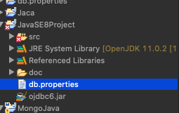

## 🏗 Properties 파일을 이용한 JDBC

> - 자바 프로그래밍 내부적으로 커넥션을 설정하는 방법 외에
>   properties파일을 이용해서 JDBC를 사용하는 방법!
> - 설정파일을 외부로 빼서 유지보수와 수정을 쉽게 할 수 있음

<br >

### 1. properties 파일 생성

**[생성위치]** : 프로젝트 src와 같은 위치



<br>

[properties 설정 파일]

    db.driver=oracle.jdbc.OracleDriver
    db.url=jdbc:oracle:thin:@127.0.0.1:1521:xe
    db.user=hr
    db.pass=hr
    db.sql=select * from departments

<br >

### 2. JDBC 연결 할 클래스 생성

[JDBC 연결 클래스]

```java

public class JDBCUsingProps {

	public static void main(String[] args) {

        //기본 값 초기화
		InputStream input = null;
		String driver = "";
		String url = "";
		String user = "";
		String password = "";
		Connection conn = null;
		Statement stmt = null;
		ResultSet rs = null;
		String sql = "";

		try {
			input = new FileInputStream("db.properties");
            //FiledInputStream( "프로퍼티 파일 이름" )
			Properties prop = new Properties();
			prop.load(input);

			driver = prop.getProperty("db.driver");
			url=prop.getProperty("db.url");
			user=prop.getProperty("db.user");
			password=prop.getProperty("db.pass");
			sql = prop.getProperty("db.sql");

            //props.getProperty() 매소드를 통해 properties파일 내부의 설정을 받아옴


		}catch(IOException io) {
			io.printStackTrace();
		}finally {
			try {
				input.close();
			} catch (IOException e) {
				// TODO Auto-generated catch block
				e.printStackTrace();
			}
		}

```

<br >

### 3. ResultSet & ResultSetMetaData로 테이블 값 불러오기

> - **ResultSet** : 쿼리를 실행한 결과문
> - **ResultSetMetaData** : ResultSet에 대한 메타데이타 / 기존에 설정된 정보

```java
try {

	conn = DriverManager.getConnection(url, user, password);
	System.out.println("Connection created : "  + conn.getClass().getName());

	//Factory Method
	stmt = conn.createStatement();
	System.out.println("Statement created : " + stmt.getClass().getName());

	rs = stmt.executeQuery(sql);
	System.out.println("ResultSet created : " + rs.getClass().getName());

	ResultSetMetaData md = rs.getMetaData();
	for(int i=1; i <= md.getColumnCount();i++)
		System.out.print(md.getColumnLabel(i) + " / ");


	    while(rs.next()) {
            for(int i=1; i <= md.getColumnCount(); i++)
	    System.out.print(rs.getString(i) + "\t \t ");
            System.out.println();
	    }

		} catch (SQLException e) {
			// TODO Auto-generated catch block
			e.printStackTrace();
		} finally {
			try {
			if(rs != null) rs.close();
			if(stmt != null) stmt.close();
			if(conn != null) conn.close();
			} catch (SQLException e) {
				// TODO Auto-generated catch block
				e.printStackTrace();
			}
		}
```

[콘솔 출력내용]

```console
Driver Loading Done!
Connection created : oracle.jdbc.driver.T4CConnection
Statement created : oracle.jdbc.driver.OracleStatementWrapper
ResultSet created : oracle.jdbc.driver.OracleResultSetImpl
DEPARTMENT_ID / DEPARTMENT_NAME / MANAGER_ID / LOCATION_ID /
10	 	 Administration	 	 200	 	 1700
20	 	 Marketing	 	 201	 	 1800
30	 	 Purchasing	 	 114	 	 1700
 (...)
```
