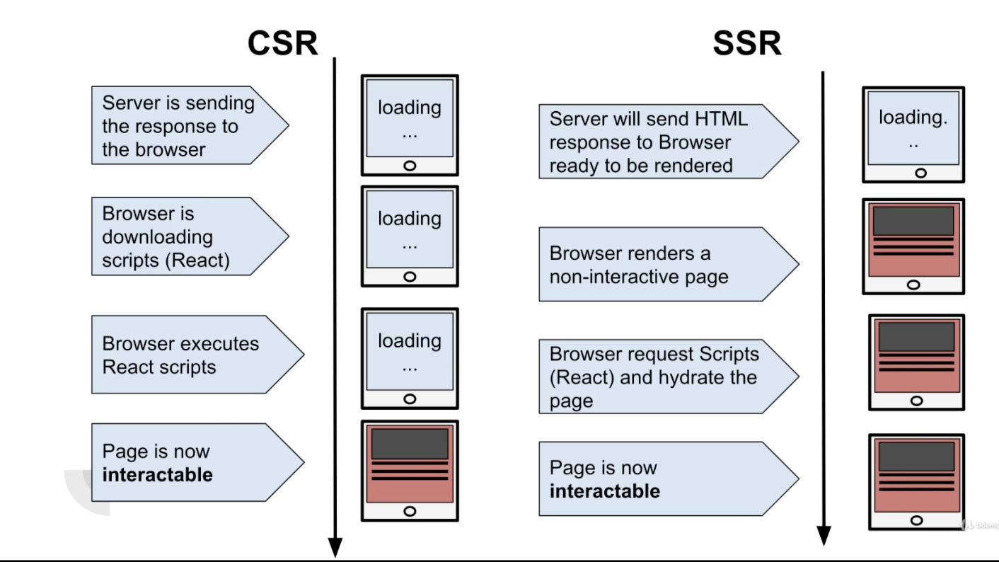

# NextJS란 🏒? 

[목표]

- 왜 넥스트JS를 사용하나?
- SSR과 CSR의 차이

 

### > NextJS란?

- 서버사이드 랜더링을 고려하여 만튼 리액트 프레임워크
- 컴포넌트 코드가 리액트처럼 숨겨져 있지 않기때문에 SEO 최적화에 유리
- 초기 로딩 속도 향상에 좋음
- 클라이언트 라우팅을 간단하게 구현할 수 있음

  
 

## > CSR vs SSR

 

- ### 클라이언트 사이드 랜더링(CSR)? 

    [장점]
    1. 초기 랜더링 제외 빠르게 랜더링이 가능
    2. UX 만족도가 높음
    3. 라이브러리와 프레임워크가 다양함

    [단점] 
    1. 초기 랜더링이 느림
    2. SEO 최적화 어려움
    3. bundle.js를 모두 로드해야해서 요청 응답이 SSR보다 느림

 

-  ### 서버사이트 랜더링(SSR)?

    [장점]
    1. 초기 랜더링이 빠름 
    2. 라우팅 시, 필요 리소스만 접근해서 랜더링함

    [단점]
    1. 서버 랜더링 부하문제
    2. 페이지 새로고침 시 깜빡임 발생 => UX 만족도 감소 

