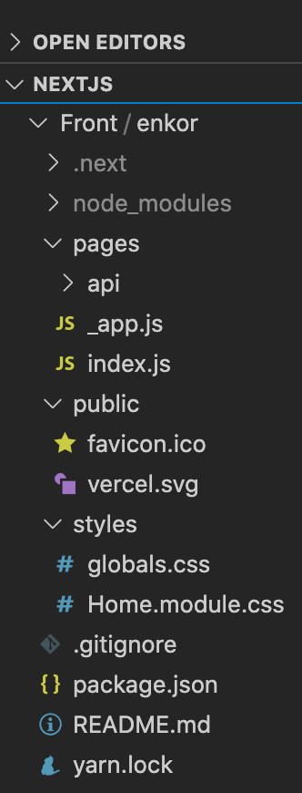
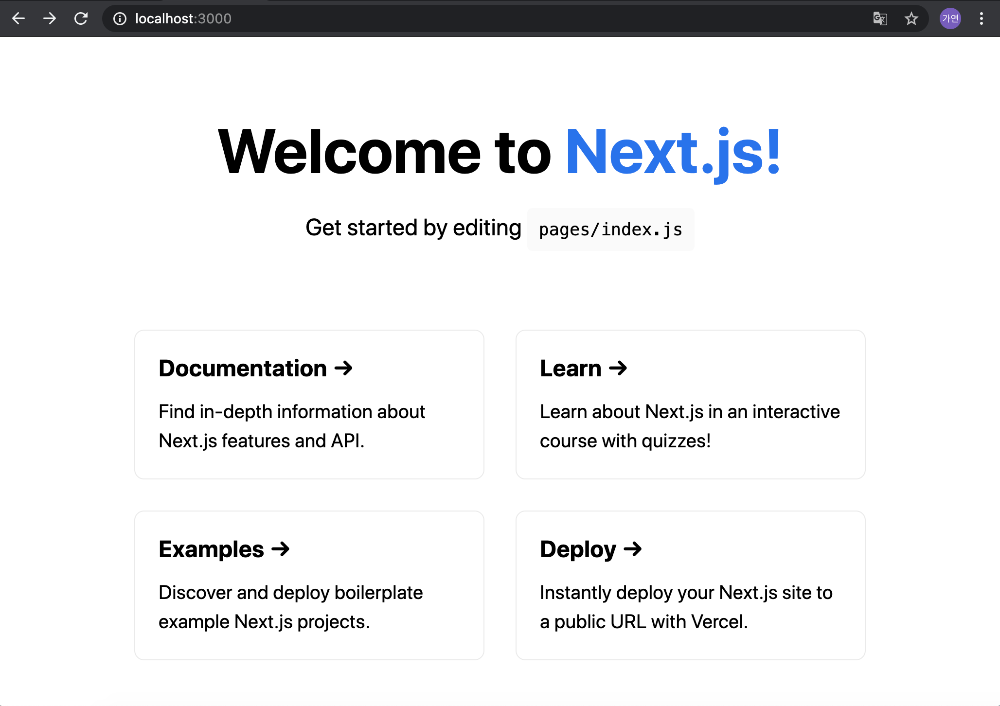

# 프로젝트 시작하기

[목표]

- NextJs 프로젝트 만들기
- 프로젝트 구조 이해하기


<br>
<br>

### 프로젝트 시작하기

```bash
npx create-next-app [project name]
```

<br>

### 프로젝트 구조 



<초기 프로젝트 구조>


<br>

1. node_modules
    > - 프로젝트 모듈
2. pages 
    >  - 리액트 컴포넌트가 위치하는 곳
    >  - '.js, .jsx, .tsx, .ts' 파일 위치
    > - 이곳의 파일 명으로 URI 생성됨 (Dynamic Routing 가능)
    > - 예 ) test.js === /test 
    - api


3. public
    > - 이미지 파일 같은 공통 리소스

4. styles
    > - 스타일링 소스


<br >
<br >

### npx create-next-app으로 생성된 메인 페이지 




