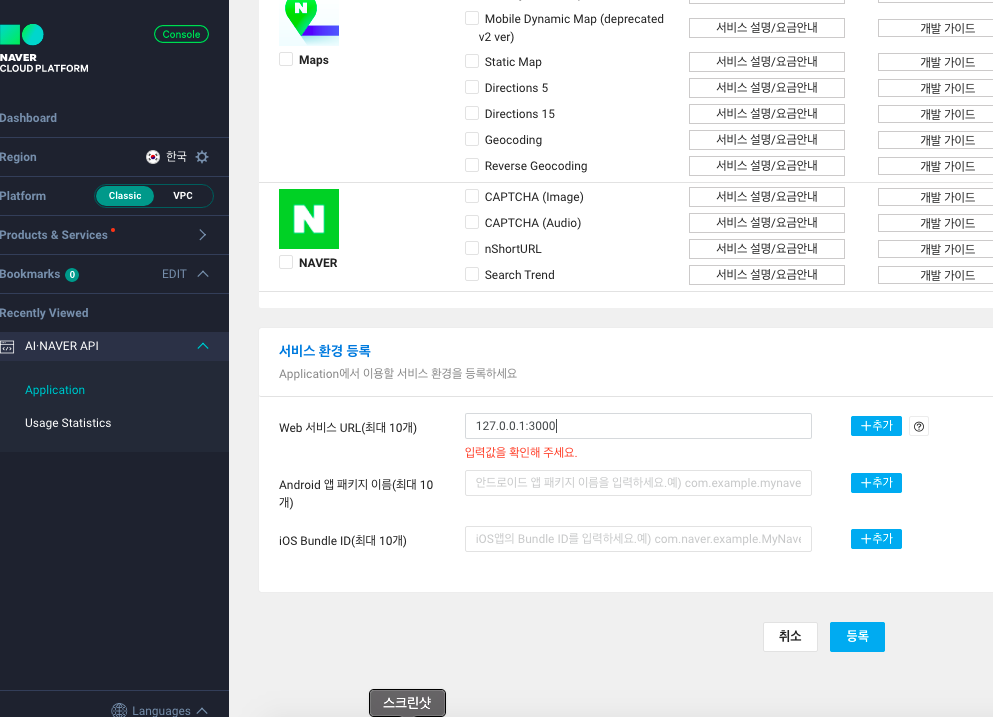
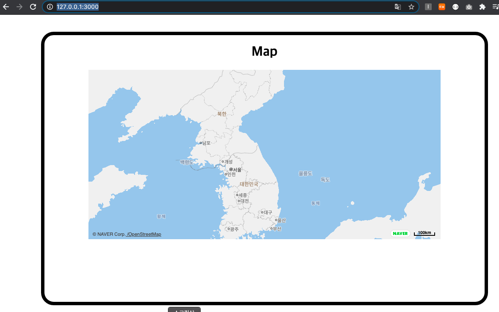

# 📍 리액트에서 Naver Map 사용하기

[목표]

- 네이버 클라우드 가입 후, client key 받아오기
- 네이버지도 API를 이용하여 리액트에 적용하기

<br>

### > Naver Cloud Platform 가입하기

> - 원래는 네이버에서 무료로 map api를 제공해줬었는데 무료 정책이 바뀜
> - 네이버 클라우드 플랫폼에 가입해서 Client 아이디를 발급받고, application을 등록해야 함
> - 참조 : https://docs.ncloud.com/ko/naveropenapi_v3/application.html

<br>

🛠 [가입하러 가기](https://www.ncloud.com/support/faq/product/3511)

<br>

_**❗️ 주의**_: Application 등록할 때 로컬호스트로 설정을 하고 싶으면 localhost:[포트번호]이 아니라 **127.0.0.1:** [포트번호] 으로 해줘야 함



<br>

### > react-naver-maps 설치

> naver-maps의 리액트 용 npm 설치

npm

`npm install react-naver-maps`

<br>

yarn

`yarn add react-naver-maps`

<br>

### > React 화면에 띄우기

#### 1. index.js

> - `<App>`을 `<RenderAfterNavermapsLoaded >`로 감싸주고 발급받은 Client Key넣어주기

<br>

```javascript
import React from "react";
import ReactDOM from "react-dom";
import App from "./App";
import * as serviceWorker from "./serviceWorker";
import { RenderAfterNavermapsLoaded } from "react-naver-maps";

ReactDOM.render(
  <React.StrictMode>
    <RenderAfterNavermapsLoaded ncpClientId={"인증키"}>
      <App />
    </RenderAfterNavermapsLoaded>
  </React.StrictMode>,
  document.getElementById("root")
);

// If you want your app to work offline and load faster, you can change
// unregister() to register() below. Note this comes with some pitfalls.
// Learn more about service workers: https://bit.ly/CRA-PWA
serviceWorker.unregister();
```

<br>

#### 2. App.js

```javascript
import React from "react";
import Home from "./view/Home";

function App() {
  return (
    <div>
      <Home />
    </div>
  );
}

export default App;
```

<br>

#### 3. Home.js

```javascript
import React from "react";
import "./home.scss";
import NaverApiMap from "./NaverAPIMap";

function Home() {
  return (
    <div className={"outline"}>
      <div className={"container"}>
        <div className="nav"> nav bar </div>
        <h1>Map</h1>
        <NaverApiMap></NaverApiMap>
        <div className={"map"}></div>
      </div>
    </div>
  );
}

export default Home;
```

<br>

#### 4. NaverApiMap.js

> - 네이버 지도 컴포넌트에 기본 설정값 추가
> - 참조: https://github.com/navermaps/maps.js.ncp

```javascript
import React from "react";
import { RenderAfterNavermapsLoaded, NaverMap } from "react-naver-maps";
import "./naverApiMap.scss";

export const NaverAPIMap = (props) => {
  return (
    <RenderAfterNavermapsLoaded clientId={"인증키"}>
      <NaverMap
        id={"map"}
        mapDivId={"react-naver-map"} // default name
        style={{
          width: "80%",
          height: "400px",
        }}
        defaultCenter={{ lat: 37.3595704, lng: 127.105399 }}
        defaultZoom={10}
      />
    </RenderAfterNavermapsLoaded>
  );
};

export default NaverAPIMap;
```

<br>

### > 완성 화면



<br>
<br>
