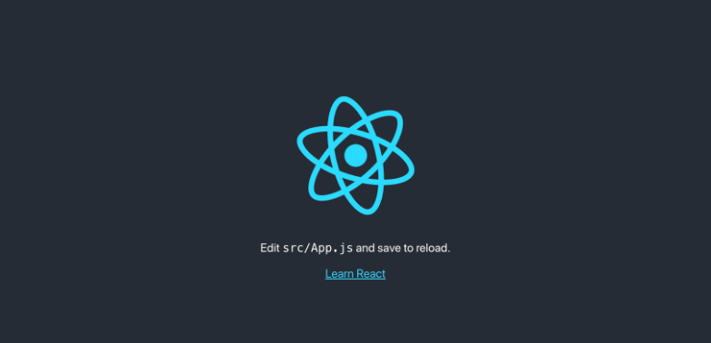

## 🖥 React 시작하기

[목표]

- 리액트 프로젝트 시작하기
- 바벨 의존성 추가하기

  

### > React Project 시작하기

> - 기본적으로 node.js와 npm이 설치 되어있어야 함

 

#### npm install -g create-react-app

> 리액트 앱을 만드는 create-react-app 설치

 

#### create-react-app [프로젝트 명]

> 프로젝트 명을 설정하고 리액트 앱 설치

 

### > 의존성 및 환경설정

> - 참조 : https://velopert.com/814
> - https://velog.io/@pop8682/%EB%B2%88%EC%97%AD-React-webpack-%EC%84%A4%EC%A0%95-%EC%B2%98%EC%9D%8C%EB%B6%80%ED%84%B0-%ED%95%B4%EB%B3%B4%EA%B8%B0#3-babel

 

#### [webpack]

- 모듈 번들러
- 브라우저 위에서 import(require)를 할 수 있게 해주고 자바스크립트 파일들을 하나로 합쳐줌

 

#### [babel]

- 아직 ECMAScript6 를 지원하지 않는 환경에서 ECMAScript6 Syntax를 사용 할 수 있게 해줌

**yarn**

`yarn add --dev @babel/core babel-loader @babel/preset-react @babel/preset-env`

**npm**

`npm install --save-dev @babel/core babel-loader @babel/preset-react @babel/preset-env`

 

#### [webpack-dev-server]

- wepback에서 지원하는 간단한 개발서버
- 별도의 서버를 구축하지 않고도 웹서버를 열 수 있음
- hot-loader를 통하여 코드가 수정될때마다 자동으로 리로드 되게 함

 

### > 앱 실행하기 npm start

 
