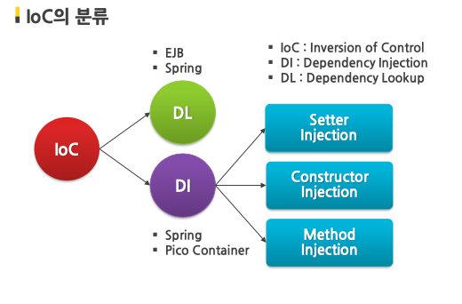

## 🌊 Dependency Injection(DI) & Inversion of Control (IoC)

#### 의존성 주입과 제어의 역전

<br >

### 1. IoC 제어의 역전이란?

> - 스프링에서 제어의 권한과 프로그램의 흐름을 개발자가 아닌 MVC 프레임워크로 넘겨주는 것
> - 개발자들이 직접 POJO를 생성할 수 있지만 컨테이너에게 맡김
> - 객체의 생성부터 생명주기관리까지 모든 권한을 컨테이너가 관리
>   => 제어권을 컨테이너로 전이
> - 객체 사이의 의존관계를 줄이고, 유지보수와 수정을 원활하게 하기 위함



<br >

### - 컨테이너란?

> - 객체의 생성과 관리를 맡아 하는 곳. 객체에 필요한 다양한 기능을 제공
> - 개발자의 소스코드를 스스로 참조하여 객체의 라이프사이클을 제어함

<br>

### 2. DI 의존성 주입이란?

> - 기존의 객체와 달리 객체의 의존성을 외부에서 주입받는 형태
> - 각 클래스간의 의존관계를 빈 설정 (Bean Definition)정보를 바탕으로 자동 연결
> - 개발자들은 단지 빈 설정파일에서 의존관계가 필요하다는 정보만 입력하면 됨
> - 객체 레퍼런스를 컨테이너로부터 주입받아서, 실행시 동적으로 의존관계 생성
> - 코드가 단순해지고 컴포넌트간의 결합도가 약해짐

<br >

#### Spring DI 용어

| 용어                  | 설명                                                                              |
| --------------------- | --------------------------------------------------------------------------------- |
| 빈 (Bean)             | 스프링이 직접 생성과 제어를 담당하는 객체                                         |
| 빈 팩토리             | IoC를 담당하는 핵심 컨테이너<br> 빈의 등록, 생성 조회 반환 기능 담당              |
| 어플리케이션 컨텍스트 | 빈 팩토리를 확장한 IoC컨테이너 <br > 스프링에서 빈 팩토리보다 더 많이 사용        |
| 설정 메타정보         | 어플리케이션 컨텍스트 혹은 빈팩토리가 IoC 적용을 위해 사용하는 메타정보 (예: XML) |

<br>

#### 의존성 주입의 3가지

1. 생성자(constructor)를 통한 의존성 주입
   > 필요 의존성을 포함하는 생성자를 만들고, 이를 통해 의존성 주입
2. setter 매소드를 통한 의존성 주입

   > 의존성을 입력받는 setter 매소드를 통해 의존성 주입
   > 의존관계가 있는 bean주입시 ref, 단순 값 전달 시 value 사용

   ```java
   <!-- Hello 클래스의 id를 주고, class로 클래스 위치를 전달 -->
   <!-- setName(), setPrinter() 매소드 => property로 설정 -->
   <!-- value는 값 전달 setName(value)-->
   <!-- ref는 strPrinter라는 id를 가진 bean을 참조한다는 뜻 -->

   <bean id="hello" class="myspring.di.xml.Hello" scope="singleton">
   <property name="name" value="spring" />
   <property name="printer" ref="strPrinter" />
   </bean>
   ```

3. 일반 매소드를 통한 의존성 주입
   > 의존성을 입력받는 일반 매소드를 만들어 의존성 주입
