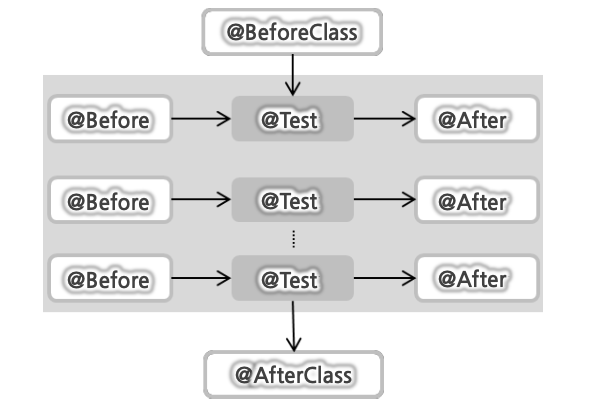

## 📟 jUnit 단위테스트

<br>

### Unit Test 단위테스트란?

> - 각 코드가 의도한 대로 작동하는지 확인하는 절차
> - 모든 함수와 매소드에 관해 테스트케이스를 작성하는 절차

### jUnit이란?

> - Java 자체 에서 단위테스트(Unit Test)를 제공해주는 프레임워크
> - 보이지 않는 단위테스트를 끌어내서 정형화된 테스트를 제공해줌
> - Assert 매소드로 테스트케이스의 수행결과 판별
> - 각 테스트마다 새로운 인스턴스를 생성하여 독립적으로 테스트가 이루어지도록 해줌

<br >

### jUnit을 사용한 DI 테스트 클래스

> - 스프링 테스트 == Bean 테스트
> - Junit 4부터 어노테이션 제공

<br>

#### - jUnit Annotation

**@Test**

    - jUnit테스트 실행을 위해서는 꼭 @Test로 명시를 해줘야함
    - 각 테스트가 영향을 주지않고 독립적으로 수행되기 위해 테스트 실행마다 객체를 따로 생성

**@Ignore**

    - @Ignore선언 시, 테스트를 실행하지 않고 넘어감

**@Before**

    - @Test 수행 전에 만드시 실행됨
    - @Test 마다 공통적으로 사용되는 코드를 @Before에서 사용해도 됨

**@After**

    - @Test 수행 후에 실행됨

**@BeforeClass**

    - @Test보다 먼저, 한 번만 실행되는 경우 사용

**@AfterClass**

    - @Test 이후에 한번만 실행되는 경우



<br />

### 테스트 결과를 확정하는 단정(Assert) 매소드

​

| 매소드 명               | 기능                            |
| ----------------------- | ------------------------------- |
| assertEquals(a, b)      | 객체 A와 B가 일치함을 확인      |
| assertArrayEquals(a, b) | 배열 A와 B가 일치함을 확인      |
| assertSame(a, b)        | 객체 A와 B가 같은 객체인지 확인 |
| assertTrue(a)           | 조건 A가 참인가를 확인          |
| assertNotNull(a)        | 객체 A가 null이 아님을 확인     |

​> 다른 매소드 확인 http://junit.sourceforge.net/javadoc/org/junit/Assert.html

<br>

| assertEquals               | assertSame                                |
| -------------------------- | ----------------------------------------- |
| 두 객체의 값이 같은지 확인 | 두 객체의 레퍼런스가 동일한가를 확인 (==) |

<br>

### SpringTest 지원하는 Annotation

> jUnit으로 쉽게 테스트 할 수 있도록 도와주는 라이브러리

#### - @RunWith(SpringJUnit4ClassRunner.class)

> - **@RunWith**

    - 테스트 실행방법 확장시 사용
    - 각 테스트별로 객체 생성시 싱글톤을 유지하도록 보장

> - **SpringJUnit4ClassRunner** : jUnit 테스트를 진행하는중 ApplicationContext (Spring Bean Container)를 만들고 관리하는 작업 진행

#### - @ContextConfigurtion

> - Bean 설정파일의 위치를 지정할 떄 사용

#### - @Autowired

> - 변수, 매소드, 생성자에 모두 사용가능
> - 해당 변수에 자동으로 Bean 매핑
>   ==> getBean()대신 사용
> - 스프링 빈 설정 파일을 읽기 위해 굳이 GenericXmlApplilcationContext를 사용할 필요가 없음

​
[junit 테스트 코드]

```java
@RunWith(SpringJUnit4ClassRunner.class)
@ContextConfiguration(locations = "classpath:config/spring_beans.xml")
public class AnnotatedHelloBeanTest {

	@Autowired
	HelloBean hello;

	@Test
	public void helloBeanProps() {
		assertEquals("Hello 어노테이션", hello.sayHello());
	}

	@Test @Ignore
	public void helloBean() {
		assertEquals("Hello 어노테이션 생성자", hello.sayHello());
		hello.print();

	}

}
```
