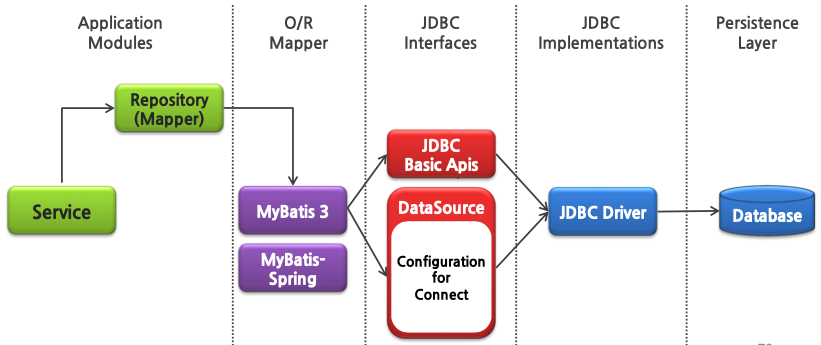
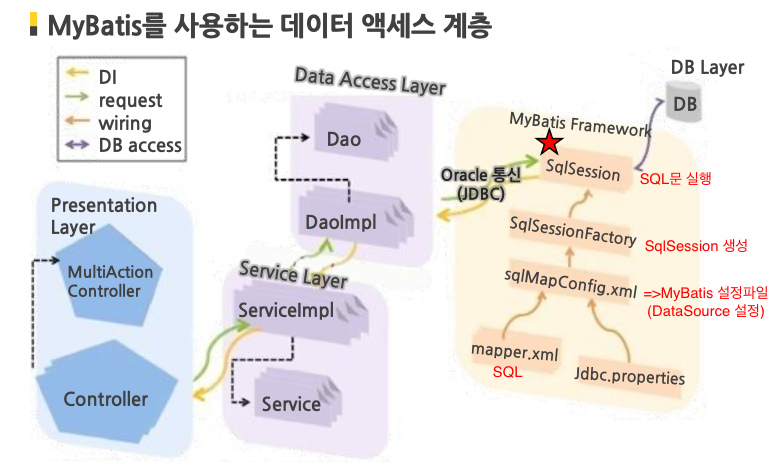
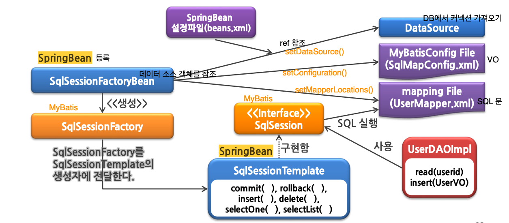
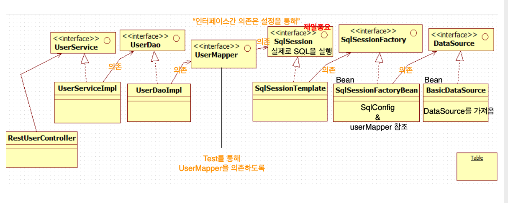
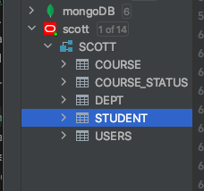

## 🦅 MyBatis 마이바티스 연동하기

<br>

### MyBatis 마이바티스란?

> - 자바 객체와 SQL문 사이를 자동으로 매핑(Mapping)해주는 ORM(Object Relation Mapping) 프레임워크
> - SQL 파일을 별도로 분리하여 관리할 수 있고, 객체-SQL 사이의 파라미터를 자동으로 매핑해주기 때문에 편리
> - SQL쿼리문을 그대로 사용하면서 도메인객체나 VO 객체 중심으로 개발이 가능

### MyBatis-Spring이란?

> - 마이바티스와 스프링을 연결해주는 역할
> - 원래 마이바티스 설정파일 (ex> SqlMapConfig.xml)에 설정해야 할 DataSource 설정, Mapper설정파일정보 VO클래스 Aliasing

**✔️ VO (Value Object)**

    - 객체의 값을 표현하기 위해 사용
    - readOnly 특징을 가짐
    - 관계 데이터 베이스의 레코드에 대응되는 자바 클래스
    - DB 레코드를 구성하는 필드를 Value Object의 Attribute로 두고 해당 변수에 접근할 수 있는 Getter, Setter 메소드를 선언

**✔️ DAO(Data Access Object)**

    - 데이터에 접근하는 것이 목적
    - 커넥션을 만들고 여러 사용자가 DAO의 인터페이스를 이용가능
    - insert, update, delete, select 처리
    - 어플리케이션 호출을 데이터에 매핑하여 데이터베이스의 세부 내용을 노출하지 않고 조작기능을 제공

<br >
<br >

### 1. MyBatis 특징

#### - 코드가 간결하고 접근이 쉬움

> - 데이터의 저장, 조회, 변경, 삭제를 다루는 가장 간단한 퍼시스턴스 프레임워크(Persistence Framework)
> - JDBC의 모든 기능을 대부분 제공
> - JDBC의 기능을 자동으로 제공해줘서 깔끔한 코드 유지 가능

#### - SQL문과 프로그래밍 코드 분리 가능

> - SQL쿼리 변경시마다 자바코드를 수정하거나 따로 컴파일 할 필요가 없음
> - SQL 작성과 관리를 분담할 수 있다.

#### - 다양한 프로그래밍 언어 사용 가능

> - Java, C#, .NET, Ruby

<br>

**[MyBatis와 MyBatis-springd을 사용한 DB접근 아키텍처]**

- MyBatis를 통해 SQL문과 자바 객체를 연결하고 JDBC에서 사용하는 API들을 자동으로 매핑해줌.
- DataSource를 통해 JDBC드라이버에 연결하여 DB에 접근





<br ><br >

### 2. MyBatis3와 MyBatis-Spring의 주요 컴포넌트와 역할

#### [MyBatis3]

| 컴포넌트                                | 역할                                                                                                                                                      |
| --------------------------------------- | --------------------------------------------------------------------------------------------------------------------------------------------------------- |
| MyBatis 설정파일 <br>(SqlMapConfig.xml) | - DB 접속 주소정보나 Mapping파일 경로등의 고정된 환경정보 설정                                                                                            |
| SqlSessionFactoryBean                   | - MyBatis 설정파일을 바탕으로 SqlSessionFactory 생성 <br> - Spring Bean으로 등록해야함                                                                    |
| SqlSessionFactoryBuilder                | - MyBatis 설정파일을 바탕으로 SqlSessionFactory 생성                                                                                                      |
| SqlSessionFactory                       | - SqlSession 생성                                                                                                                                         |
| SqlSession                              | - SQL실행 및 트렌잭션 관리를 실행하는 핵심적인 클래스 <br> - 여러 thread에서 공유할 경우 오류 발생 ( Thread-Safe하지 않음) => thread마다 필요에 따라 생성 |
| mapping 파일 <br> (user.xml)            | - SQL문과 OR Mapping 설정                                                                                                                                 |

<br>

#### [MyBatis-Spring]

| 컴포넌트                                | 역할                                                                                                                                                                                                             |
| --------------------------------------- | ---------------------------------------------------------------------------------------------------------------------------------------------------------------------------------------------------------------- |
| MyBatis 설정파일 <br>(SqlMapConfig.xml) | - VO 객체 정보 설정                                                                                                                                                                                              |
| SqlSessionFactoryBean                   | - MyBatis 설정파일을 바탕으로 SqlSessionFactory 생성 <br> - Spring Bean으로 등록해야함 <br > - DataSourceBean의 ref,MyBatis 설정파일 정보, Mapper파일정보 참조                                                   |
| SqlSessionTemplate                      | - SQL실행 및 트렌잭션 관리를 실행하는 핵심적인 클래스 <br> - SqlSession 인터페이스 구현 / Thread-safe 함 <br > - Spring Bean으로 등록해야 함 <br> - constructor injection으로 SqlSessionFactory의 ref를 주입받음 |
| mapping 파일 <br> (userMapper.xml)      | - SQL문과 OR Mapping 설정                                                                                                                                                                                        |
| SpringBean 설정파일 <br > (beans.xml)   | - SqlSessionFactoryBean을 Bean으로 등록할 때, DataSource정보와 MyBatis Config 파일정보, Mapping 파일 정보를 함께 설정 <br> SqlSessionTemplate을 Bean으로 등록                                                    |

**SqlSessionFactory를 구현 => SqlSessionFactoryBean**
**SqlSession을 구현 => SqlSessionTemplcate**

<br>

[ 참조 : 컴포넌트 구성 시각화 ]


<br>

[ 참조 : 레이어드 아키텍처 시각화 ]


<br><br>

### 3. MyBatis & MyBatis-Spring 적용 코드

1. Maven 의존성 설정하기 [java 프로젝트 내 pom.xml]
   - mybatis / mybatis-spring / commons-dbcp2 (dataSource용)
   - 메이븐 레포 : https://mvnrepository.com/search?q=mybatis

```xml
	<!-- https://mvnrepository.com/artifact/org.mybatis/mybatis -->
    <dependency>
		<groupId>org.mybatis</groupId>
		<artifactId>mybatis</artifactId>
		<version>3.5.5</version>
    </dependency>
    <dependency>
		<groupId>org.mybatis</groupId>
		<artifactId>mybatis-spring</artifactId>
		<version>2.0.5</version>
	</dependency>
    <!-- https://mvnrepository.com/artifact/org.apache.commons/commons-dbcp2 -->
	<dependency>
		<groupId>org.apache.commons</groupId>
		<artifactId>commons-dbcp2</artifactId>
		<version>2.7.0</version>
	</dependency>

```

2. 자바 프로젝트 [ src > config > spring_beans.xml ]
   - Spring Bean 설정 파일

```xml
<!--SQL session Template 클래스를 빈으로 등록 -->
<!-- id 첫번째 글자는 무조건 소문자!  -->
<bean id="sqlSession" class="org.mybatis.spring.SqlSessionTemplate">
	<constructor-arg ref="sqlSessionFactory" />
</bean>

<!-- SQL session FactoryBean 클래스 빈으로 등-->
<bean id="sqlSessionFactory" class="org.mybatis.spring.SqlSessionFactoryBean">
	<property name="dataSource" ref="dataSource" />
	<property name="configLocation" value="classpath:config/SqlMapConfig.xml" />
    <!-- mapperLocations를 통해 사용할 Mapper XML파일을 등록-->
	<property name="mapperLocations">
		<list>
		<value>classpath:config/*Mapper.xml</value>
        	</list>
<!-- <value>classpath:config/*Mapper.xml</value> 는 -->
<!-- <value>classpath:config/UserMapper.xml</value>
    <value>classpath:config/StudentMapper.xml<value> 와 같은 설정 -->
	</property>
</bean>


<!-- BasicDataSource Bean으로 등록  -->
<!-- value는 properties파일에서 불러옴 -->
<bean id="dataSource" class="org.apache.commons.dbcp2.BasicDataSource" >
	<property name="driverClassName" value="${db.driverClass}" />
	<property name= "url" value="${db.url}" />
	<property name="username" value="${db.username}" />
	<property name="password" value="${db.password}" />
</bean>
```

3. value 값만 모아둔 properties 파일 [ src > config > values.properties]

```txt
db.driverClass=oracle.jdbc.OracleDriver
db.url=jdbc:oracle:thin:@127.0.0.1:1521:xe
db.username=scott
db.password=tiger
```

4. Java객체와 SQL 매핑 설정 [sqlMapConfig.xml]

```xml
<?xml version="1.0" encoding="UTF-8" ?>
<!DOCTYPE configuration PUBLIC "-//mybatis.org//DTD Config 3.0//EN"
	"http://mybatis.org/dtd/mybatis-3-config.dtd">
<configuration>
	<typeAliases>
    <!-- alias로 자바객체 연결 -->
		<typeAlias alias="User" type="myspring.user.vo.UserVO" />
		<typeAlias alias="Person" type="myspring.user.vo.PersonVO" />
		<typeAlias alias="Student" type="myspring.user.vo.StudentVO" />
		<typeAlias alias="Dept" type="myspring.user.vo.DeptVO" />
		<typeAlias alias="Course" type="myspring.user.vo.CourseVO" />
		<typeAlias alias="CourseStatus" type="myspring.user.vo.CourseStatusVO" />
	</typeAliases>

</configuration>
```

<!-- [alias로 연결한 SQL 테이블]
 -->

5. DB users 테이블과 Mapping할 SQL문 설정 [userMapper.xml]
   - tag로 insert, update, select, delete 지정
   - **NameSpace란?**
     - `<mapper></mapper>`로 Mapping 파일로 기재된 SQL을 호출하기 위함
     <!-- - Mapper인터페이스 없이는 SqlSession의 인자를 "네임스페이스.SQL ID"로 지정해야함 -->
     - 네임스페이스은 간단한 이름으로 인터페이스 바인딩을 가능하게 하여 코드가 깔끔해짐
     <!-- - spring bean 설정파일에 mapperlocaions를 등록하고, 사용할 Mapper.xml 위에 네임스페이스를 설정하여 사용 -->

```xml
<?xml version="1.0" encoding="UTF-8" ?>
<!DOCTYPE mapper PUBLIC "-//mybatis.org//DTD Mapper 3.0//EN"
	"http://mybatis.org/dtd/mybatis-3-mapper.dtd">
<!-- <mapper namespace="myspring.user.dao.mapper.UserMapper"> -->
<mapper namespace="userNS">
	<select id="selectUserById" parameterType="string" resultType="User">
		select * from users where userid=#{value}
	</select>

	<select id="selectUserList" resultType="User">
		select * from users order by userid
	</select>

	<insert id="insertUser" parameterType="User">
    	<!-- getuserId, getName, getGender, getCity로 여기 받아옴 -->
		insert into users
		values
		(
		#{userId},
		#{name},
		#{gender},
		#{city}
		)
	</insert>

	<update id="updateUser" parameterType="User">
		update users set
		name = #{name},
		gender = #{gender},
		city = #{city}
		where userid = #{userId}
	</update>

	<delete id="deleteUser" parameterType="string">
		delete from users where
		userid = #{value}
	</delete>
</mapper>
```

6. jUnit Test Class [DataSourceTest.java]

```java
@RunWith(SpringJUnit4ClassRunner.class)
@ContextConfiguration(locations = "classpath:config/spring_beans.xml")
public class DataSourceTest {
	@Autowired
	//basic datasource를 Bean으로 설정;
	DataSource dataSource;

	@Autowired
	SqlSessionFactory factory;

	@Autowired
	SqlSession session;

	@Test
	public void con() {
        // DataSource 커넥션 테스트
	    try {
		    Connection connection = dataSource.getConnection();
		    System.out.println(connection);

	    } catch (SQLException e) {
			// TODO Auto-generated catch block
		    e.printStackTrace();
			}
		System.out.println(factory.getClass().getName());
	}

        @Test
	public void insertUser() {
        //UserVo 생성
	    UserVO user2= new UserVO("Spring", "Spring", "M", "Incheon");

        //session.insert(userMapper.xml에서 설정한 id, 설정한 인자)
	    int cnt = session.insert("insertUser", user2 );
	    System.out.println("Enrolled count : " + cnt);
	}
```

7. 다른 테이블을 참조하는 SQL문 [studentMapper.xml]
   - resultMap의 property와 테이블 컬럼의 값이 다를 시 id와 column으로 매핑
   - 1:1로 참조하는 다른 테이블은 `<association>`으로 / 1:n 관계는 `<collection>`으로 받아옴
   - 마이바티스로 쿼리문을 넣을때 자동으로 getMethod를 불러서 객체에 인자로 전달해줌
   - 그 후 받은 getMethod를 이용해 setMethod(property)로 새로운 객체 생성

```xml
 <mapper namespace="studentNS">

	<resultMap id="studentDeptResultMap" type="Student">
	<!--type="Student" 는 StudentVO를 인자로 받겠다는 뜻 -->
	<!-- property="name" 는 StudentVO 클래스 내의 setName를 의미 -->

     	<!-- 테이블의 칼럼명이 StudentVO의 setter method와 다르기때문에 resultMap으로 하나하나 매핑해줌 -->
		<id property="id" column="stu_id" javaType="Integer" jdbcType="NUMERIC" />
		<result property="name" column="stu_name" javaType="String"
			jdbcType="VARCHAR" />
		<result property="age" column="stu_age" javaType="Integer"
			jdbcType="NUMERIC" />
		<result property="grade" column="stu_grade" javaType="String"
			jdbcType="VARCHAR" />
		<result property="daynight" column="stu_daynight" javaType="String"
			jdbcType="VARCHAR" />

			<!-- deptResultMap 참조 : Association 태그 사용 -->
		<association property="dept" column="dept_id" javaType="Dept"
			resultMap="deptResultMap" />
	</resultMap>

	<resultMap id="deptResultMap" type="Dept">
		<id property="deptid" column="dept_id" javaType="Integer" jdbcType="NUMERIC" />
		<result property="deptname" column="dept_name" javaType="String"
			jdbcType="VARCHAR" />
	</resultMap>

    <!-- SQL 쿼리 -->
	<select id="selectStudentCourseStatusById" resultMap="studentCourseStatusResultMap">
	select  s.stu_id,
		    s.stu_name,
		    s.stu_age,
		    s.stu_grade,
		    s.stu_daynight,
	        d.dept_id,
	        d.dept_name,
		    c.course_id,
		    c.course_name,
		    c.course_instructor,
		    t.status_id,
		    t.COURSE_SCORE
		from  student s, COURSE_STATUS t, course c, dept d
		where s.stu_id = t.stu_id
		  and s.DEPT_ID = d.DEPT_ID
		  and t.course_id = c.course_id
	</select>
</mapper>
```

8. jUnit Test Class [DataSourceTest.java]

```java
@RunWith(SpringJUnit4ClassRunner.class)
@ContextConfiguration(locations = "classpath:config/spring_beans.xml")
public class DataSourceTest {
	@Autowired
	//basic datasource를 Bean으로 설정;
	DataSource dataSource;

	@Autowired
	SqlSessionFactory factory;

	@Autowired
	SqlSession session;

        @Test
	public void student() {
	List<StudentVO> List = session.selectList("studentNS.selectStudentCourseStatusById");
	for (StudentVO courseVO : List) {
		System.out.println(courseVO); }
    }
```

[Console 결과값]

```bash
StudentVO [id=1002, name=홍길동, age=20, grade=1학년, daynight=주간, dept=Dept [deptid=30, deptname=영어영문학과],
courseStatus=[
CourseStatusVO [statusId=1, student=null, course=CourseVO [courseId=1, courseName=자바프로그래밍, courseInstructor=김자바], courseScore=90],
CourseStatusVO [statusId=2, student=null, course=CourseVO [courseId=2, courseName=파이썬프로그래밍, courseInstructor=박파이썬], courseScore=80]]]
```
