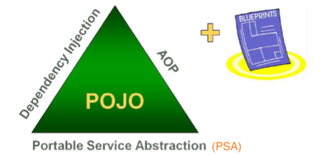

## 🌱 Spring 프레임워크 기초

 

## 1. Spring 프레임워크

> - Java를 이용한 엔터프라이즈 개발을 편리하게 해주는 도구
> - 특정 계층이나 기술에 국한되지 않고 전 영역을 포괄하는 범용적인 사용가능
> - 실수하기 쉬운 low level에 많이 신경쓰지 않으면서 비지니스 로직에 집중할 수 있도록 해줌

 

## 2. Spring 프레임워크의 전략 : 삼각형

#### 1. Portable Service Abstraction (PSA) : 서비스 추상화

> - 개발환경이나 로우레벨의 기술에 구애받지 않고 서비스를 개발 할 수 있도록 기술 구현부분과 인터페이스를 분리

#### 2. Dependency Injection (DI) : 의존성 주입

> - 객체 지향설계가 가능하도록 유연하게 확장 가능.
> - 외부 XML등으로 내부 객체의 관계를 설정

#### 3. Aspect Oriented Programming(AOP) : 관점 지향 프로그래밍

> - 한 로직을 기준으로 핵심/부가 관점으로 나누어 각각 모듈화함
> - 각 모듈에서 공통적으로 사용하는 부분을 핵심 비지니스 로직에서 분리하여 재사용
> - 트랜젝션이나 보안같이 공통적으로 필요로하는 모듈등을 실제 핵심 모듈에서 분리하여 적용 가능

#### 4. Plain Old Java Object(POJO)

> - JRE (Java Runtile Enviorment)만으로도 작동하는 일반적인 자바객체
> - Spring 컨테이너에 저장된 객체는 특정 인터페이스나 클래스를 상속받지 않아도 됨

 
 

## 3. Spring 프레임워크 특징

#### 1. 컨테이너 역할

> - Spring 컨테이너는 java의 생명주기(Life Cycle)을 관리하며 필요한 객체를 참조할 수 있음

#### 2. DI 지원

> - 설정파일이나 어노테이션을 통해 객체간의 의존관계를 설정 및 관리

#### 3. AOP 지원

> - 각 모듈에서 공통된 모듈을 실제 핵심 모듈과 분리하여 관리 가능

#### 4. POJO 지원

> - 특정 환경에 제약되지 않고 필요에 따라 재활용 될 수 있음

#### 5. 일관적인 트렌젝션 처리

> - JDBC, JTA(Java Transaction API) 등 어떤 트렌젝션을 사용하던 설정을 통해 정보를 관리하기 때문에 동일한 코드로 구현 가능

#### 6. 영속성을 제공하는 다양한 API 지원

> - Mybatis, Hiberneate 등 DB처리를 위한 ORM (Object Relational Mapping) 프레임워크들과 연동 지원
