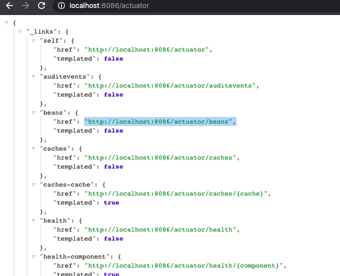
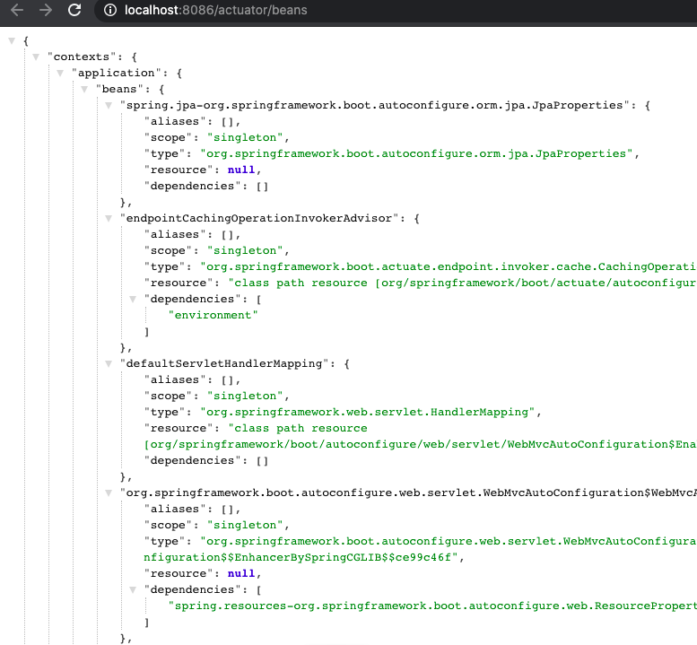
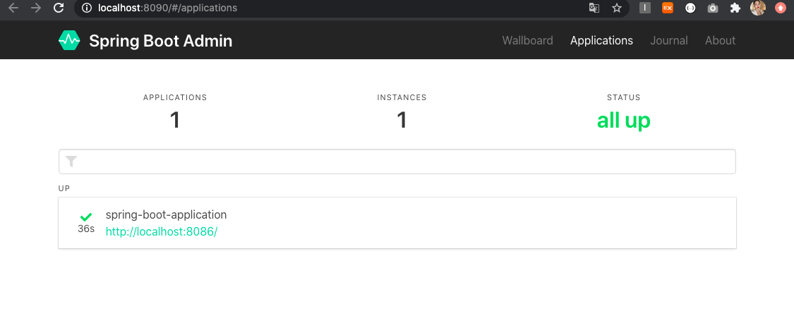
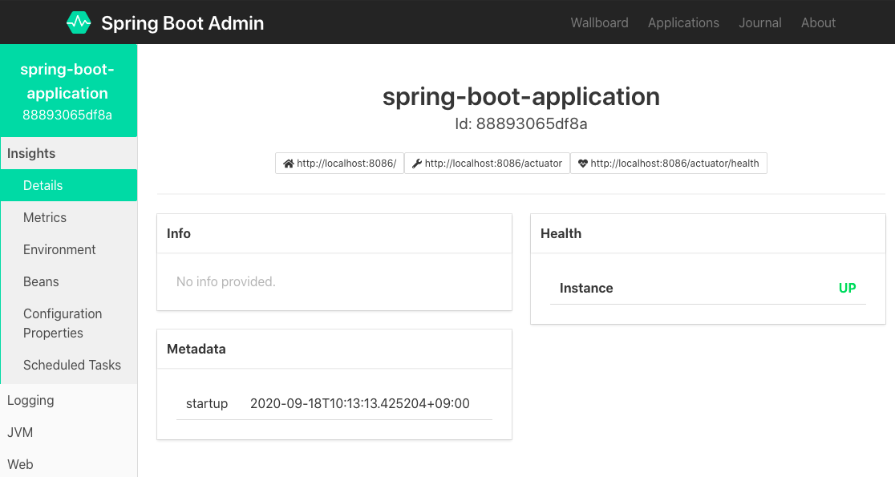

## 📢 Spring Boot Acturator로 프로젝트 관리하기

[목표]

- Acturator을 사용해 보기
- http로 코드만 확인하기 / Codecentric의 admin로 GUI 확인하기

<br>

### Spring Boot Acturator란?

> - 스프링 부트가 제공하는 애플리케이션 운영 환경 관리 기능
> - 엔드포인트와 메트릭스 데이터를 활용하는 모니터링 기능
> - 애플리케이션의 각종 정보를 확인할 수 있는 Endpoints

- 참조 : https://docs.spring.io/spring-boot/docs/current/reference/htmlsingle/#production-ready-endpoints

<br><br>

### 스프링 부트 엑추레이터 사용해보기

<br>

#### 1. 스프링 부트 Actuator 의존성 추가

[pom.xml]

```xml
<dependency>
    <groupId>org.springframework.boot</groupId>
    <artifactId>spring-boot-starter-actuator</artifactId>
</dependency>
```

<br>

#### 2. Acturator 두 가지 사용 방법 써보기

<br>

#### - HTTP 사용하기

<br>

1. health와 info를 제외한 대부분의 Endpoint가 기본적으로 비공개 상태

2. 공개 옵션 조정 [application.properties]

> management.endpoints.web.exposure.include=\*

<br>

3. [웹 페이지로 접속] : http://localhost:8086/actuator



<br>

3. [Bean 정보 확인하기] : http://localhost:8086/actuator/beans



<br><br>

#### - CodeCentric의 Admin 사용하기

<br>

##### [Server Side 서버 사이드]

1. 새로운 admin-server용 프로젝트 생성


<br>

2. 의존성 추가

[pom.xml]

```xml
<dependency>
    <groupId>de.codecentric</groupId>
    <artifactId>spring-boot-admin-starter-server</artifactId>
    <version>2.1.4</version>
</dependency>
```

<br>

3. [BootAdminServerApplication.java]: @EnableAdminServer 추가

```java
@SpringBootApplication
@EnableAdminServer

public class BootAdminServerApplication {
    public static void main(String[] args) {
	SpringApplication.run(BootAdminServerApplication.class, args);
    }
}
```

<br>

[application.properties] : 포트번호 추가

```xml
server.port=8090
```

<br>

##### [Client Side 클라이언트 사이드]

<br>

4. 관리할 프로젝트(어플리케이션 내용이 들어있는)에 Client 의존성 추가

[pom.xml]

```xml
<dependency>
    <groupId>de.codecentric</groupId>
    <artifactId>spring-boot-admin-client</artifactId>
    <version>2.1.4</version>
</dependency>
```

<br>

[application.properties] : 포트번호 추가

```xml
 spring.boot.admin.client.url=http://localhost:8090
```

<br>

[웹페이지 접속] : http://localhost:8090

<br>



<br>

[웹페이지 접속] : instacne 정보 확인하기~!



<br>
