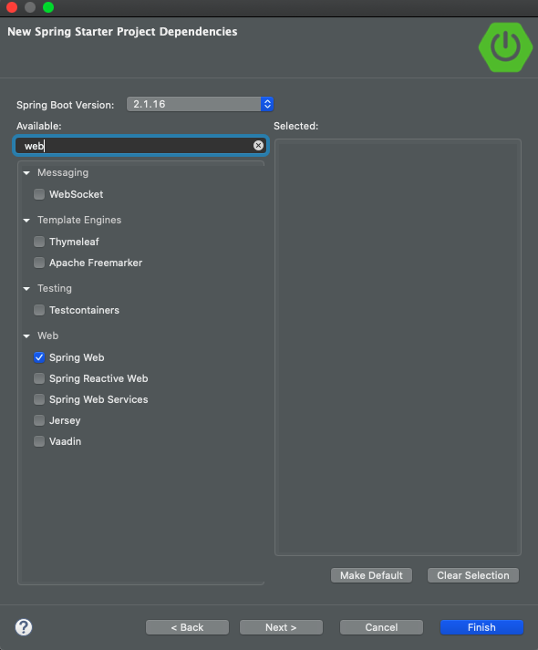
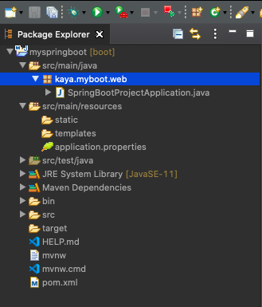
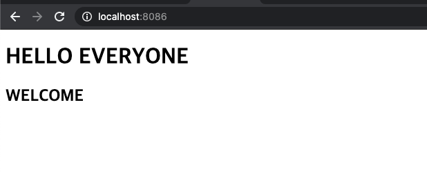

## 🎁 Spring Boot 스프링 부트 기초

[목표]

- 스프링 부트의 구조를 이해하기
- 스프링 부트 프로젝트 생성하기

<br >

### Spring Boot 스프링 부트란?

> - 스프링 프레임워크의 하위 프로젝트
> - 단독으로 실행 가능하고(stand-alone), 제품 수준의(production-grade) 스프렝 어플리케이션을 쉽게 제작할 수 있는 프로젝트
> - 내장 서버 (Tomcat, Jetty, UnderTow)등의 서버를 별도 설치 없이 사용 가능
> - **XML없는** 단순한 설정방식 제공 (어노테이션으로 대체)

<br>

### Spring Boot의 특징

#### 1. 의존성 설정 부담이 덜함

     - 그 전 스프링 프레임워크에서 일일히 설정해 줬던 의존성이 부트에서는 내부적으로 관리를 해주기 때문

<br>

#### 2. 의존성 버전관리가 쉬움

    -pom.xml에 설정된 **spring-boot-starter-** 라이브러리들이 버전을 관리함

[pom.xml]

```xml
<?xml version="1.0" encoding="UTF-8"?>
<project xmlns="http://maven.apache.org/POM/4.0.0"
	xmlns:xsi="http://www.w3.org/2001/XMLSchema-instance"
	xsi:schemaLocation="http://maven.apache.org/POM/4.0.0 https://maven.apache.org/xsd/maven-4.0.0.xsd">
	<modelVersion>4.0.0</modelVersion>
	<parent>
		<groupId>org.springframework.boot</groupId>
		<artifactId>spring-boot-starter-parent</artifactId>
		<version>2.1.16.RELEASE</version>
		<relativePath />
         <!-- lookup parent from repository -->
	</parent>
	<groupId>kaya.myboot</groupId>
	<artifactId>web</artifactId>
	<version>0.0.1-SNAPSHOT</version>
	<packaging>jar</packaging>
```

<br>

#### 3. @SpringBootApplication으로 컴포넌트를 자동 설정해줌

    - @SpringBootApplication으로 Bean을 자동 설정해줌
    - 1단계 : @ComponentScan로 Project 생성시 정해준 default 패키지부터 스캐닝하며 등록 할 빈을 찾음
    - 2단계 : @EnableAutoConfiguration : 스프링 프레임워크에 자주 사용되는 Bean들을 자동으로 컨테이너에 등록해  기본적인 웹 프로젝트를 만들 수 있도록 해줌

| 어노테이션             | 기능                                                                   |
| ---------------------- | ---------------------------------------------------------------------- |
| @SpringBootApplication | = @SpringBootConfiguration + @ComponentScan + @EnableAutoConfiguration |

<br>

### Spring Boot 시작하기

1. 프로젝트 생성


2. 의존성 웹으로 설정



3. BaseUrl 설정 (Spring.io에서 boot zip파일을 만드는 방식과 같음)


4. 생성된 프로젝트 확인



5. Port번호 설정 [application.properties]

```txt
#Tomcat port번호 변경
server.port=8086
```

<br><br>

### 프로젝트 구조 이해하기

[구조]

| 폴더명                                   | 기능                                                                                                                          |
| ---------------------------------------- | ----------------------------------------------------------------------------------------------------------------------------- |
| src/main/java                            | - 자바 Source파일들이 위치하는 디폴트 패키지 <br> - 클래스와 패키지를 **꼭** 이 위치에 만들어야 component scan과 빈 선언 가능 |
| src/main/resources/applicaion.properties | - 스프링 부트에서 사용할 프로퍼티 값을 모아둠                                                                                 |
| src/main/resources/static                | - HTML / CSS 같은 정적 파일 위치                                                                                              |
| src/main/resources/templates             | - jsp, thymeleaf 같은 동적파일                                                                                                |
| src/test/java                            | - 자바 테스트 파일들                                                                                                          |


<br>
<br>

### index.html 띄우기

> - src/main/resource/static에 index.html추가 후 서버 실행

[index.html]

```html
<!DOCTYPE html>
<html>
  <head>
    <meta charset="UTF-8" />
    <title>Insert title here</title>
  </head>
  <body>
    <h1>HELLO EVERYONE</h1>
    <h2>WELCOME</h2>
  </body>
</html>
```


