# 🧳 데이터 베이스 사용하기

[목표]

- In-Memory 데이터 베이스(H2) 사용하기
- MariaDB 연결하기
- Spring-Data-JPA 사용하기

<br>

### In-Memory 데이터 베이스 사용하기

> - 스프링 부트에서 지원하는 In-Memory 데이터베이스 : H2, HSQL, Derby
> - 그 중 H2 의존성 추가해서 사용해보기

<br>

#### 1. 부트 프로젝트 파일 설정

##### >>> 의존성 추가하기

[pom.xml] : Spring-boot-starter-jdbc 의존성 추가 => 설정이 필요한 bean 자동 설정

```xml
<dependency>
 <groupId>com.h2database</groupId>
 <artifactId>h2</artifactId>
 <scope>runtime</scope>
</dependency>
<dependency>
 <groupId>org.springframework.boot</groupId>
 <artifactId>spring-boot-starter-jdbc</artifactId>
</dependency>
```

<br>

##### >>> 코드 작성

[DBRunner.java] : Connectionr과 DataSource로 연결정보 받아오기

```java
@Component
@Order(1)
public class DBRunner implements ApplicationRunner{

	@Autowired
	private DataSource dataSource;

	private Logger logger = LoggerFactory.getLogger(DBRunner.class);


	@Override
	public void run(ApplicationArguments args) throws Exception {

		logger.info("=====>> connection ===========");
		Connection connection = dataSource.getConnection();
		DatabaseMetaData dbMeta = connection.getMetaData();
		logger.debug("DB URL : " + dbMeta.getURL());
		logger.debug("DB Username : " +dbMeta.getUserName());
		logger.info("=====>> end =============");
	}
}
```

[콘솔]

    =====>> connection ===========
    DB URL : jdbc:h2:mem:testdb
    DB Username : SA
    =====>> end =============

<br>

#### 2. 웹 브라우저 : H2 DB 관리 가능

localhost:8087/h2-console로 접속

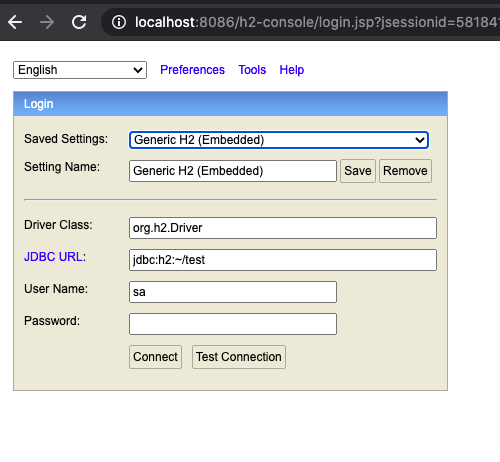

JDBC URL 콘솔에 나온 값으로 변경

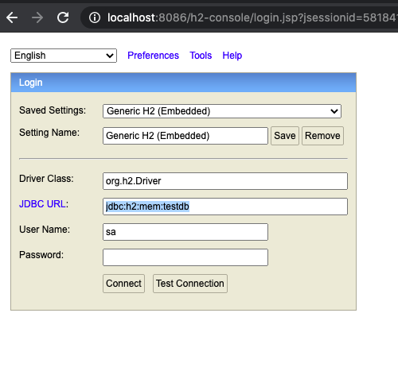

Connect후 화면

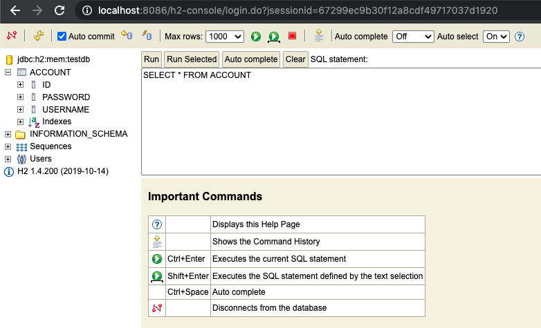

<br><br>

### MariaDB 사용하기

> - **스프링 부트는 기본적으로 제공하는 DBCP** (DataBase Connection Pooling)
>
> 1. HikariDP ( - spring.datasource.hikrai.\*)
> 2. Tomcat CP ( - spring.datasource.tomcat.\*)
> 3. Commons DBCP2 ( - spring.datasource.dbcp2)
>
> - MySQL 커넥터 의존성과 MySQL Datasource 설정으로 MariaDB에 연결할 수 있음

<br>

##### >>> 의존성 추가하기

[pom.xml] : MySQL 커텍터 의존성 추가

```xml
<dependency>
    <groupId>mysql</groupId>
    <artifactId>mysql-connector-java</artifactId>
    <version>8.0.13</version>
</dependency>
```

##### >>> 환경 설정

[application.properties] MySQL DataSource 설정

```xml
#mysql 설정
spring.datasource.url=jdbc:mysql://127.0.0.1:3306/spring_db?useUnicode=true&charaterEncoding=utf-8&useSSL=false&serverTimezone=UTC
spring.datasource.username=spring
spring.datasource.password=spring
spring.datasource.driverClassName=com.mysql.cj.jdbc.Driver
```

[터미널로 Maria DB에 접속 및 데이터 추가] : MySQL Database 생성

```sql
mysql -u root –p
show databases;
use mysql;
create user spring@localhost identified by 'spring';
grant all on *.* to spring@localhost;
flush privileges;
exit;
mysql -u spring -p
create database spring_db;
show databases;
use spring_db;
```

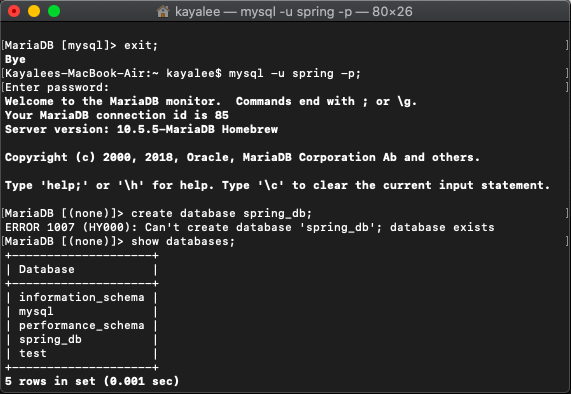

<br><br>

### Spring-Data-JPA 사용하기

#### ORM과 JPA 란?

> - **ORM**(Object-Relational Mapping) : 관계형 DB테이블을 객체지향적으로 사용하기 위해 객체와 관계를 연결해줌 (DB테이블 자체를 객체로 사용)
> - **JPA**(Java Persistance API) : ORM 표준기술로 데이터베이스 정보를 객체 지향으로 쉽게 적용할 수 있게 도와줌
> - 그 중, 스프링부트는 Hibernate로 구현

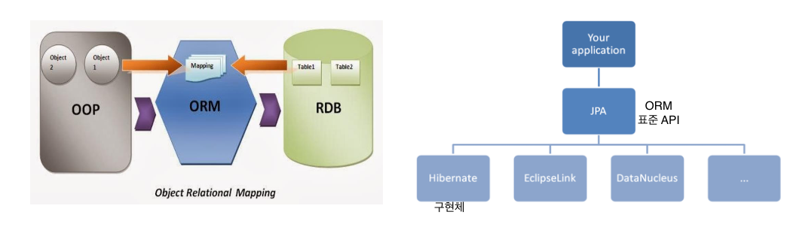

<br>

#### Spring-Data-JPA의 특징

> - JPA를 쉽게 사용하기 위해 스프링에서 제공하는 프레임워크
> - Repository Bean을 자동생성
> - 쿼리 메소드 자동구현
> - @EnalbeJpaRepositories (스프링부트가 자동으로 설정해줌)

<br>

##### >>> 의존성 추가하기

[pom.xml] : Spring-Data-JPA와 spring-boot-starter-test 의존성 추가

```xml
<!-- Spring Data JPA -->
<dependency>
    <groupId>org.springframework.boot</groupId>
    <artifactId>spring-boot-starter-data-jpa</artifactId>
</dependency>

<!-- Spring Boot Starter Test -->
<dependency>
    <groupId>org.springframework.boot</groupId>
    <artifactId>spring-boot-starter-test</artifactId>
    <!-- scope test는 test directory안에서만 의존성이 동작한다는 뜻 -->
    <scope>test</scope>
</dependency>
```

<br>

##### >>> 코드 작성

[사용 어노테이션 먼저 알기]

| 어노테이션      | 기능                                                                                                          |
| --------------- | ------------------------------------------------------------------------------------------------------------- |
| @Entity         | - 엔티티 클래스임을 지정하며 **DB 테이블**과 매핑하는 객체를 나타냄                                           |
| @Id             | - 엔티티의 **기본키**를 나타내는 어노테이션입니다.                                                            |
| @GeneratedValue | - 주 키의 값을 **자동 생성**하기 위해 명시하는 데 사용 <br> -자동 생성 전략 : AUTO, IDENTITY, SEQUENCE, TABLE |

**앤티티(Entity)란** 데이터베이스에서 표현하려고 하는 유형, 무형의 객체로서 서로 구별되는 것을 뜻함. 이 객체들은 DB 상에서는 보통 table로서 나타남

**객체 <=> DB 매핑**

    - 클래스(엔티티) <=> 테이블
    - 객체 <=> Row (행)
    - 변수 <=> Column (열)

<br>

[Account.java] : DB Account 테이블 생성하기

```java
@Entity
public class Account {
	@Id @GeneratedValue(strategy = GenerationType.IDENTITY)
	//primary key만들기
	private Long id;

	@Column(unique = true)
	private String username;

	private String password;

	public Long getId() {
		return id;
	}

	public void setId(Long id) {
		this.id = id;
	}

	public String getUsername() {
		return username;
	}

	public void setUsername(String username) {
		this.username = username;
	}

	public String getPassword() {
		return password;
	}

	public void setPassword(String password) {
		this.password = password;
	}

	@Override
	public String toString() {
		return "Account [id=" + id + ", username=" + username + ", password=" + password + "]";
	}
}
```

<br>

[AccountRepository.java] : Repository 인터페이스 작성

> - AccountRepository의 구현클래스를 따로 작성하지 않아도 Spring-Data-JPA가 자동적으로 해당 문자열 username에 대한 인수를 받아 자동적으로 DB Table에 매핑
> - JpaRepository<엔티티 클래스, 프라이머리 키 타입>
> - JpaRepository의 상위 객체 CrudRepository가 이미 여러 매소드를 구현해 놓기 때문에 없는것들만 여기에 저장해둠
> - 참조 : https://attacomsian.com/blog/spring-data-jpa-auditing#further-reading

**CrudRepository** 구현 메소드들:

- save(), saveAll()
- findById(), findAll(), findAllById()
- count()
- delete(), deleteById(), deleteAll()

<br>

```java
public interface AccountRepository extends JpaRepository<Account, Long>{

    //findBy(column명)
    Account findByUsername(String username);
}
```

[applicaion.properties] : JPA로 데이터베이스를 자동 초기화하도록 설정

```xml
#SQL 설정
spring.jpa.hibernate.ddl-auto=create
spring.jpa.show-sql=true
```

<br>

[jpa 설정옵션]

**spring.jpa.hibernate.ddl-auto=** create|create-drop|update|validate

**1. create**

> JPA가 DB와 상호작용할 때 기존에 있던 스키마(테이블)을 삭제하고 새로 만듬

**2. create-drop**

> JPA 종료 시점에 기존에 있었던 테이블을 삭제

**3. update**

> 기존 스키마는 유지하고, 새로운 것만 추가하고, 기존의 데이터도 유지/ 변경된 부분만 반영함
> 주로 개발 할 때 적합

**4.validate**

> 엔티티와 테이블이 정상 매핑 되어 있는지를 검증

**spring.jpa.show-sql=true**

> JPA가 생성한 SQL문을 보여줄 지에 대한 여부를 알려줌

<br>

[src/test/java/AppRepoTest.java] : 실제로 쿼리가 정상적으로 동작하는지 jUnit 확인

```java
@RunWith(SpringRunner.class)
@SpringBootTest
public class AppRepoTest {
	@Autowired
	private AccountRepository repository;

	@Test
	public void account() throws Exception {
		System.out.println(repository.getClass().getName());
		//1. Account 객체 생성 -> 등록
		Account account = new Account();
		account.setUsername("Spring2");
		account.setPassword("1234");

		Account addAccount = repository.save(account);
		System.out.println(addAccount.getId() + " " + addAccount.getUsername());
	}
}
```

[콘솔] : hibernate가 쿼리문을 실행
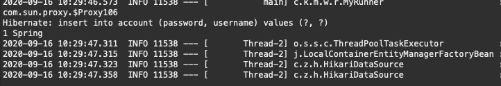

[jUnit 실행결과] : 정상 작동

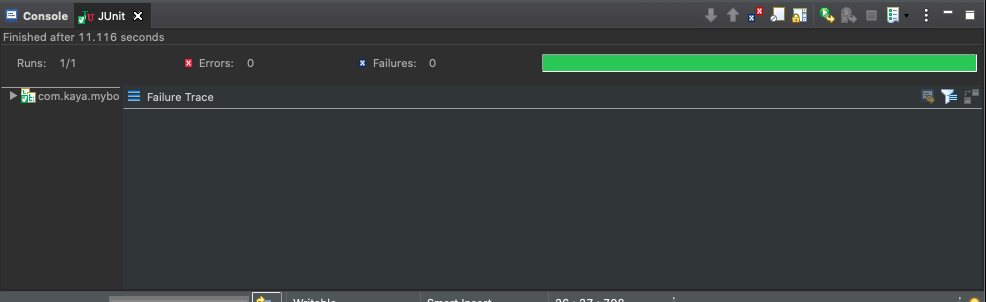

[table확인] : 추가한 데이터 확인

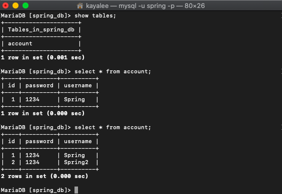

<br>

#### + ddl-auto : validate 확인해보기

[applicaion.properties]

```xml
#SQL 설정
spring.jpa.hibernate.ddl-auto=validate
spring.jpa.show-sql=true
```

[Account.java] : email값 추가해보기

```java
@Entity
public class Account {
	@Id @GeneratedValue(strategy = GenerationType.IDENTITY)
	//primary key만들기
	private Long id;

	@Column(unique = true)
	private String username;

	@Column
	private String password;

	@Column
	private String email;

	public String getEmail() {
		return email;
	}

    (...)
}
```

[src/test/java/AppRepoTest.java] : 다시 사용자 추가 가능한지 확인 / 코드 수정없음

[콘솔 에러] : validate로 변경하고 email추가 시, 콘솔에 에러 발생

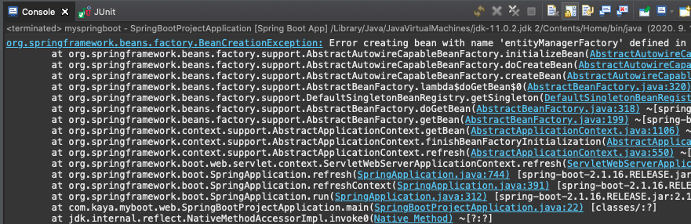

[applicaion.properties] : 다시 update로 변경시 정상 작동

```xml
#SQL 설정
spring.jpa.hibernate.ddl-auto=update
spring.jpa.show-sql=true
```

[데이터 확인] : email column 생성
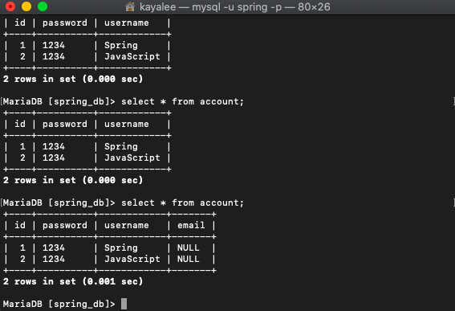

<br>

#### + Optional 객체 사용해보기

> - **Optional 객체 반환**
> - Java8은 함수형 언어의 접근 방식에서 영감을 받아 java.util.Optional<T>라는 새로운 클래스를 도입
> - **Optional**: “존재할 수도 있지만 않 할 수도 있는 객체”, ”null이 될 수도 있는 객체” 를 감싸고 있는 일종의 래퍼 클래스
> - 명시적으로 해당 변수가 null일 수도 있다는 가능성을 표현히여 불필요한 NullPointException 방어 로직을 줄일 수 있음
> - Optional에 저장된 객체의 값이 있으면 True 없으면 null(False)

<br>

#### username과 id로 테이블 조회 해보기

[AccountRepository.java]

```java
public interface AccountRepository extends JpaRepository<Account, Long>{
	Account findByUsername(String username);

    //optional 추가
    // Optional<객체> : 객체는 정상적일수도, null일수도
	Optional<Account> findByEmail(String email);
}
```

[Test.java] :

```java

@RunWith(SpringRunner.class)
@SpringBootTest

public class AppRepoTest {

	@Autowired
	private AccountRepository repository;

	@Test
	public void finder() {
        //table에 없는 username 불러보기
        //null값 출력
	Account account = repository.findByUsername("lambda2");
	System.out.println(account);

        //Optional에 저장된 Account객체의 값이 있으면
        // TrueOptional에 저장된 Account객체의 값이 없으면 (null) False

	Optional<Account> optional = repository.findById(1L);
	System.out.println(optional.isPresent());
	}
}
```

[콘솔 출력]
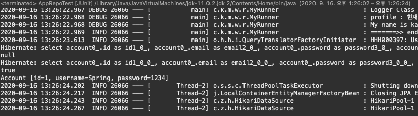

[Test.java] : Optional적용 후 없는 Email값 찾아보기

```java
@RunWith(SpringRunner.class)
@SpringBootTest

public class AppRepoTest {
	@Autowired
	private AccountRepository repository;

	@Test
	public void finder() {
        //table에 없는 ID 불러보기
        //null값 출력
	Account account = repository.findByUsername("lambda2");
	System.out.println(account);

        //id가 1번인 account객체가 존재하는지 optional이 출력
        //true
	Optional<Account> optional = repository.findById(1L);
	System.out.println(optional.isPresent());


        // <요청한 아이디가 있으면 Account객체 반환, 없으면 예외 발생하도록 설정>

        // optional 설정 후 받아오기
	if(optional.isPresent()) {
	    Account account2 = optional.get();
	    System.out.println(account2);
        //콘솔 Print
        // optional.get() : Account [id=1, username=Spring, password=1234]
	}

        //없는 이메일 주소로 찾아보기
	Optional<Account> optEmail = repository.findByEmail("lambda1@gmail.com");

	//Supplier 함수형 인터페이스추상 메소드 T get()사용
	Account account3 = optEmail.orElseThrow(()-> new RuntimeException("요청한 이메일 주소를 가진 Account가 없습니다. "));
	System.out.println(account3);
	}
}
```

[jUnit Test결과] : 예외 처리 발생
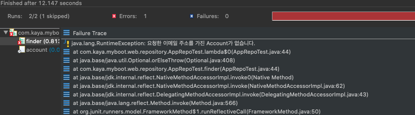

<br>

#### Eamil값 업데이트 해보기

[test.java] : 업데이트 메소드 추가 후 실행

```java
@Test
public void update() {
    Optional<Account> optFindById = repository.findById(2L);

    //요청한 아이디와 일치하는 객치가 있을 경우
    if(optFindById.isPresent()) {
	Account account = optFindById.get();
	account.setEmail("changed@email.com");
	repository.save(account);
	}
}
```

[콘솔 출력] : Email 값이 null=> changed@email.com으로 변경

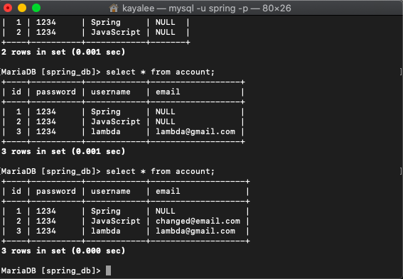
