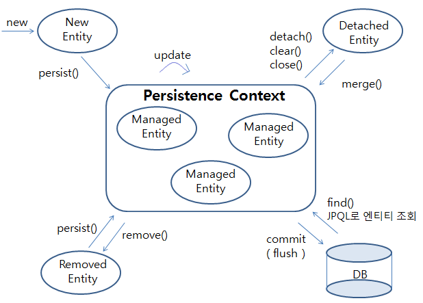

## JPA의 @PersistenceContext와 EntityManager

 

### Persistence Context 영속적 컨텍스트란?

> - 서버사이드와 DB 사이에 엔티티를 저장하는 논리적인 영역
> - 엔티티 매니저가 엔티티를 저장/조회한 것을 영속성 컨텍스트에서 보관하고 관리
> - 엔티티 매니저를 생성할 때 같이 생성됨
> - @Id 필드가 꼭 있어야 엔티티 식별 가능

 

### Entity Manager 엔티티 매니저란?

> - 여러 엔티티 매니저가 같은 영속성 컨텍스트에 접근 가능
> - 하나의 엔티티 매니저에 하나의 영속성 컨텍스트가 생성됨
> - 엔티티 매니저를 통해서 영속성 컨텍스트에 접근 & 관리 가능

출처: https://wckhg89.tistory.com/10 [줌구의 개발일기]

 

이미지 출처 : https://victorydntmd.tistory.com/207
