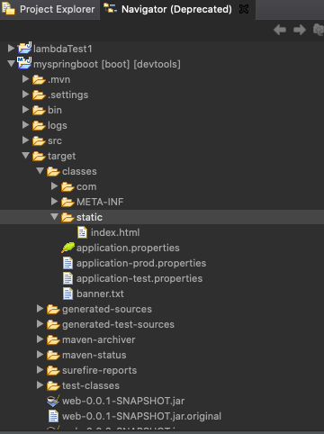
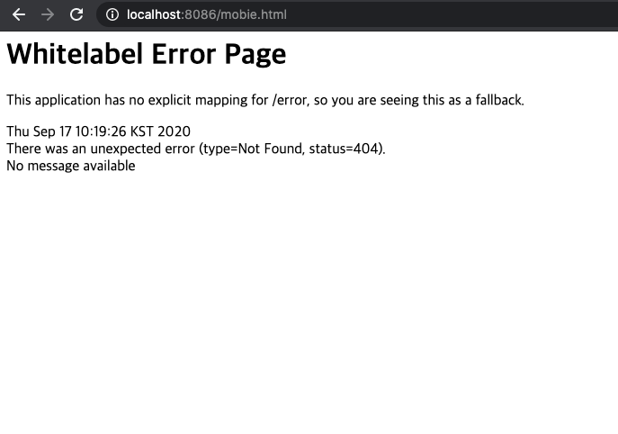
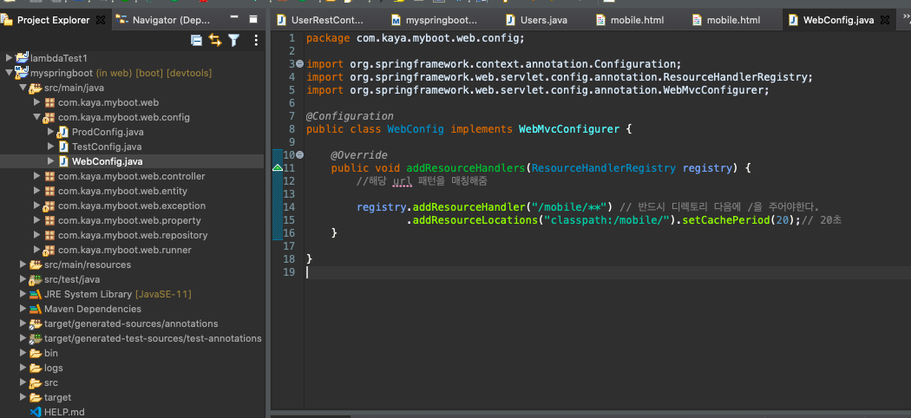

## 📡 Static File Path 연결하기

[목표]

- Static 파일 경로를 설정하여 웹 브라우저에 띄우기

<br>

### Staic File 정적 파일

• HTML, CSS등의 정적 파일은 src/main/resources/static에 위치

• 정적 리소스 지원하는 기본 리소스에 패스를 지정해서 웹 페이지에 올릴 수 있음

    lasspath:/static
    classpath:/public classpath:/resources/ classpath:/META-INF/resources

[Navigator로 static files 위치 확인]


<br>
<br>

### HTML 파일 추가 후, 경로 연결하기

> - static 폴더 안에 mobile폴더와 mobile.html 만들기
> - 만든 HTML과 url 연결하기

<br>

[main/src/sources/static/mobile/mobile.html]

```html
<!DOCTYPE html>
<html>
  <head>
    <meta charset="UTF-8" />
    <title>Insert title here</title>
  </head>
  <body></body>
</html>
```

[localhost 경로로 웹 브라우저에서 동작하나 확인] : 연결 안됨



[main/java/config/WebConfig.java] : url path 연결



[localhost url 매핑] : 연결 완료


<br><br>
