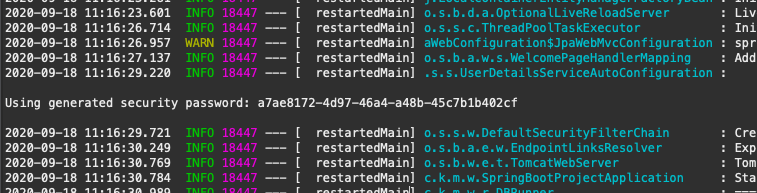
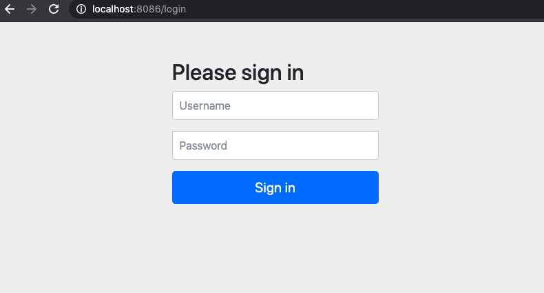
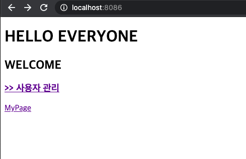
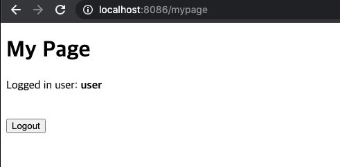
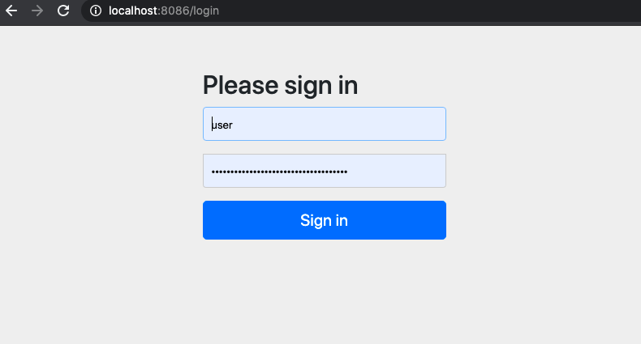
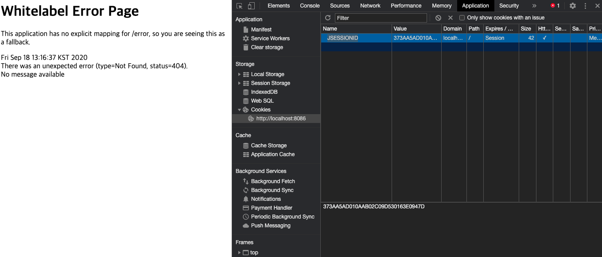
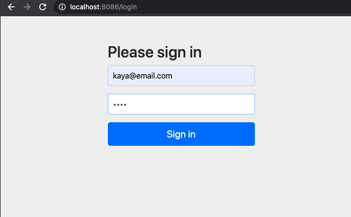
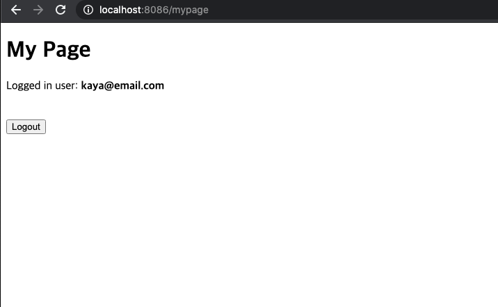

## 🔐 Spring Boot Security 스프링 부트 인증시스템

[목표]

- 스프링부트의 인증 시스템 사용해보기
- 여러 유저로 접속 가능한 인증시스템 넣어보기

<br>

### Spring Boot Security 특징

> - 웹과 메서드에 시큐리티 기능 제공
> - Basic 인증, Form 인증, OAuth, LDAP등 다양한 인증 방법 지원
> - 스프링 부트 시큐리티 자동 설정에 필요한 설정
>   **@SecurityAutoConfiguration** & **UserDetailsServiceAutoConfiguration**
> - 처음에 기본 사용자를 자동으로 생성
>   - Username : user
>   - Password : 애플리케이션을 실행할 때 마다 랜덤 값 생성 (콘솔에 출력됨)

- 참고 : https://docs.spring.io/spring-boot/docs/2.1.1.RELEASE/reference/htmlsingle/#boot-features-security-mvc

<br><br>

### Security 구현하기

<br>

#### 1. spring-boot-starter-security 의존성 추가

[pom.xml]

```xml
<dependency>
    <groupId>org.springframework.boot</groupId>
    <artifactId>spring-boot-starter-security</artifactId>
</dependency>
```

<br>

- 추가 후 콘솔창에 인증번호 출력



<br>

- 웹페이지 접속 : localhost:8087

> Id: user / password : 콘솔창 인증번호로 로그인



<br>

#### 2. index.html과 controller.java에 코드 추가

**[index.html]** : 메인페이지에 /mypage url 링크태그 입력

```html
<!DOCTYPE html>
<html>
  <head>
    <meta charset="UTF-8" />
    <title>Insert title here</title>
  </head>
  <body>
    <h1>HELLO EVERYONE</h1>
    <h2>WELCOME</h2>
    <h3>
      <a href="/index"> >> 사용자 관리 </a>
    </h3>
    <a href="/mypage">MyPage</a>
  </body>
</html>
```

**[Controller.java]** :/mypage 매핑

```java

@Controller
public class UserThymController {

	@Autowired
	UserRepository userRepo;

	@Controller
	public class TemplateController {
	@GetMapping("/mypage") public String mypage() {
	return "mypage"; }
	}
}
```

[웹 브라우저]



<br>

#### 3. mypage.html 생성

[templates>mypage.html]

```html
<!DOCTYPE html>
<html xmlns:th="http://www.thymeleaf.org">
  <meta charset="UTF-8" />
  <body>
    <h1>My Page</h1>
    <div>
      Logged in user:
      <b th:inline="text" class="user">
        [[${#httpServletRequest.remoteUser}]]
      </b>
      <br />
      <form th:action="@{/app-logout}" method="POST">
        <input type="submit" value="Logout" />
      </form>
    </div>
  </body>
</html>
```

[/mypage 웹 브라우저] : 타란~!~!



<br>
<br>

#### 4. index.html와 mypage의 접근 권한 달리 하기

**[SecurityConfig.java]** : WebSecurityConfigurerAdapter 상속 받아 configure 매소드 사용하기

```java

@Configuration
public class SecurityConfig extends WebSecurityConfigurerAdapter {

    @Override
	protected void configure(HttpSecurity http) throws Exception {
	    http.authorizeRequests()
		.antMatchers("/mypage/**")
		.authenticated()
		.antMatchers("/**")
		.permitAll()
		.and()
		.formLogin()
		.and().httpBasic() // 여기까지 index는 필요 없고 mypage로 들어갈때만 인증 필요하도록
    }

    //password를 인코딩해주는 빈 추가
    @Bean
	public PasswordEncoder passwordEncoder() {
		return PasswordEncoderFactories.createDelegatingPasswordEncoder();
	}
}
```

[/mypage url 접속 시, 인증 요구]



[인증 완료]


<br>

#### 5. mypage에 로그아웃 구현하기

**[SecurityConfig.java]** : 로그아웃 코드 추가

```java
@Configuration
public class SecurityConfig extends WebSecurityConfigurerAdapter {

	@Override
	protected void configure(HttpSecurity http) throws Exception {
		http.authorizeRequests()
		.antMatchers("/mypage/**")
		.authenticated()
		.antMatchers("/**")
		.permitAll()
		.and()
		.formLogin()
		.and().httpBasic() // 여기까지 index는 필요 없고 mypage로 들어갈때만 인증 필요하도록

        // 로그아웃 기능 구현!
		.and()
		.logout()
		.logoutUrl("/app-logout")
        //deleteCookies(웹 브라우저 쿠키 Name)로 연결 login 세션 끊어주기
        //아래 이미지 참조
		.deleteCookies("JSESSIONID")
		.logoutSuccessUrl("/"); //logout시 다시 루트로
	}

}
```

[웹 브라우저 쿠키 ]



<br>

#### 6. DB의 유저 정보로 로그인 할 수 있도록 설정하기

<br>

**[AccountService.java]** : 서비스 Bean 추가하기

> - UserDetailsService를 상속받아 Account를 생성하는 createAcount() 메서드 구현
> - Import시, 만들어 놓은 User 객체가 아닌 UserDetail를 불러와야 함
>   `import org.springframework.security.core.userdetails.User`
> - loadUserByUsername() 매소드로 입력한 정보가 valid한지 체크함

| 어노테이션     | 기능                                                                                                                  |
| -------------- | --------------------------------------------------------------------------------------------------------------------- |
| @PostConstruct | - 객체를 생성하자마자 처리할 일이 있을 때 사용하는 매소드 <br> - Constructor 호출 후, 바로 @PostConstruct 매소드 처리 |

<br>

```java
import org.springframework.security.core.userdetails.User;
import org.springframework.security.core.userdetails.UserDetails;
import org.springframework.security.core.userdetails.UserDetailsService;
import org.springframework.security.core.userdetails.UsernameNotFoundException;

@Service
public class AccountService implements UserDetailsService {

	private final AccountRepository repo;

    //properties 객체 사용
	private final KayaProperties props;

	//생성자로 @Autowired 대체
	public AccountService(AccountRepository repo, KayaProperties props) {
		this.repo = repo;
		this.props = props;
	}

	@Override
    //login 할때 사용자가 입력한 정보가 유효한지를 체크한다.
	public UserDetails loadUserByUsername(String email) throws UsernameNotFoundException {
		Optional<Account> userAcc = repo.findByEmail(email);
		Account account = userAcc.orElseThrow(()-> new UsernameNotFoundException("요청하신 "+email + "이 없습니다."));

	//*주의* Security의 USer임 Entity(X)
        //User(ID, password, 권한) 확인
		return new User(account.getEmail(), account.getPassword(), authorities());
	}

     //위에서 확인 할 User 객체의 권한설정
     //'ROLE_USER'은 내장된 값
	private Collection<? extends GrantedAuthority> authorities() {
		return Arrays.asList(new SimpleGrantedAuthority("ROLE_USER"));
	}

     //새로운 어카운트 생성 매소드
     //서비스 객체생성시, PostConstruct를 통해 createAccount 호출됨
	public Account createAccount(String email, String password) {
		Account account = new Account();
		account.setEmail(email);

            //SecurityConfig에서 설정해준 passwordEncoder 매소드의 을 받아옴
		account.setPassword(passwordEncoder.encode(password));
		return repo.save(account);
	}

	@PostConstruct
    //Service Bean 생성 직후에 바로 호출되는 매소드
     //찾는 값이 있으면 가져오고, 없으면 createAccount()로
	public void init() {
		Optional<Account> optEmail = repo.findByEmail(props.getEmail());

		//Email주소와 매핑되는 Account가 없으면 등록
		if(optEmail.isEmpty()) {
		    Account account = this.createAccount(props.getEmail(), props.getPassword());
		    System.out.println(account);
		}
	}
}
```

<br>

[웹 브라우저] : Account DB에 추가된 정보로 로그인




