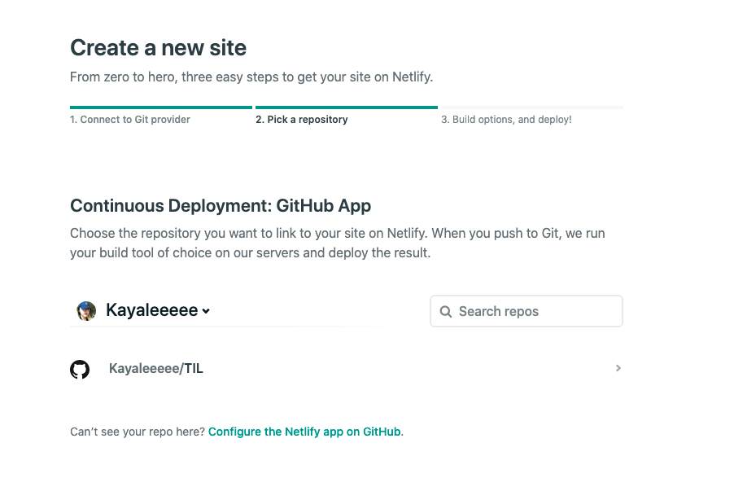
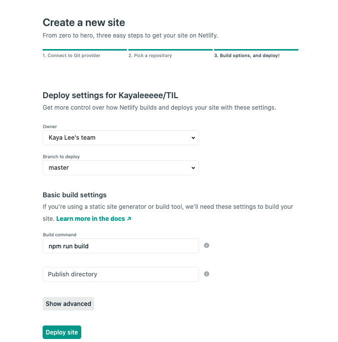

## 🌵[Netlify](https://www.netlify.com/)로 배포하기

> Netlify는 깃허브 레포지토리를 그대로 배포할 수 있는 아주 깔쌈한 서비스다.
> basic모드로 사용하면 개인적인 용도의 배포는 **무료**라니 감사감사합니다.
>
> Netlify를 이용해서 Docsify까지 배포해보기~!~!~!~!

<br />
<br />

## 🚘 Netlify 사이트에서 배포하기

### 1. https://www.netlify.com 에서 깃허브를 통해서 로그인


<br />

### 2. 새로운 사이트 만들기

> 깃허브 repo를 그대로 쓸꺼라서 github 선택
> 

<br />

### 3. 배포할 깃허브 Repo 선택하기


<br />

### 3. 배포 세팅

> 이제 깃허브 Repo와 사이트를 연결해서 push할 때마다 자동으로 배포되도록 배포 명령어와 directory 설정하기



## 🚲 CLI로 배포하기

> 원래 사이트에서 바로 배포가 되어야 하는데^^,, 오류만 백만번 나는 바람에 CLI로 다시 배포했습니다.
> 사이트에서 오류가 나시는 분들은 CLI로도 진행해보세요.
> https://www.netlify.com/blog/2019/05/28/deploy-in-seconds-with-netlify-cli/

<br/><br/>

### 터미널에 Netlify CLI 설치하기

```bash
npm install netlify-cli -g
### OR ###
yarn global add netlify-cli
```

<br>

### Netlify 로그인 하기

```bash
netlify login
```

<br>

### 배포할 폴더에서 Netlify init

> init을 실행하면 터미널 창에서 자동으로 사이트 이름과 git repo를 고르는 것까지 쭉 도와준다

```bash
netlify init
```

### netlify 로컬 서버로 돌려보기

```bash
netlify dev
netlify dev ---live
```

```
◈ Server listening to 3999

   ┌─────────────────────────────────────────────────┐
   │                                                 │
   │   ◈ Server now ready on http://localhost:8888   │
   │                                                 │
   └─────────────────────────────────────────────────┘
```

문제 없으면 배포 하기~!~!

```bash
netlify deploy -p
```

#### git file 수정 후 재 업로드

```bash
netlify deploy
netlify deploy -p
```
