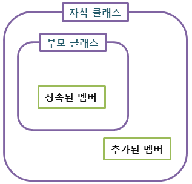

## 상속(inheritance)

### 상속(inheritance)이란?

* 기존의 클래스에 기능을 추가하거나 재정의하여 새로운 클래스를 정의하는 것을 의미
* 상속은 캡슐화, 추상화와 더불어 객체 지향 프로그래밍을 구성하는 중요한 특징 중 하나
* 상속을 이용하면 기존에 정의되어 있는 클래스의 모든 필드와 메소드를 물려받아, 새로운 클래스를 생성할 수 있음
* 부모 클래스(parent class), 상위 클래스(super class), 기초 클래스(base class) 
  * 기존에 정의되어 있던 클래스
* 자식 클래스(child class), 하위 클래스(sub class), 파생 클래스(derived class)
  * 상속을 통해 새롭게 작성되는 클래스


### 상속의 장점

1. 기존에 작성된 클래스를 재활용할 수 있음
2. 자식 클래스 설계 시 중복되는 멤버를 미리 부모 클래스에 작성해 놓으면, 자식 클래스에서는 해당 멤버를 작성하지 않아도 됨
3. 클래스 간의 계층적 관계를 구성함으로써 다형성의 문법적 토대를 마련


##### 자식 클래스(child class)

> 자식 클래스란 부모 클래스의 모든 특성을 물려받아 새롭게 작성된 클래스

``` java
class 자식클래스이름 extend 부모클래스이름 { ... }
```



* 자식 클래스에는 부모 클래스의 필드와 메소드만이 상속되며, 생성자와 초기화 블록은 상속되지 않음
* 부모 클래스의 접근 제어가 private이나 default로 설정된 멤버는 자식 클래스에서 상속받지만 접근할 수는 없음


##### Object 클래스

> Object 클래스는 모든 클래스의 부모 클래스가 되는 클래스


* 자바의 모든 클래스는 자동으로 Object 클래스의 모든 필드와 메소드를 상속받게 됨

* 즉, 자바의 모든 클래스는 별도로 extends 키워드를 사용하여 Object 클래스의 상속을 명시하지 않아도 Object 클래스의 모든 멤버를 자유롭게 사용할 수 있음

* toString(), clone()

  

### super와 super()

##### super 키워드

> super 키워드는 부모 클래스로부터 상속받은 필드나 메소드를 자식 클래스에서 참조하는 데 사용하는 참조 변수

* 인스턴스 변수의 이름과 지역 변수의 이름이 같을 경우 인스턴스 변수 앞에 this 키워드를 사용하여 구분할 수 있었음

* 이와 마찬가지로 부모 클래스의 멤버와 자식 클래스의 멤버 이름이 같을 경우 super 키워드를 사용하여 구별할 수 있음

* super 참조 변수를 사용하여 부모 클래스의 멤버에 접근 할 수 있음

  ```java
  class Parent {
      int a = 10;
  }
  
  class Child extends Parent {
      int a = 20;
      void display() {
          System.out.println(a);
          System.out.println(this.a);
          System.out.println(super.a);
      }
  }
   
  public class Inheritance03 {
      public static void main(String[] args) {
          Child ch = new Child();
          ch.display();
      }
  }
  
  //실행 결과
  20
  20
  10
  ```

  

##### super() 메소드

>  this() 메소드가 같은 클래스의 다른 생성자를 호출할 때 사용된다면, super() 메소드는 부모 클래스의 생성자를 호출할 때 사용됨

* 자식 클래스의 인스턴스를 생성하면, 해당 인스턴스에는 자식 클래스의 고유 멤버뿐만 아니라 부모 클래스의 모든 멤버까지도 포함되어 있음

* 따라서 부모 클래스의 멤버를 초기화하기 이해서는 자식 클래스의 생성자에서 부모 클래스의 생성자까지 호출해야하만 함

* 이러한 부모 클래스의 생성자 호출은 모든 클래스의 부모 클래스인 Object 클래스의 생성자까지 계속 거슬러 올라가며 수행함

* 따라서 자바 컴파일러는 부모 클래스의 생성자를 명시적으로 호출하지 않는 모든 자식 클래스의 생성자 첫줄에 자동으로 다음과 같은 명령문을 추가하여, 부모 클래스의 멤버를 초기화할 수 있도록 해줌

  ```java
  class Parent {
      int a;
      Parent() { a = 10; }
      Parent(int n) { a = n; }
  }
  
  class Child extends Parent {
      int b;
      Child() {
  ①      //super(40);      자동으로 super(); 구문을 삽입함
          b = 20;
      }
      void display() {
          System.out.println(a);
          System.out.println(b);
      }
  }
  
  public class Inheritance04 {
      public static void main(String[] args) {
          Child ch = new Child();
          ch.display();
      }
  }
  
  //실행 결과
  10
  20
  ```

  

