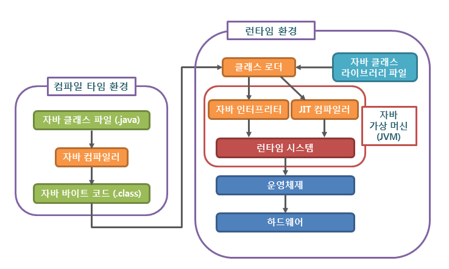
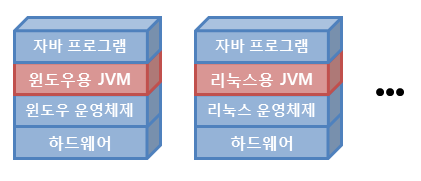

# 자바 프로그래밍

### 자바 프로그램의 실행 과정 

### 자바 컴파일러(Java Compiler)

* 자바 소스 코드를 자바 가상 머신이 이해할 수 있는 자바 바이트 코드로 변환
* 자바 컴파일러는 자바를 설치하면 javac.exe라는 실행 파일 형태로 설치됨

### 자바 바이트 코드(Java bytecode)

* 자바 가상 머신이 이해할 수 있는 언어로 변환된 자바 소스 코드를 의미
* 자바 컴파일러에 의해 변환되는 코드의 명령어 크기가 1바이트라서 자바 바이트 코드라고 불림
* 이러한 자바 바이트 코드의 확장자는 .class 
* 자바 바이트 코드는 자바 가상 머신만 설치되어 있으면, 어떤 운영체제에서라도 실행될 수 있음

### 자바 가상 머신(JVM)

* 자바 가상 머신(JVM, Java Virtual Machine)이란 자바 바이트 코드를 실행시키기 위한 가상의 기계

* 자바로 작성된 모든 프로그램을 자바 가상 머신에서만 실행될 수 있음(반드시 자바 프로그램 실행을 위해서 자바 가상 머신이 설치되어야함)

  

* 서로 다른 운영체제라도 JVM만 설치 되어 있다면, 같은 자바 프로그램이 아무런 추가 조치 없이 동작
  * 즉, 개발자는 한 번만 프로그램을 작성하면, 모든 운영체제에서 같은 사용할 수 있는 장점이 있음
* 단, 자바 프로그램과는 달리 JVM은 운영체제에 종속적이므로, 각 운영체제에 맞는 자바 가상 머신을 설치 해야함
* 또한, 자바 프로그램은 일반 프로그램 보다 JVM이라는 한 안계를 더 거쳐야 하므로, 상대적으로 실행 속도가 느리다는 단점이 있음

### 자바 가상 머신의 구성

* 자바 인터프리터(interpreter)

  * 자바 컴파일러에 의해 변환된 자바 바이트 코드를 읽고 해석하는 역활

  

* 클래스 로더(class loader)

  * 자바는 동적으로 클래스를 읽어옴으로, 프로그램이 실행 중인 런타임에서야 모든 코드가 자바 가상 머신과 연결
  * 이렇게 동적으로 클래스를 로딩해주는 역활

  

* JIT 컴파일러(Just-In-Time compiler)

  * 프로그램이 실행 중인 런타임에 실제 기계어로 변환해 주는 컴파일러
  * 동적 번역이라고도 불리는 이 기법은 프로그램의 실행 속도를 향상시키기 위해 개발되었음
  * 즉, JIT 컴파일러는 자바 컴파일러가 생성한 자바 바이트 코드를 런타임에 바로 기계어로 변환하는 데 사용

  

* 가비지 컬렉터(garbage collector)

  * 더는 사용하지 않은 메모리를 자동으로 회수
  * 개발자가 따로 메모리를 관리하지 않아도 됨, 손쉽게 프로그래밍을 할 수 있도록 도와줌