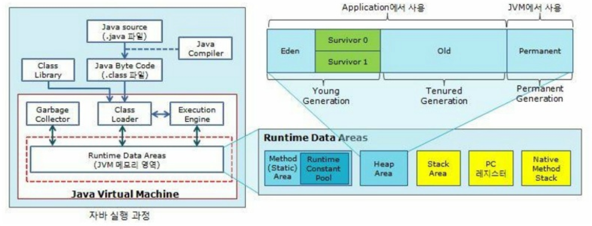
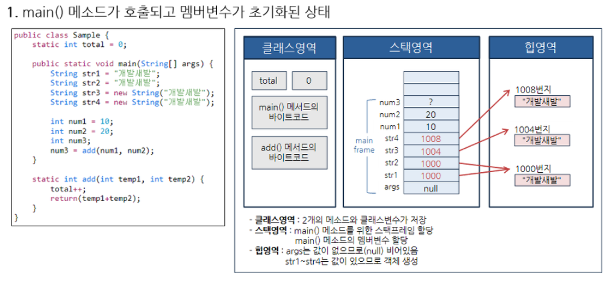

# 자바의 구동 원리와 JVM

1. 소스코드를 작성한다. (.java 확장자의 소스파일)
2. 컴파일러(javac.exe)가 바이트코드로 변한다.(.class 확장자의 클래스 파일)
3. 런처(java.exe)로 자바 가상 머신을 구동시킨다.
4. 자바 가상 머신이 바이트코드를 해석하여 자바 프로그램이 실행된다.

* 자바 가상 머신만 설치되어 있다면 바이트코드는 어떤 운영체제에서라도 실행될 수 있다.

  * 즉, 자바 프로그램의 클래스 파일들은 운영체제에서 직접 동작하는 것이 아니라 JVM 위에서 동작한다.

    * 자바 프로그램은 한 번 만들기만 하면 윈도우든 리눅스든 어느 OS에서 실행 할 수 있다.(= 플랫폼 독립성, 이식성이 높다.) => 운영체제에 종속적이다. -> 그래서 실행 속도가 느리다.

    

* 클래스 로더 
  * 런타임 시 클래스 파일들을 JVM 내부로 로딩하느고, 클래스 파일을 분석한 뒤에 각각 런타임 데이터 영역에 배치한다. 자바는 동적으로 클래스를 읽어오므로(동적 로딩) 런타임 시점에서야 모든 코드가 JVM과 연결된다.
* 런타임 데이터 영역
  * 클래스 로더에서 분석된 클래스 파일의 데이터를 저장하고 실행 도중에 필요한 데이터를 저장한다. 메모리를 효율적으로 관리하기 위해 크게 5개의 영역(스태틱, 힙, 스택, PC 레지스터, 네이티브 메서드 스택)으로 구분하며, 간단히 메모리 영역이라고 부른다.
* 실행 엔진
  * 런타임 데이터 영역에 배치된 바이트코드를 해석하며 실행한다. 이 때 인터프리터 방식과 JIT 컴파일 방식을 혼합하여 해석한다.
    * 인터프리터(Interpreter) 방식 : 바이트코드를 한 줄씩 읽고 해석한다.
    * JIT 컴파일(Just-In-Time compile) 방식 : 바이트코드를 런타임 시점에 바로 기계어로 변환한다.
    * 최초의 가상 머신은 인터프리터 방식만 써서 실행 속도가 느렸지만, JIT 컴파일 방식을 추가하여 이를 보완하고자 했다. 그런데 JIT 컴파일은 바이트코드를 기계어로 바꾸기 때문에 실행 속도가 빠르지만 변환하는 데 비용이 발생하게 된다. 그래서 **인터프리터 방식을 사용하다가 일정한 기준이 넘어가면 JIT 컴파일 방식으로 실행한다.**
* 가비지 컬렉터
  * 때에 따라 가비지 컬렉터가 메모리 관리 기능을 자동으로 수행한다. 더 이상 사용되지 않는 객체를 해제시켜 메모리를 자동으로 반납한다.

* 자바 메모리 영역
  * 주로 메서드, 힙, 스택 영역
    * 메서드(=class, static)
      * 가장 먼저 데이터가 저장되는 공간
      * 클래스 로더에 의해 로딩된 **클래스, 메서드, 클래스변수(static),** **전역변수**가 저장됨
      * 클래스변수나 전역변수를 무분별하게 많이 사용하면 메모리가 부족할 수 있음
      * 보존기간
        * 프로그램의 시작부터 종료까지 메모리에 남는다.
        * 명시적인 Null 선언시 **GC 청소대상**
    * 힙
      * 런타임 시 결정되는 **[참조형 데이터타입](http://gbsb.tistory.com/6?category=674290#java-reference-types)**이 저장되는 공간
      * new 연산자를 통해 생성된 객체가 저장되는 공간
      * 보존기간
        * 객체가 더 이상 안쓰이거나, 명시적인 Null 선언시 **GC 청소대상**
    * 스택
      * 컴파일 시 결정되는 **[기본형 데이터타입](http://gbsb.tistory.com/6?category=674290#java-primitive-types)**이 저장되는 공간
      * **지역변수, 매개변수, 리턴값, 참조변수** 등이 저장됨
      * 메서드 호출될 때, 메모리에 FILO로 하나씩 생성
      * 메서드 끝날 때, 메모리에 LIFO로 하나씩 제거
      * 메서드 호출시마다 각각의 스택프레임(그 메서드만의 방)이 생성
        * 보존기간
          * { } 또는 메서드가 끝날 때까지 (끝날 땐 프레임별로 삭제)

참조

https://gbsb.tistory.com/2

