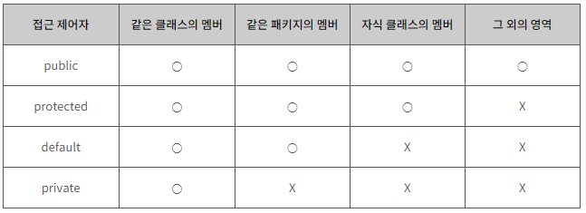

# 접근 제어자

### 제어자(modifier)

> 제어자란 클래스와 클래스 멤버의 선언시 사용하여 부가적인 의미를 부여하는 키워드를 의미함

* 자바에서는 제어자는 접근 제어자(access modifier)와 기타 제어자로 구분할 수 있음
* 기타 제어자는 경우에 따라 여러개를 함께 사용할 수도 있지만, 접근 제어자는 두개 이상 같이 사용할 수 없음

### 접근 제어자(access modifier)

> * 객체 지향에서 정보 은닉(data hiding)이란 사용자가 굳이 알 필요가 없는 정보는 사용자로부터 숨겨야한다는 개념
> * 자바에서는 이러한 정보 은닉을 위해 접근 제어자(access modifier)라는 기능을 제공

* 접근 제어자를 사용하면 클래스 외부에서의 직접적인 접근을 허용하지 않는 멤버를 설정하여 정보 은닉을 구체화할 수 있음

1. priviate
2. public
3. default
4. protected

### private 접근 제어자

* private 접근 제어자를 사용하여 선언된 클래스 멤버는 외부에 공개되지 않으며, 외부에서는 직접 접근 할 수 없다.
* 즉, 자바 프로그램은 private 멤버에 직접 접근할 수 없으며, 해당 객체의 public 메소드를 통해서만 접근할 수 있음
* private 멤버는 public 인터페이스를 직접 구성하지 않고, 클래스 내부의 세부적인 동작을 구현하는데 사용됨

### public 접근 제어자

* public 접근 제어자를 사용하여 선언된 클래스 멤버는 외부로 공개되며, 해당 객체를 사용하는 프로그램 어디에서나 직접 접근할 수 있음
* 자바 프로그램은 public 메소드를 통해서만 해당 객체의 private 멤버에 접근할 수 있음
* public 메소드는 private 멤버와 프로그램 사이의 인터페이스(interface) 역할을 수행한다고 할 수 있음

### default 접근 제어자

* 자바에서는 클래스 및 클래스 멤버의 접근제어의 기본값으로 default 접근 제어를 별도로 명시하고 있음
* default를 위한 접근 제어자는 따로 존재하지 않으며, 접근 제어자가 지정되지 않으면 자동적으로 default 접근 제어를 가지게 됨
* default 접근 제어를 가지는 멤버는 같은 클래스의 멤버와 같은 패키지에 속하는 멤버에서만 접근할 수 있음

### protected 접근 제어자

* 자바 클래스느 private 멤버로 정보를 은닉하고, public 멤버로 사용자나 프로그램과의 인터페이스를 구축함
* 여기에 부모 클래스(parent class)와 관련된 접근 제어자가 하나 더 존재함
* protected 멤버는 부모 클래스에 대해서 public 멤버처럼 취급되며, 외부에서는 private 멤버 처럼 취급됨

### 접근 제어자의 접근 범위

>public > protected > default > private

