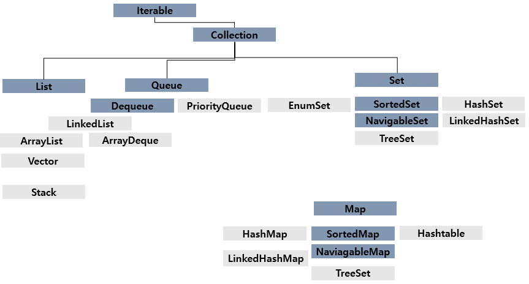

# 컬렉션 프레임워크

### 컬렉션 프레임워크(collection framework)란?

> 자바에서 컬렉션 프레임워크(collection framework)란 다수의 데이터를 쉽고 효과적으로 처리할 수 있는 표준화된 방법을 제공하는 클래스의 집합을 의미함

* 즉, 데이터를 저장하는 자료구조와 데이터를 처리하는 알고리즘을 구조화하여 클래스로 구현해 놓은 것임
* 이러한 컬렉션 프레임워크는 자바의 인터페이스(interface)를 사용하여 구현됨

[Java™ Platform, Standard Edition 8, Collection](https://docs.oracle.com/javase/8/docs/api/java/util/Collection.html)