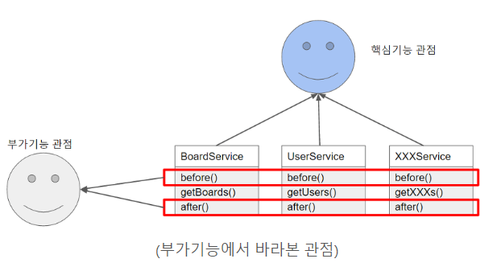
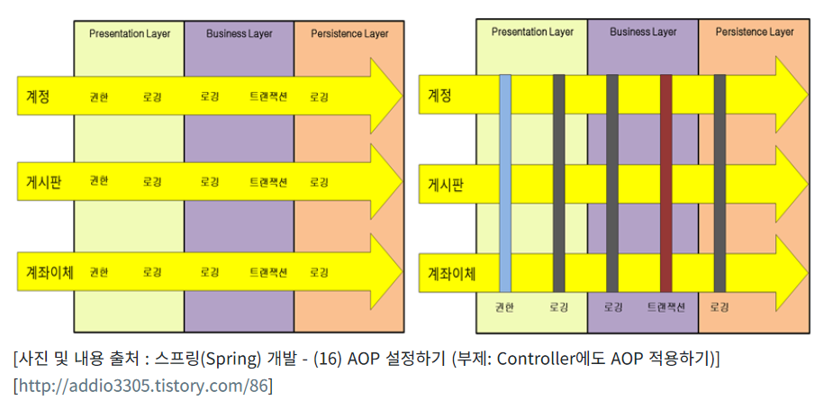

## AOP

> 관점 지향 프로그래밍(Aspect Oriented Programming)

* 공통적으로 적용되는 기능들을 특정 Method 혹은 Class가 실행되기 전/후 등의 단계에서 자동으로 실행될 수 있도록 지원하는 프로그래밍
* 어떤 로직을 기준으로 핵심적인 관점, 부가적인 관점으로 나누어서 보고 그 관점을 기준으로 각각 모듈화하는 것
* 애플리케이션의 핵심적인 기능과 부가적인 기능을 분리해, Aspect라는 모듈로 만들어 설계하고 개발하는 방법

## AOP와 OOP

> AOP란 OOP를 대신하는 새로운 개념이 아니라, OOP를 더욱 OOP답게 사용할 수 있도록 도와주는 개념

* OOP는 객체를 재사용함으로써 반복적인 코드의 양을 굉장히 많이 줄일수가 있었지만 객체의 재사용에도 불구하고 반복되는 코드를 없앵ㄹ수는 없었다.
* 예를 들어 로그, 권한 체크, 인증, 예외 처리 등 필수적으로 해야하기 때문에 소스에서 반복될 수 없는 부분이 존재한다. 
  * AOP는 이런 부분을 해결
* 기능을 비지니스 로직과 공통모듈로 구분한 후에 개발자의 코드 밖에서 필요한 시점에 비지니스 로직에 삽입하여 실행되도록한다.
  * 즉, OOP에서는 공통적인 기능을 각 객체의 횡단으로 입력했다면, AOP는 공통적 기능을 종단간으로 삽입할 수 있도록 한 것
* 기존의 OOP로직의 흐름은 계정, 게시판, 계좌이체를 처리할 때마다 똑같은 권한, 트랜잭션, 로깅을 처리해야하기 때문에 모든 로직에 똑같은 코드가 반복적으로 삽입될 수 밖에 없다.
  * 즉, 권한, 로깅, 트랜잭션이라는 관심(Aspect)이 횡단으로 삽입되는 것이다.
* 하지만 AOP는 이러한 관심을 종단으로 삽입할 수 있도록 해준다.
* 개발자는 계정, 게시판, 계좌이체와 같은 기능을 만들고, 공통적인 관심을 처리하는 모듈을 분리해서 개발한 뒤, 필요한 시점에 자동으로 소스코드가 삽입되도록 하는 것이다.

* [출처 : https://doublesprogramming.tistory.com/115]

