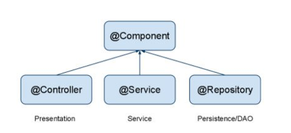

## 공부내용 정리

### context:component-scan

>  애노테이션의 관계



```java
<context:component-scan base-package="com.project.controller" />
```

- base-package에 component-scan을 할 패키지 경로를 명시해주면 해당 경로를 포함한 모든 하위 경로에 적용됨
- 애노테이션을 명시한 자바 파일들이 Bean으로 등록되어 사용가능해짐
