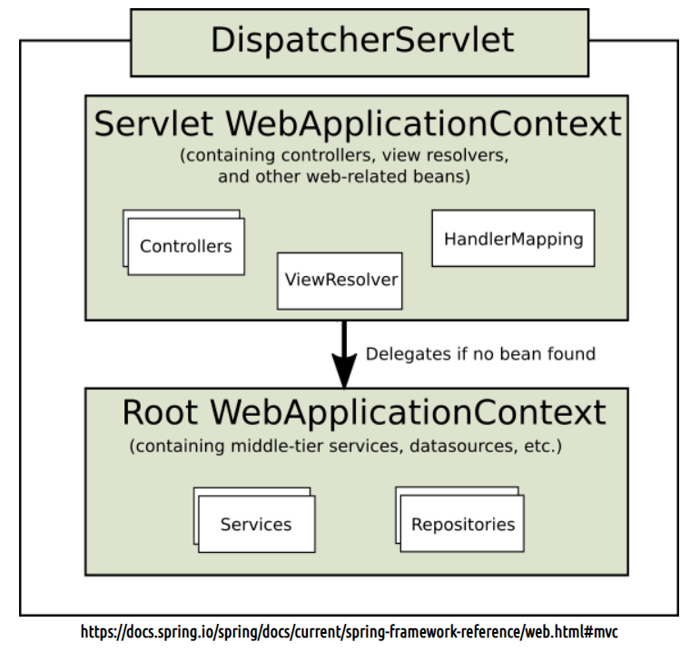

### root-context.xml, servlet-context.xml, web.xml

* root-context.xml 

  * controller 속에서 처리
  * 다른 웹 컴포넌트들과 공유하는 자원들을 선언하는 용도로 사용
  * view와 관련되지 않은 객체를 정의 (jsp와 관련 없는)
  * service, dao, repository등

* servlet-context.xml 

  * dispatcherservlet 속에서 처리
  *  DispatcherServlet의 request-processing에 관한 내용이 선언
  * 요청과 관련된 객체 정의(jsp와 관련 있는)
  * controller, annotation, viewResolve, Interceptor(로그인), MultipartResolve(파일업로드)

* web.xml

  * 설정을 위한 설정파일
  * 배포자 기술자 DD(Deployment Descriptor)
  * WAS(Web Application Server)가 최초 구동될 때(톰켓이 최초 구동될 때) web.xml을 읽고 그에 해당하는 설정을 구성한다.
  * 여러 xml파일을 인식하도록 각 파일을 가리켜준다.

  

  ** servlet-context는 root-context의 bean를 참조할 수 있지만 반대는 불가능

