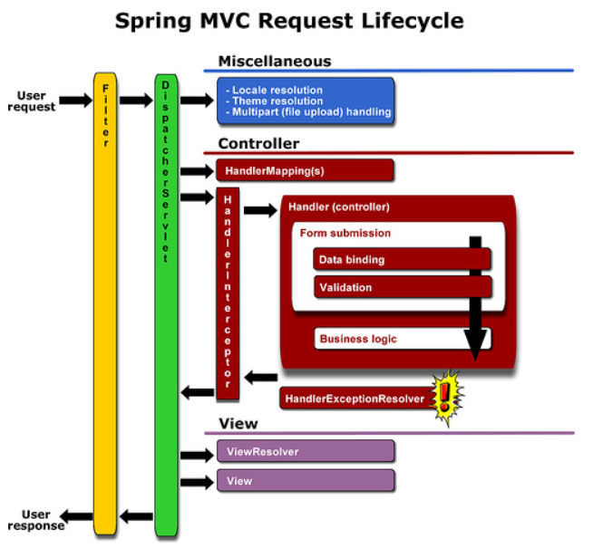

### Spring MVC request Life Cycle

> Browser로 부터 request가 들어왔을 때 처리과정

* 순서

1. web.xml의 filter 통해서 넘어옴 
   - ex) filter에서 설정해준 utf-8설정을 통해 넘어와서 전부 utf-8로 바뀜
2. DispatcherServlet을 거침(=프론트 컨트롤러 역활을 함)
3. locale, thema, multipart(file upload) handling
   * multipartresolver
     * servlet-context.xml에서 setting
4. Controller
   * handlerIntecepter -> handle처리(=spring Intercepter, 우리가 말하는 처리를 말함)
     * 여기에 controller가 처리되기 전에 intercepter 설정해줌
     * 그림에서는 그렇게 보이지 않지만 controller 밖에서 감싸고있음 
     * aop는 controller 안에서 감싸고 있음
   * pre(Intercepter)
   * aop
     * before
     * after
   * post(Intercepter)
5. view
   * viewResolver

### AOP와 Intercepter 차이

* AOP
  * target : method, parameter
  * @Before
  * @After
  * After Returning
* Intercepter
  * target : request, response(controller)
  * preHandle()
  * postHandle()
  * afterCompletion
