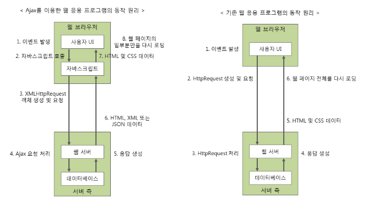

## Ajax란

### Ajax란?

* Ajax란 Asynchronous JavaScript and XML의 약자
* Ajax는 빠르게 동작하는 동적인 웹페이지를 만들기 위한 개발 기법의 하나
* Ajax는 웹 페이지 전체를 로딩하지 않고도 웹페이지의 일부분만을 갱신할 수 있음
* 즉, Ajax를 이용하면 백그라운드 영역에서 서버와 통신하여, 그 결과를 웹페이지의 일부분에만 표시할 수 있음
* 서버와 주고받는 데이터 형식
  * JSON
  * XML
  * HTML
  * TXT 파일

### Ajax의 장점

1. 웹 페이지 전체를 다시 로딩하지 않고도, 웹 페이지의 일부분만을 갱신할 수 있음
2. 웹 페이지가 로드된 후에 서버로 데이터 요철을 보낼 수 있음
3. 웹 페이지가 로드된 후에 서버로부터 데이터를 받을 수 있음
4. 백그라운드 영역에서 서버로 데이터를 보낼 수 있음

### Ajax의 한계

1. Ajax는 클라이언트가 서버에 데이터를 요청하는 클라이언트 풀링 방식을 사용하므로, 서버 푸시 방식의 실시간 서비스는 만들 수 없음
2. Ajax로는 바이너리 데이터를 보내거나 받을 수 없음
3. Ajax 스크립트가 포함된 서버가 아닌 다른 서버로 Ajax 요청을 보낼 수 없음
4. 클라이언트의 PC로 Ajax 요청을 보낼 수 없음

* 클라이언트 풀링(client polling) 방식
  * 사용자가 직접 원하는 정보를 서버에게 요청하여 얻는 방식을 의미
  * 이에 반에 서버 푸시(server push) 방식이란 사용자가 요청하지 않아도 서버가 알아서 자동으로 특정 정보를 제공하는 것을 의미
    * 예시) 스마트폰에서 각종 앱이 보내는 푸시 알림이 서버 푸시 방식의 대표적인 예

### Ajax 구성 요소

* Ajax는 기존에 사용되던 여러 기술을 함께 사용하여, 웹 페이지의 일부분만을 갱신할 수 있도록 해주는 개발 기법
* Ajax에서 사용하는 기존 기술
  * 웹 페이지의 표현을 위한 HTML과 CSS
  * 데이터에 접근하거나 화면 구성을 동적으로 조작하기 위해 사용되는 DOM 모델
  * 데이터의 교환을 위한 JSON이나 XML
  * 웹 서버와의 비동기식 통신을 위한 XMLHttpRequest 객체
  * 위에서 언급한 모든 기수을 결합하여 사용자의 작업 흐름을 제어하는 데 사용되는 자바스크립트

### Ajax 동작 원리

> Ajax를 이용한 웹 응용 프로그램은 자바스크립트 코드를 통해 웹 서버와 통신을 하게 됨
>
> 따라서 사용자의 동작에는 영향을 주지 않으면서도 백그라운드에서 지속해서 서버와 통신할 수 있음

