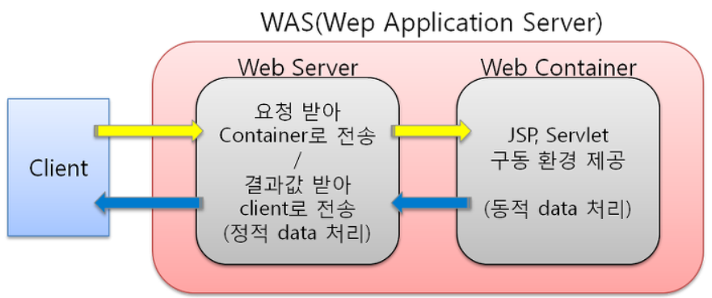

# Web Server VS Web Application Server(WAS)

> 간단하게 정리

### Web Server

* 웹 브라우저에서 요청받은 **정적 컨텐츠**(html, css, js, 이미지 리소스 등) 를 제공하기 위한 서버
* EX
  * Apache재단의 Apache
  * Microsoft사의 IIS, nginx
* 웹서버의 아파치나 IIS 와 같은 소프트웨어는 HTML/CGI 나 기타 웹 문서들을 HTTP 규약에 따라 웹 클라이언트와 주고받으며 통신하는 것이 주 역할

### Web Application Server(WAS)

* 클라이언트 측에서 요청받은 정보를 가지고 연산을 수행한 뒤, **동적인 콘텐츠**를 만들어 제공하기 위한 서버 (JSP, ASP, PHP)

* EX

  * Web Logic
  * Web Sphere
  * Jeus
  * Tomcat

* WAS는 규모가 크고 엔터프라이즈 환경에 필요한 트랜잭션, 보안, 트래픽관리, DB커넥션 풀, 사용자 관리 등등의 다양하고 강력한 기능을 제공하는 S/W 를 의미

* WAS의 구성

  * 사용자 요청(웹 브라우저) -> 웹 서버 -> WAS(동적 처리) -> 웹 서버 -> 사용자 응답 메세지(웹 브라우저)

    <출처: https://ithub.tistory.com/101 [Fall in IT.]>
  
* WAS는 정적,동적 처리 둘다 가능하지만 정적처리를 WAS가 하게되면 부하가 많이 걸려서 좋지 않음

  * WAS 에서 Web Server 기능을 처리하기도 하나, 트래픽이 몰릴 경우 WAS 의 부담이 커지게 됩니다.
  * 규모에 따라 Web Server 와 WAS 를 하나의 서버로 구성하거나, 독립 된 서버로 구성하기도 합니다.

#### 아파치 웹서버와 아파치 톰켓의 차이

- 아파치 웹서버 : WEB 서버

- 아파치 톰켓: WAS 서버 ( WEB 서버 내장 )

#### 언어별 웹서버 구성

- (JAVA) JSP, Servlet -> 아파치 톰켓 -> WAS 서버 (WEB서버 내장)

- (C,C++) PHP -> RWAPM -> WAS 서버 (WEB서버 내장)

- (MFC, .NET) ASP, ASPX -> IIS ->WAS 서버 (WEB서버 내장)

##### 참고

https://sungks.tistory.com/195

https://2dubbing.tistory.com/29
